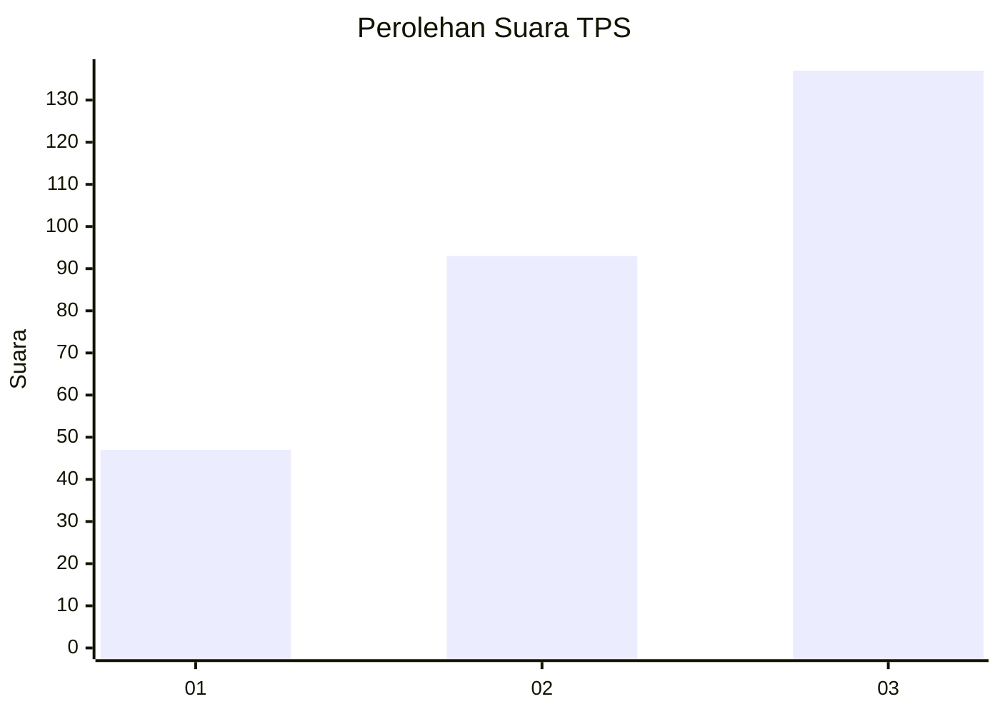
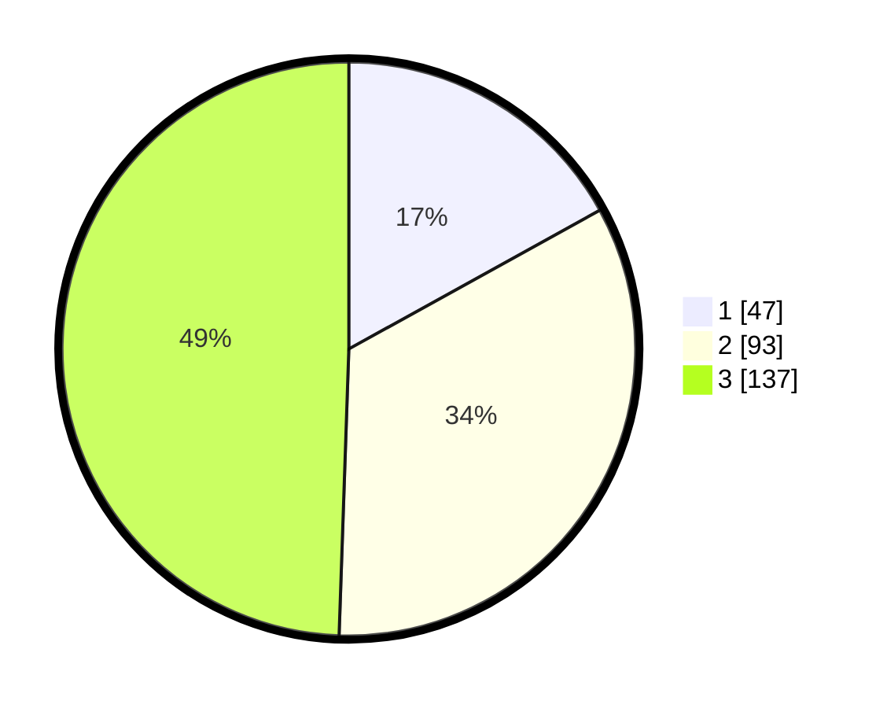

# Hasil

## Grafik

## Tabel

| No. | Nama Paslon    | Suara | Suara (raw) | Persentase |
|:--- |:-------------- | -----:| -----------:| ----------:|
| 1   | ANIES MUHAIMIN | 47    | [47][p-1]   | 16,97      |
| 2   | PRABOWO GIBRAN | 93    | [93][p-2]   | 33,57      |
| 3   | GANJAR MAHFUD  | 137   | [137][p-3]  | 49,46      |

[p-1]: https://github.com/gigit-pemilu/pemilu-2024/blob/main/pilpres/hitung-suara/sub/33-jawa-tengah/sub/10-klaten/sub/19-tulung/sub/2001-mundu/sub/005-tps/sub/paslon-1.txt
[p-2]: https://github.com/gigit-pemilu/pemilu-2024/blob/main/pilpres/hitung-suara/sub/33-jawa-tengah/sub/10-klaten/sub/19-tulung/sub/2001-mundu/sub/005-tps/sub/paslon-2.txt
[p-3]: https://github.com/gigit-pemilu/pemilu-2024/blob/main/pilpres/hitung-suara/sub/33-jawa-tengah/sub/10-klaten/sub/19-tulung/sub/2001-mundu/sub/005-tps/sub/paslon-3.txt

## Foto C Plano

https://sirekap-obj-formc.kpu.go.id/7d44/pemilu/ppwp/33/10/19/20/01/3310192001005-20240216-150148--8ce337b5-7fa6-4761-98f4-e86039617097.jpg

https://sirekap-obj-formc.kpu.go.id/7d44/pemilu/ppwp/33/10/19/20/01/3310192001005-20240216-150149--cd4e1c7f-7a0a-4df9-9744-0fc73d936f5b.jpg

https://sirekap-obj-formc.kpu.go.id/7d44/pemilu/ppwp/33/10/19/20/01/3310192001005-20240216-150149--b9515e7e-4f5b-4f85-9100-30a5507aa167.jpg

## Metadata

| Key        | Value               |
| ---------- | ------------------- |
| Time Stamp | 2024-02-16 21:01:00 |

## DATA PEMILIH TETAP

Jumlah pemilih dalam DPT: **275**.
 * L: **142**.
 * P: **133**.

## DATA PENGGUNA HAK PILIH

Jumlah pengguna hak pilih dalam DPT: **266**.
 * L: **138**.
 * P: **128**.

Jumlah pengguna hak pilih dalam DPTb: **1**.
 * L: **0**.
 * P: **1**.

Jumlah pengguna hak pilih dalam DPK: **11**.
 * L: **6**.
 * P: **5**.

Jumlah pengguna hak pilih: **278**.
 * L: **144**.
 * P: **134**.

## JUMLAH SUARA SAH DAN TIDAK SAH

JUMLAH SELURUH SUARA SAH: **277**.

JUMLAH SUARA TIDAK SAH: **1**.

JUMLAH SELURUH SUARA SAH DAN SUARA TIDAK SAH: **278**.

