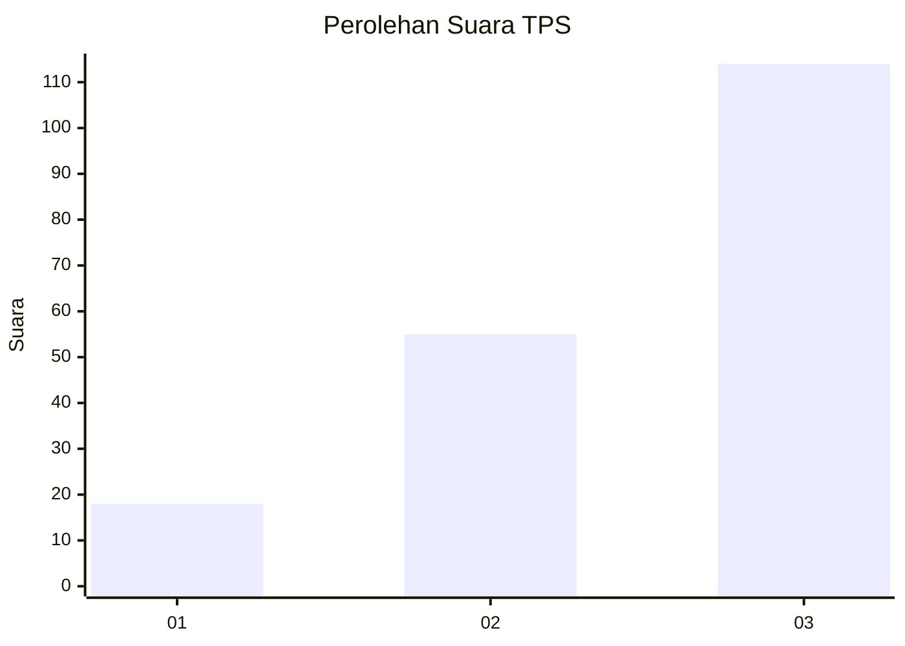
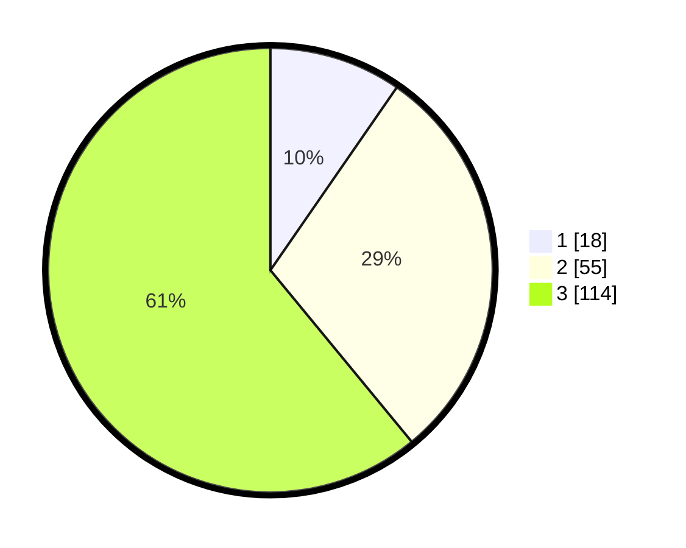

# Hasil

## Grafik

## Tabel

| No. | Nama Paslon    | Suara | Suara (raw) | Persentase |
|:--- |:-------------- | -----:| -----------:| ----------:|
| 1   | ANIES MUHAIMIN | 18    | [18][p-1]   | 9,63       |
| 2   | PRABOWO GIBRAN | 55    | [55][p-2]   | 29,41      |
| 3   | GANJAR MAHFUD  | 114   | [114][p-3]  | 60,96      |

[p-1]: https://github.com/gigit-pemilu/pemilu-2024/blob/main/pilpres/hitung-suara/sub/33-jawa-tengah/sub/10-klaten/sub/19-tulung/sub/2002-sedayu/sub/009-tps/sub/paslon-1.txt
[p-2]: https://github.com/gigit-pemilu/pemilu-2024/blob/main/pilpres/hitung-suara/sub/33-jawa-tengah/sub/10-klaten/sub/19-tulung/sub/2002-sedayu/sub/009-tps/sub/paslon-2.txt
[p-3]: https://github.com/gigit-pemilu/pemilu-2024/blob/main/pilpres/hitung-suara/sub/33-jawa-tengah/sub/10-klaten/sub/19-tulung/sub/2002-sedayu/sub/009-tps/sub/paslon-3.txt

## Foto C Plano

https://sirekap-obj-formc.kpu.go.id/3db5/pemilu/ppwp/33/10/19/20/02/3310192002009-20240216-130044--3f841687-6cf2-45a0-99af-640dde4ac5b7.jpg

https://sirekap-obj-formc.kpu.go.id/3db5/pemilu/ppwp/33/10/19/20/02/3310192002009-20240216-175256--59f00972-2339-41b8-90c0-582c6399c5bc.jpg

https://sirekap-obj-formc.kpu.go.id/3db5/pemilu/ppwp/33/10/19/20/02/3310192002009-20240216-191340--4714deb8-95ee-4fdb-bc72-1a7fa906fef9.jpg

## Metadata

| Key        | Value               |
| ---------- | ------------------- |
| Time Stamp | 2024-02-16 22:01:00 |

