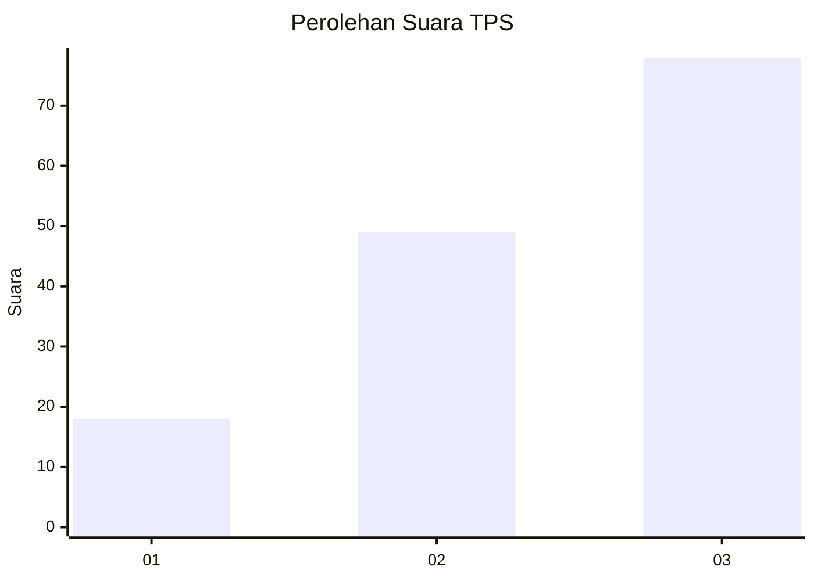
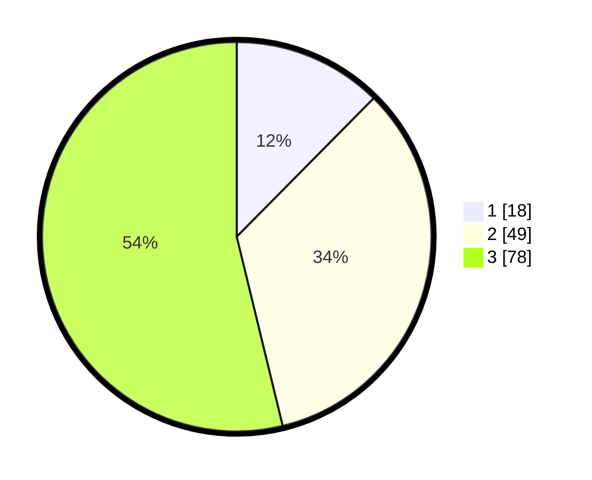

# Hasil

## Grafik

## Tabel

| No. | Nama Paslon    | Suara | Suara (raw) | Persentase |
|:--- |:-------------- | -----:| -----------:| ----------:|
| 1   | ANIES MUHAIMIN | 18    | [18][p-1]   | 12,41      |
| 2   | PRABOWO GIBRAN | 49    | [49][p-2]   | 33,79      |
| 3   | GANJAR MAHFUD  | 78    | [78][p-3]   | 53,79      |

[p-1]: https://github.com/gigit-pemilu/pemilu-2024/blob/main/pilpres/hitung-suara/sub/33-jawa-tengah/sub/10-klaten/sub/19-tulung/sub/2002-sedayu/sub/010-tps/sub/paslon-1.txt
[p-2]: https://github.com/gigit-pemilu/pemilu-2024/blob/main/pilpres/hitung-suara/sub/33-jawa-tengah/sub/10-klaten/sub/19-tulung/sub/2002-sedayu/sub/010-tps/sub/paslon-2.txt
[p-3]: https://github.com/gigit-pemilu/pemilu-2024/blob/main/pilpres/hitung-suara/sub/33-jawa-tengah/sub/10-klaten/sub/19-tulung/sub/2002-sedayu/sub/010-tps/sub/paslon-3.txt

## Foto C Plano

https://sirekap-obj-formc.kpu.go.id/74d1/pemilu/ppwp/33/10/19/20/02/3310192002010-20240214-213152--31122abc-5341-4617-8503-74a623156440.jpg

https://sirekap-obj-formc.kpu.go.id/74d1/pemilu/ppwp/33/10/19/20/02/3310192002010-20240214-212911--cf65c7f5-166e-46bc-a418-dfeb918b32fd.jpg

https://sirekap-obj-formc.kpu.go.id/74d1/pemilu/ppwp/33/10/19/20/02/3310192002010-20240214-213136--32174cd9-3e47-4e96-9796-e13d940b8c09.jpg

## Metadata

| Key        | Value               |
| ---------- | ------------------- |
| Time Stamp | 2024-02-15 15:00:29 |

