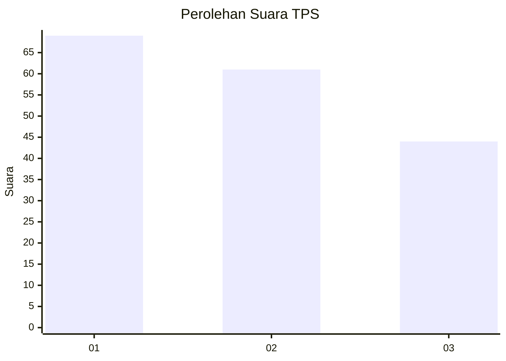
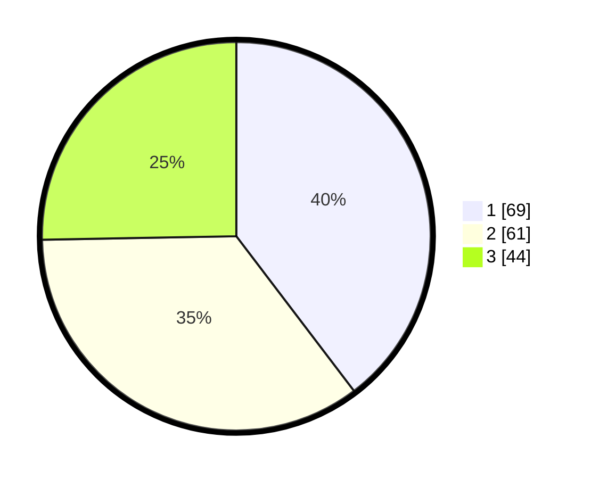

# Hasil

## Grafik

## Tabel

| No. | Nama Paslon    | Suara | Suara (raw) | Persentase |
|:--- |:-------------- | -----:| -----------:| ----------:|
| 1   | ANIES MUHAIMIN | 69    | [69][p-1]   | 39,66      |
| 2   | PRABOWO GIBRAN | 61    | [61][p-2]   | 35,06      |
| 3   | GANJAR MAHFUD  | 44    | [44][p-3]   | 25,29      |

[p-1]: https://github.com/gigit-pemilu/pemilu-2024/blob/main/pilpres/hitung-suara/sub/33-jawa-tengah/sub/10-klaten/sub/19-tulung/sub/2004-bono/sub/005-tps/sub/paslon-1.txt
[p-2]: https://github.com/gigit-pemilu/pemilu-2024/blob/main/pilpres/hitung-suara/sub/33-jawa-tengah/sub/10-klaten/sub/19-tulung/sub/2004-bono/sub/005-tps/sub/paslon-2.txt
[p-3]: https://github.com/gigit-pemilu/pemilu-2024/blob/main/pilpres/hitung-suara/sub/33-jawa-tengah/sub/10-klaten/sub/19-tulung/sub/2004-bono/sub/005-tps/sub/paslon-3.txt

## Foto C Plano

https://sirekap-obj-formc.kpu.go.id/d49e/pemilu/ppwp/33/10/19/20/04/3310192004005-20240216-151639--01d84e7f-8c4c-455c-b883-c35fa365b6d5.jpg

https://sirekap-obj-formc.kpu.go.id/d49e/pemilu/ppwp/33/10/19/20/04/3310192004005-20240216-144209--e9ffc87c-6c5a-43fa-9bea-1d41432dc4d9.jpg

https://sirekap-obj-formc.kpu.go.id/d49e/pemilu/ppwp/33/10/19/20/04/3310192004005-20240214-214707--c25712ba-5020-4316-8af8-eeba203abf5f.jpg

## Metadata

| Key        | Value               |
| ---------- | ------------------- |
| Time Stamp | 2024-02-16 22:01:00 |

