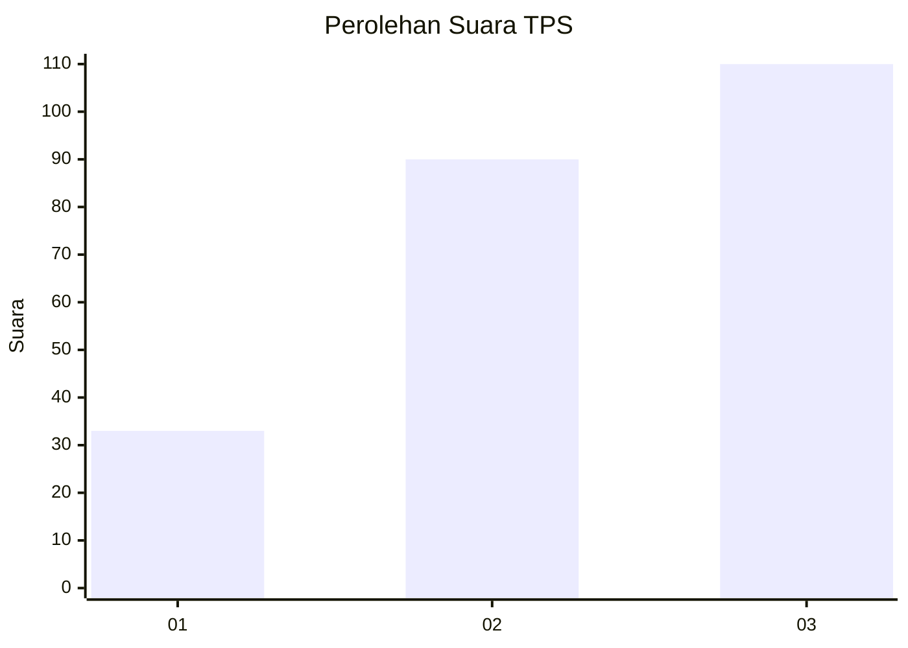
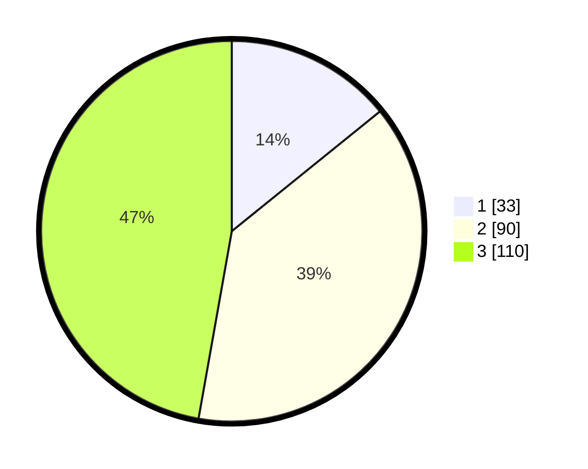

# Hasil

## Grafik

## Tabel

| No. | Nama Paslon    | Suara | Suara (raw) | Persentase |
|:--- |:-------------- | -----:| -----------:| ----------:|
| 1   | ANIES MUHAIMIN | 33    | [33][p-1]   | 14,16      |
| 2   | PRABOWO GIBRAN | 90    | [90][p-2]   | 38,63      |
| 3   | GANJAR MAHFUD  | 110   | [110][p-3]  | 47,21      |

[p-1]: https://github.com/gigit-pemilu/pemilu-2024-33-jawa-tengah/blob/main/pilpres/hitung-suara/sub/33-jawa-tengah/sub/10-klaten/sub/19-tulung/sub/2009-sorogaten/sub/003-tps/sub/paslon-1.txt
[p-2]: https://github.com/gigit-pemilu/pemilu-2024-33-jawa-tengah/blob/main/pilpres/hitung-suara/sub/33-jawa-tengah/sub/10-klaten/sub/19-tulung/sub/2009-sorogaten/sub/003-tps/sub/paslon-2.txt
[p-3]: https://github.com/gigit-pemilu/pemilu-2024-33-jawa-tengah/blob/main/pilpres/hitung-suara/sub/33-jawa-tengah/sub/10-klaten/sub/19-tulung/sub/2009-sorogaten/sub/003-tps/sub/paslon-3.txt

## Foto C Plano

https://sirekap-obj-formc.kpu.go.id/2665/pemilu/ppwp/33/10/19/20/09/3310192009003-20240214-220610--f0fc2df6-1882-4dd7-a6e4-0449f8385a4e.jpg

https://sirekap-obj-formc.kpu.go.id/2665/pemilu/ppwp/33/10/19/20/09/3310192009003-20240214-220728--34ebd4e2-9068-46b8-94cc-2ea80b4e9582.jpg

https://sirekap-obj-formc.kpu.go.id/2665/pemilu/ppwp/33/10/19/20/09/3310192009003-20240214-220824--b7c16a0b-8c27-494b-819d-a79e9d55c757.jpg

## Metadata

| Key        | Value               |
| ---------- | ------------------- |
| Time Stamp | 2024-02-15 15:30:25 |

