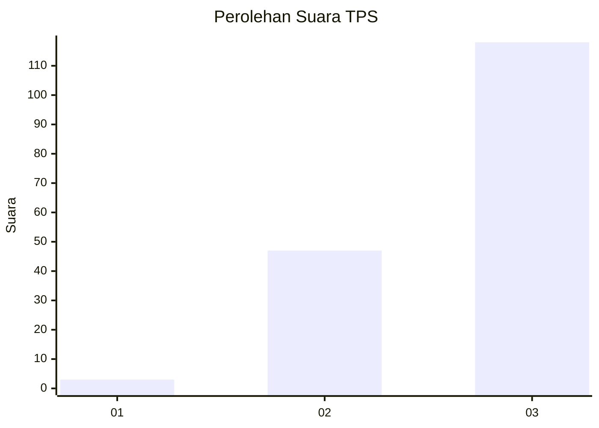
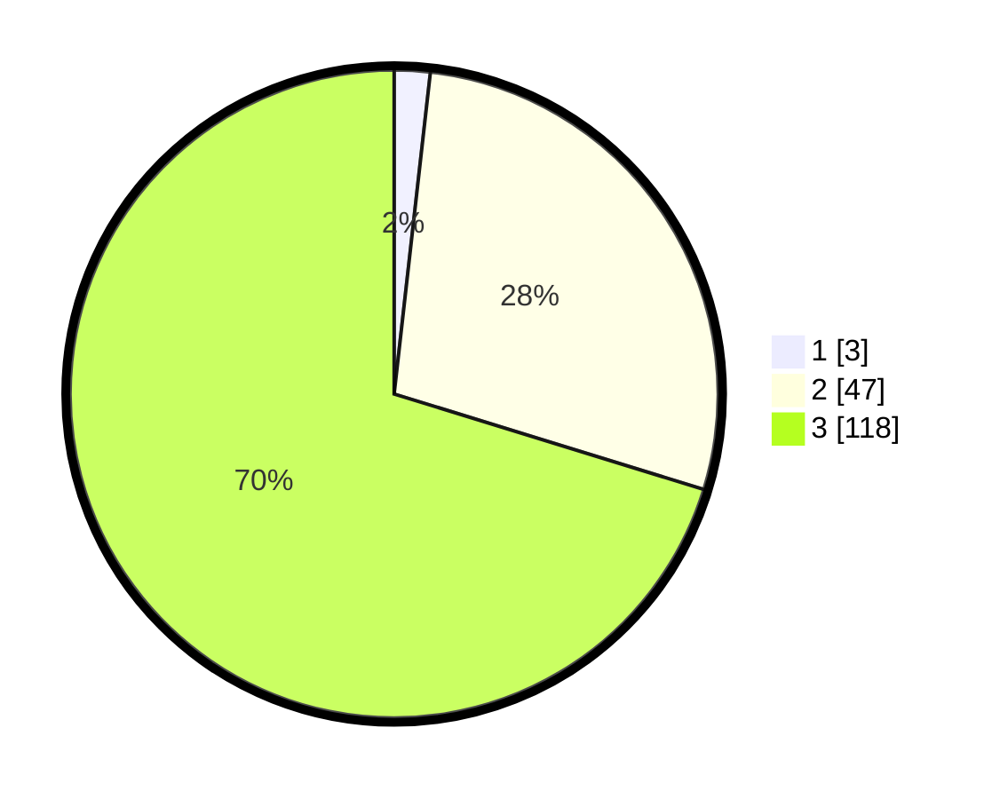

# Hasil

## Grafik

## Tabel

| No. | Nama Paslon    | Suara | Suara (raw) | Persentase |
|:--- |:-------------- | -----:| -----------:| ----------:|
| 1   | ANIES MUHAIMIN | 3     | [3][p-1]    | 1,79       |
| 2   | PRABOWO GIBRAN | 47    | [47][p-2]   | 27,98      |
| 3   | GANJAR MAHFUD  | 118   | [118][p-3]  | 70,24      |

[p-1]: https://github.com/gigit-pemilu/pemilu-2024-33-jawa-tengah/blob/main/pilpres/hitung-suara/sub/33-jawa-tengah/sub/10-klaten/sub/20-jatinom/sub/2014-krajan/sub/012-tps/sub/paslon-1.txt
[p-2]: https://github.com/gigit-pemilu/pemilu-2024-33-jawa-tengah/blob/main/pilpres/hitung-suara/sub/33-jawa-tengah/sub/10-klaten/sub/20-jatinom/sub/2014-krajan/sub/012-tps/sub/paslon-2.txt
[p-3]: https://github.com/gigit-pemilu/pemilu-2024-33-jawa-tengah/blob/main/pilpres/hitung-suara/sub/33-jawa-tengah/sub/10-klaten/sub/20-jatinom/sub/2014-krajan/sub/012-tps/sub/paslon-3.txt

## Foto C Plano

https://sirekap-obj-formc.kpu.go.id/2465/pemilu/ppwp/33/10/20/20/14/3310202014012-20240214-141014--677e3e83-88cf-4d11-b71c-cdc6c089eb87.jpg

https://sirekap-obj-formc.kpu.go.id/2465/pemilu/ppwp/33/10/20/20/14/3310202014012-20240214-141642--9ef0be4a-efdc-4606-8ccb-13571e74fab3.jpg

https://sirekap-obj-formc.kpu.go.id/2465/pemilu/ppwp/33/10/20/20/14/3310202014012-20240214-141824--cc1a3276-469b-4c28-be60-2e120b62966f.jpg

## Metadata

| Key        | Value               |
| ---------- | ------------------- |
| Time Stamp | 2024-02-15 00:41:44 |

