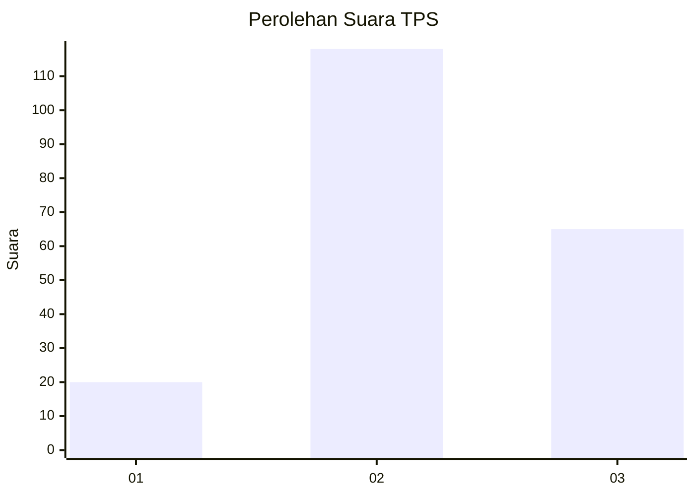
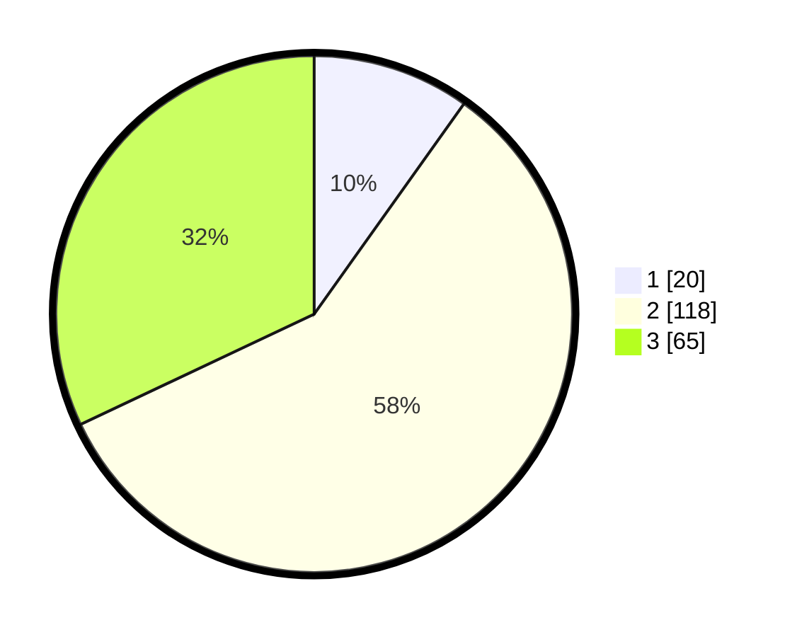

# Hasil

## Grafik

## Tabel

| No. | Nama Paslon    | Suara | Suara (raw) | Persentase |
|:--- |:-------------- | -----:| -----------:| ----------:|
| 1   | ANIES MUHAIMIN | 20    | [20][p-1]   | 9,85       |
| 2   | PRABOWO GIBRAN | 118   | [118][p-2]  | 58,13      |
| 3   | GANJAR MAHFUD  | 65    | [65][p-3]   | 32,02      |

[p-1]: https://github.com/gigit-pemilu/pemilu-2024-33-jawa-tengah/blob/main/pilpres/hitung-suara/sub/33-jawa-tengah/sub/10-klaten/sub/22-ngawen/sub/2001-manjung/sub/001-tps/sub/paslon-1.txt
[p-2]: https://github.com/gigit-pemilu/pemilu-2024-33-jawa-tengah/blob/main/pilpres/hitung-suara/sub/33-jawa-tengah/sub/10-klaten/sub/22-ngawen/sub/2001-manjung/sub/001-tps/sub/paslon-2.txt
[p-3]: https://github.com/gigit-pemilu/pemilu-2024-33-jawa-tengah/blob/main/pilpres/hitung-suara/sub/33-jawa-tengah/sub/10-klaten/sub/22-ngawen/sub/2001-manjung/sub/001-tps/sub/paslon-3.txt

## Foto C Plano

https://sirekap-obj-formc.kpu.go.id/50f1/pemilu/ppwp/33/10/22/20/01/3310222001001-20240214-223247--9ab8b8fc-ec49-4d11-af47-36b29735c482.jpg

https://sirekap-obj-formc.kpu.go.id/50f1/pemilu/ppwp/33/10/22/20/01/3310222001001-20240214-223553--2ff08de8-67eb-4cb2-9de4-a52c734b3c51.jpg

https://sirekap-obj-formc.kpu.go.id/50f1/pemilu/ppwp/33/10/22/20/01/3310222001001-20240214-223656--136fc466-ba80-46bf-8ddd-0a2693258c3e.jpg

## Metadata

| Key        | Value               |
| ---------- | ------------------- |
| Time Stamp | 2024-02-15 21:01:18 |

