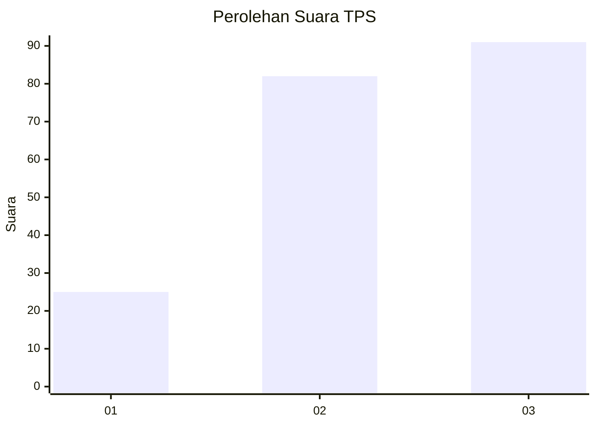
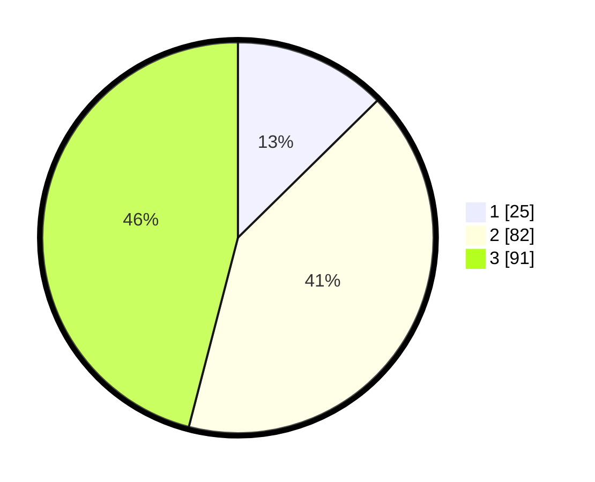

# Hasil

## Grafik

## Tabel

| No. | Nama Paslon    | Suara | Suara (raw) | Persentase |
|:--- |:-------------- | -----:| -----------:| ----------:|
| 1   | ANIES MUHAIMIN | 25    | [25][p-1]   | 12,63      |
| 2   | PRABOWO GIBRAN | 82    | [82][p-2]   | 41,41      |
| 3   | GANJAR MAHFUD  | 91    | [91][p-3]   | 45,96      |

[p-1]: https://github.com/gigit-pemilu/pemilu-2024/blob/main/pilpres/hitung-suara/sub/33-jawa-tengah/sub/10-klaten/sub/22-ngawen/sub/2001-manjung/sub/005-tps/sub/paslon-1.txt
[p-2]: https://github.com/gigit-pemilu/pemilu-2024/blob/main/pilpres/hitung-suara/sub/33-jawa-tengah/sub/10-klaten/sub/22-ngawen/sub/2001-manjung/sub/005-tps/sub/paslon-2.txt
[p-3]: https://github.com/gigit-pemilu/pemilu-2024/blob/main/pilpres/hitung-suara/sub/33-jawa-tengah/sub/10-klaten/sub/22-ngawen/sub/2001-manjung/sub/005-tps/sub/paslon-3.txt

## Foto C Plano

https://sirekap-obj-formc.kpu.go.id/b263/pemilu/ppwp/33/10/22/20/01/3310222001005-20240214-215612--c30f9cbd-d5e4-48c7-8bce-2308fcd713e6.jpg

https://sirekap-obj-formc.kpu.go.id/b263/pemilu/ppwp/33/10/22/20/01/3310222001005-20240214-215856--1071edf0-2aea-4fda-adee-8ca28f8e28da.jpg

https://sirekap-obj-formc.kpu.go.id/b263/pemilu/ppwp/33/10/22/20/01/3310222001005-20240214-220120--8dda455e-f05a-4925-a1b3-e5ba3cf86d94.jpg

## Metadata

| Key        | Value               |
| ---------- | ------------------- |
| Time Stamp | 2024-02-15 21:01:18 |

