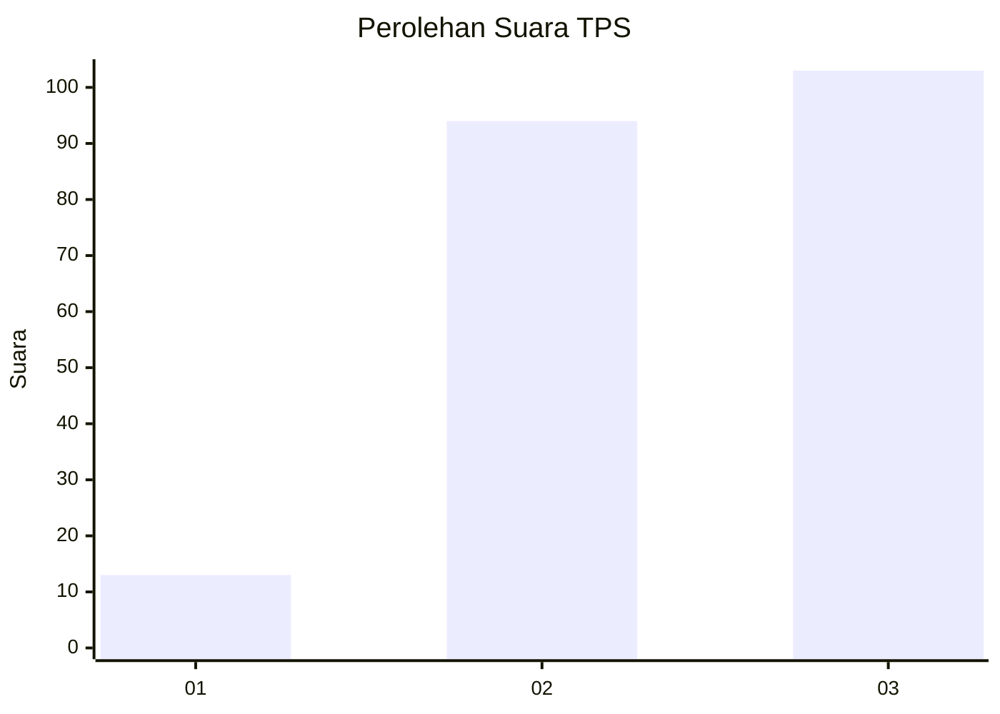
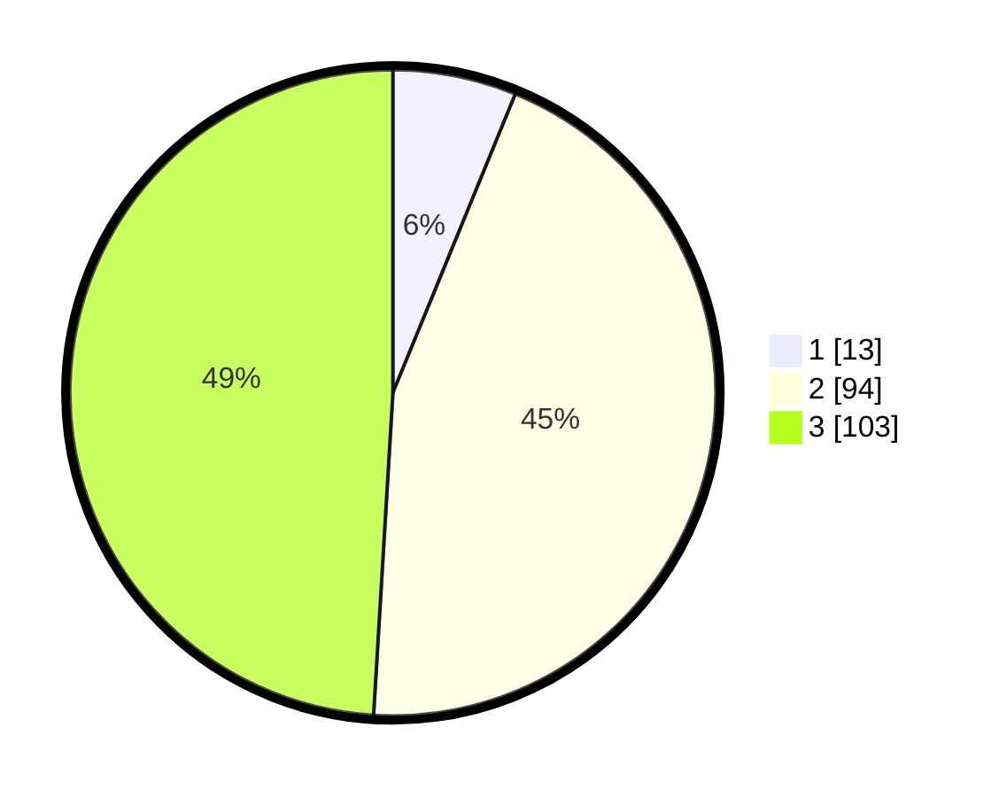

# Hasil

## Grafik

## Tabel

| No. | Nama Paslon    | Suara | Suara (raw) | Persentase |
|:--- |:-------------- | -----:| -----------:| ----------:|
| 1   | ANIES MUHAIMIN | 13    | [13][p-1]   | 6,19       |
| 2   | PRABOWO GIBRAN | 94    | [94][p-2]   | 44,76      |
| 3   | GANJAR MAHFUD  | 103   | [103][p-3]  | 49,05      |

[p-1]: https://github.com/gigit-pemilu/pemilu-2024/blob/main/pilpres/hitung-suara/sub/33-jawa-tengah/sub/10-klaten/sub/22-ngawen/sub/2001-manjung/sub/012-tps/sub/paslon-1.txt
[p-2]: https://github.com/gigit-pemilu/pemilu-2024/blob/main/pilpres/hitung-suara/sub/33-jawa-tengah/sub/10-klaten/sub/22-ngawen/sub/2001-manjung/sub/012-tps/sub/paslon-2.txt
[p-3]: https://github.com/gigit-pemilu/pemilu-2024/blob/main/pilpres/hitung-suara/sub/33-jawa-tengah/sub/10-klaten/sub/22-ngawen/sub/2001-manjung/sub/012-tps/sub/paslon-3.txt

## Foto C Plano

https://sirekap-obj-formc.kpu.go.id/3f0d/pemilu/ppwp/33/10/22/20/01/3310222001012-20240215-231105--9511ae3c-e128-451e-a9e5-dfc8c3d54d7d.jpg

https://sirekap-obj-formc.kpu.go.id/3f0d/pemilu/ppwp/33/10/22/20/01/3310222001012-20240215-231726--8a3df1f6-735b-4cf6-b0ce-9cf6d9e50913.jpg

https://sirekap-obj-formc.kpu.go.id/3f0d/pemilu/ppwp/33/10/22/20/01/3310222001012-20240216-004522--ee5758de-b230-42d4-9591-696364ad7cf5.jpg

## Metadata

| Key        | Value               |
| ---------- | ------------------- |
| Time Stamp | 2024-02-19 06:16:00 |

