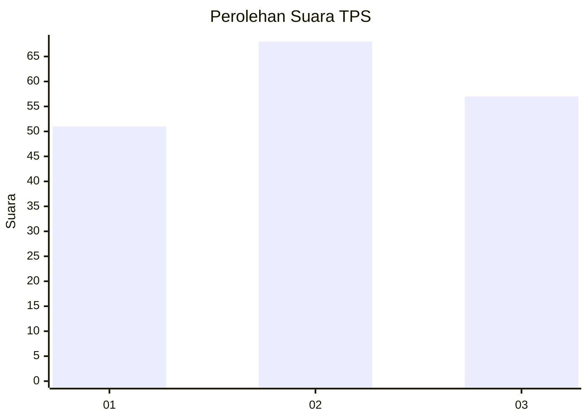
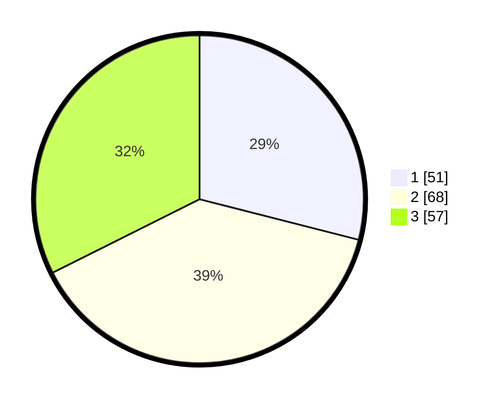

# Hasil

## Grafik

## Tabel

| No. | Nama Paslon    | Suara | Suara (raw) | Persentase |
|:--- |:-------------- | -----:| -----------:| ----------:|
| 1   | ANIES MUHAIMIN | 51    | [51][p-1]   | 28,98      |
| 2   | PRABOWO GIBRAN | 68    | [68][p-2]   | 38,64      |
| 3   | GANJAR MAHFUD  | 57    | [57][p-3]   | 32,39      |

[p-1]: https://github.com/gigit-pemilu/pemilu-2024/blob/main/pilpres/hitung-suara/sub/33-jawa-tengah/sub/10-klaten/sub/22-ngawen/sub/2002-gatak/sub/001-tps/sub/paslon-1.txt
[p-2]: https://github.com/gigit-pemilu/pemilu-2024/blob/main/pilpres/hitung-suara/sub/33-jawa-tengah/sub/10-klaten/sub/22-ngawen/sub/2002-gatak/sub/001-tps/sub/paslon-2.txt
[p-3]: https://github.com/gigit-pemilu/pemilu-2024/blob/main/pilpres/hitung-suara/sub/33-jawa-tengah/sub/10-klaten/sub/22-ngawen/sub/2002-gatak/sub/001-tps/sub/paslon-3.txt

## Foto C Plano

https://sirekap-obj-formc.kpu.go.id/8b9a/pemilu/ppwp/33/10/22/20/02/3310222002001-20240218-093110--59e7a225-7718-494a-8640-c783baf9d8fa.jpg

https://sirekap-obj-formc.kpu.go.id/8b9a/pemilu/ppwp/33/10/22/20/02/3310222002001-20240218-093157--ac6684d7-4486-4510-8b47-536a524c7448.jpg

https://sirekap-obj-formc.kpu.go.id/8b9a/pemilu/ppwp/33/10/22/20/02/3310222002001-20240218-093229--2d6b53ca-04f6-4024-8170-ea462108fc8f.jpg

## Metadata

| Key        | Value               |
| ---------- | ------------------- |
| Time Stamp | 2024-02-19 06:16:00 |

