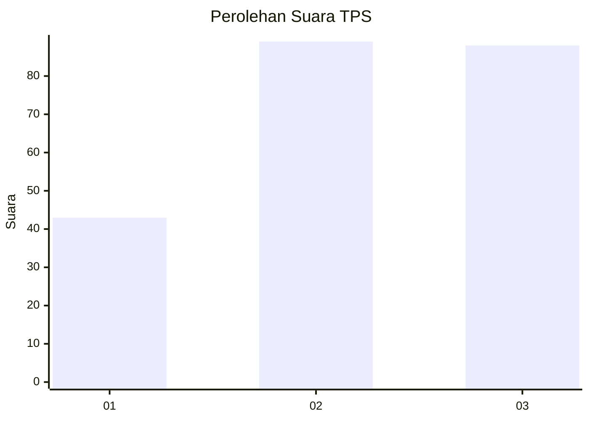
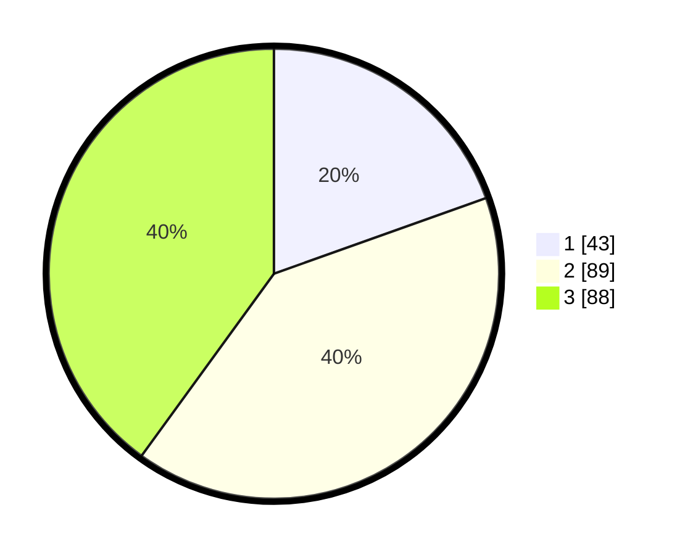

# Hasil

## Grafik

## Tabel

| No. | Nama Paslon    | Suara | Suara (raw) | Persentase |
|:--- |:-------------- | -----:| -----------:| ----------:|
| 1   | ANIES MUHAIMIN | 43    | [43][p-1]   | 19,55      |
| 2   | PRABOWO GIBRAN | 89    | [89][p-2]   | 40,45      |
| 3   | GANJAR MAHFUD  | 88    | [88][p-3]   | 40,00      |

[p-1]: https://github.com/gigit-pemilu/pemilu-2024/blob/main/pilpres/hitung-suara/sub/33-jawa-tengah/sub/10-klaten/sub/22-ngawen/sub/2002-gatak/sub/005-tps/sub/paslon-1.txt
[p-2]: https://github.com/gigit-pemilu/pemilu-2024/blob/main/pilpres/hitung-suara/sub/33-jawa-tengah/sub/10-klaten/sub/22-ngawen/sub/2002-gatak/sub/005-tps/sub/paslon-2.txt
[p-3]: https://github.com/gigit-pemilu/pemilu-2024/blob/main/pilpres/hitung-suara/sub/33-jawa-tengah/sub/10-klaten/sub/22-ngawen/sub/2002-gatak/sub/005-tps/sub/paslon-3.txt

## Foto C Plano

https://sirekap-obj-formc.kpu.go.id/55fe/pemilu/ppwp/33/10/22/20/02/3310222002005-20240215-003606--efd7e1b0-37a2-495f-b681-1abbebc603fa.jpg

https://sirekap-obj-formc.kpu.go.id/55fe/pemilu/ppwp/33/10/22/20/02/3310222002005-20240215-003631--fcbc4ae8-6cd4-4f3d-a2e1-4d3c2b396474.jpg

https://sirekap-obj-formc.kpu.go.id/55fe/pemilu/ppwp/33/10/22/20/02/3310222002005-20240215-003659--26843774-bab6-410e-ba35-47ab331a422d.jpg

## Metadata

| Key        | Value               |
| ---------- | ------------------- |
| Time Stamp | 2024-02-16 16:25:10 |

