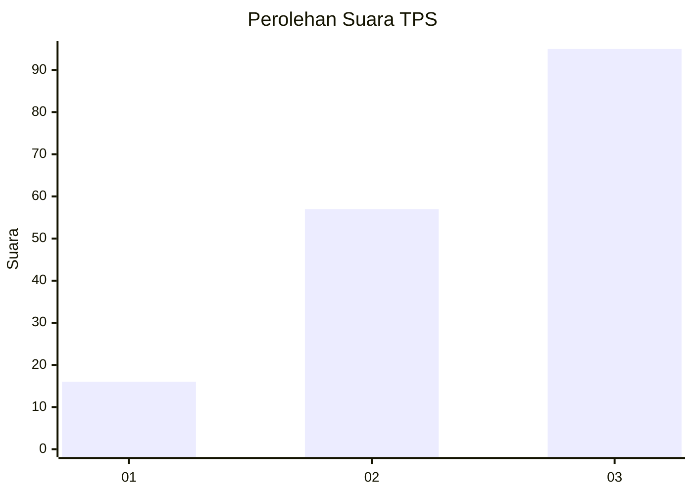
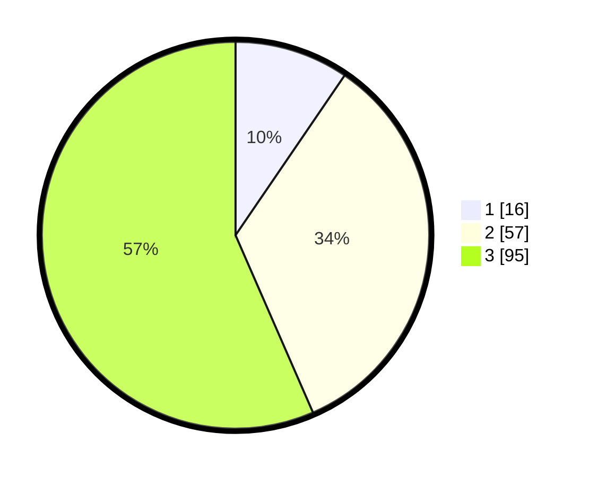

# Hasil

## Grafik

## Tabel

| No. | Nama Paslon    | Suara | Suara (raw) | Persentase |
|:--- |:-------------- | -----:| -----------:| ----------:|
| 1   | ANIES MUHAIMIN | 16    | [16][p-1]   | 9,52       |
| 2   | PRABOWO GIBRAN | 57    | [57][p-2]   | 33,93      |
| 3   | GANJAR MAHFUD  | 95    | [95][p-3]   | 56,55      |

[p-1]: https://github.com/gigit-pemilu/pemilu-2024/blob/main/pilpres/hitung-suara/sub/33-jawa-tengah/sub/10-klaten/sub/22-ngawen/sub/2004-senden/sub/010-tps/sub/paslon-1.txt
[p-2]: https://github.com/gigit-pemilu/pemilu-2024/blob/main/pilpres/hitung-suara/sub/33-jawa-tengah/sub/10-klaten/sub/22-ngawen/sub/2004-senden/sub/010-tps/sub/paslon-2.txt
[p-3]: https://github.com/gigit-pemilu/pemilu-2024/blob/main/pilpres/hitung-suara/sub/33-jawa-tengah/sub/10-klaten/sub/22-ngawen/sub/2004-senden/sub/010-tps/sub/paslon-3.txt

## Foto C Plano

https://sirekap-obj-formc.kpu.go.id/287a/pemilu/ppwp/33/10/22/20/04/3310222004010-20240216-150317--5df1c59b-bace-4f89-a2b7-7e3aeff9a583.jpg

https://sirekap-obj-formc.kpu.go.id/287a/pemilu/ppwp/33/10/22/20/04/3310222004010-20240214-220047--7090cc25-2cd1-435e-a6f4-f569731d1f19.jpg

https://sirekap-obj-formc.kpu.go.id/287a/pemilu/ppwp/33/10/22/20/04/3310222004010-20240214-220202--ee788595-6984-4c21-a092-a728a2377443.jpg

## Metadata

| Key        | Value               |
| ---------- | ------------------- |
| Time Stamp | 2024-02-16 16:25:10 |

