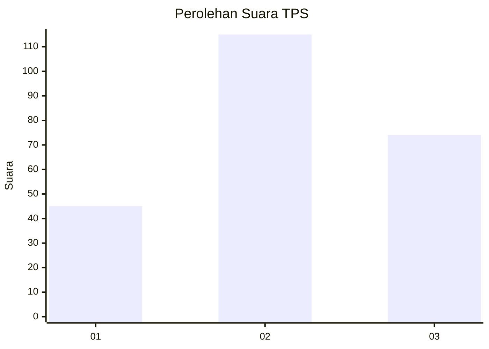
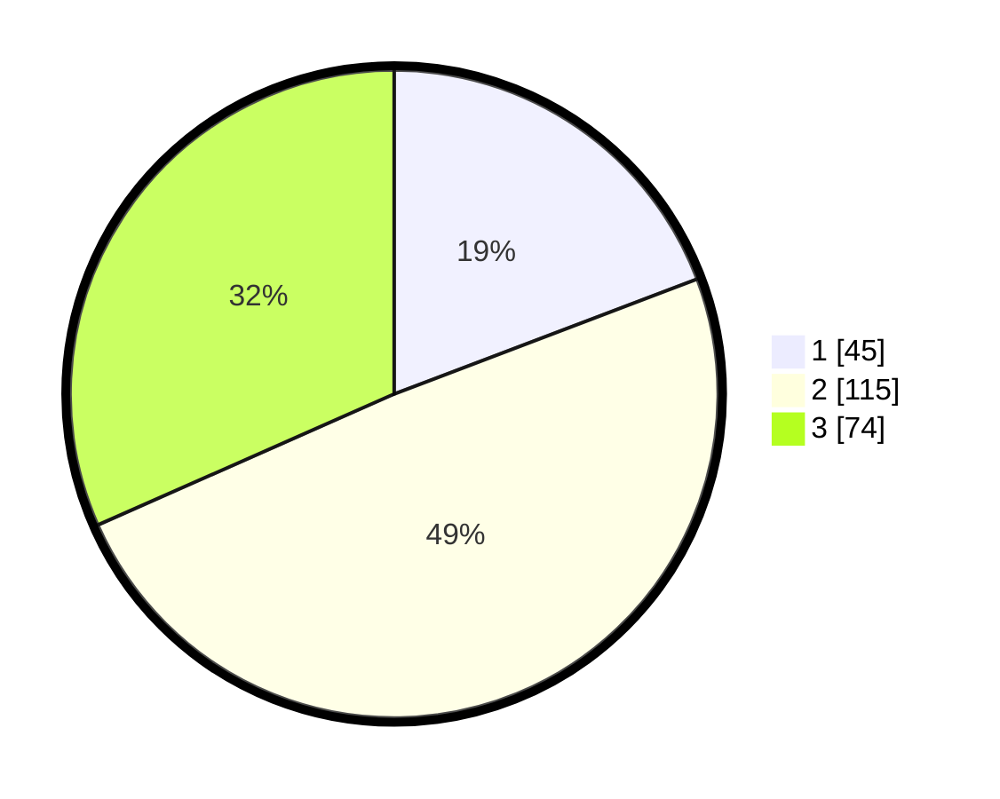

# Hasil

## Grafik

## Tabel

| No. | Nama Paslon    | Suara | Suara (raw) | Persentase |
|:--- |:-------------- | -----:| -----------:| ----------:|
| 1   | ANIES MUHAIMIN | 45    | [45][p-1]   | 19,23      |
| 2   | PRABOWO GIBRAN | 115   | [115][p-2]  | 49,15      |
| 3   | GANJAR MAHFUD  | 74    | [74][p-3]   | 31,62      |

[p-1]: https://github.com/gigit-pemilu/pemilu-2024/blob/main/pilpres/hitung-suara/sub/33-jawa-tengah/sub/10-klaten/sub/22-ngawen/sub/2007-pepe/sub/001-tps/sub/paslon-1.txt
[p-2]: https://github.com/gigit-pemilu/pemilu-2024/blob/main/pilpres/hitung-suara/sub/33-jawa-tengah/sub/10-klaten/sub/22-ngawen/sub/2007-pepe/sub/001-tps/sub/paslon-2.txt
[p-3]: https://github.com/gigit-pemilu/pemilu-2024/blob/main/pilpres/hitung-suara/sub/33-jawa-tengah/sub/10-klaten/sub/22-ngawen/sub/2007-pepe/sub/001-tps/sub/paslon-3.txt

## Foto C Plano

https://sirekap-obj-formc.kpu.go.id/b91e/pemilu/ppwp/33/10/22/20/07/3310222007001-20240214-200940--a4bd1f84-2ef0-454e-bdc9-b2fe6586bd1f.jpg

https://sirekap-obj-formc.kpu.go.id/b91e/pemilu/ppwp/33/10/22/20/07/3310222007001-20240214-201321--b04f5d56-3b83-4416-8b64-f042d9d3a0b3.jpg

https://sirekap-obj-formc.kpu.go.id/b91e/pemilu/ppwp/33/10/22/20/07/3310222007001-20240214-201609--b9a4e06d-20d3-4987-9bf5-74d96c0556ae.jpg

## Metadata

| Key        | Value               |
| ---------- | ------------------- |
| Time Stamp | 2024-02-15 22:00:27 |

