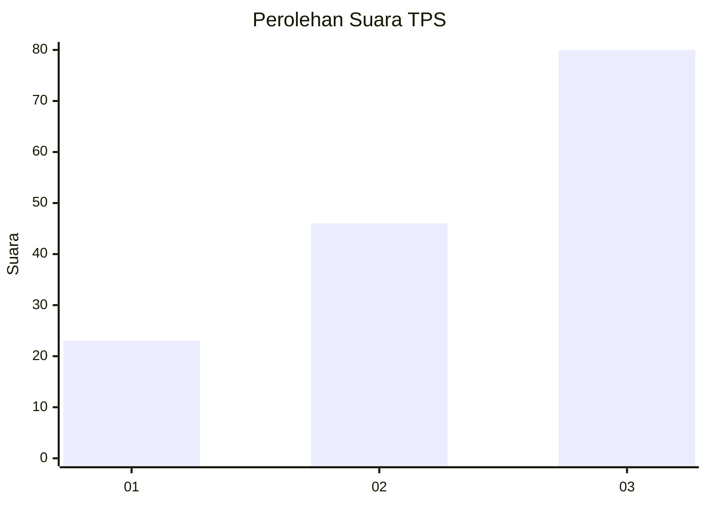
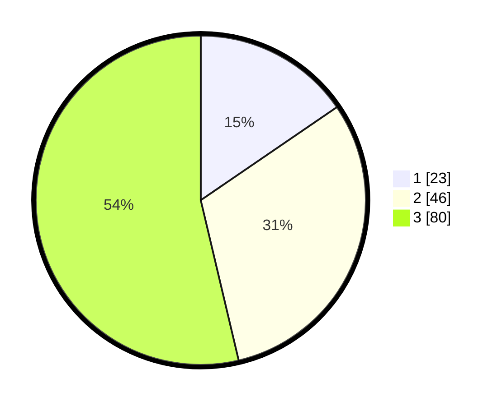

# Hasil

## Grafik

## Tabel

| No. | Nama Paslon    | Suara | Suara (raw) | Persentase |
|:--- |:-------------- | -----:| -----------:| ----------:|
| 1   | ANIES MUHAIMIN | 23    | [23][p-1]   | 15,44      |
| 2   | PRABOWO GIBRAN | 46    | [46][p-2]   | 30,87      |
| 3   | GANJAR MAHFUD  | 80    | [80][p-3]   | 53,69      |

[p-1]: https://github.com/gigit-pemilu/pemilu-2024/blob/main/pilpres/hitung-suara/sub/33-jawa-tengah/sub/10-klaten/sub/22-ngawen/sub/2007-pepe/sub/007-tps/sub/paslon-1.txt
[p-2]: https://github.com/gigit-pemilu/pemilu-2024/blob/main/pilpres/hitung-suara/sub/33-jawa-tengah/sub/10-klaten/sub/22-ngawen/sub/2007-pepe/sub/007-tps/sub/paslon-2.txt
[p-3]: https://github.com/gigit-pemilu/pemilu-2024/blob/main/pilpres/hitung-suara/sub/33-jawa-tengah/sub/10-klaten/sub/22-ngawen/sub/2007-pepe/sub/007-tps/sub/paslon-3.txt

## Foto C Plano

https://sirekap-obj-formc.kpu.go.id/0a8a/pemilu/ppwp/33/10/22/20/07/3310222007007-20240214-184750--3080ef0a-0977-45f1-9495-c06efb6fe5bb.jpg

https://sirekap-obj-formc.kpu.go.id/0a8a/pemilu/ppwp/33/10/22/20/07/3310222007007-20240214-184808--f5b49469-7a77-4448-8ee2-8a84271dc3a9.jpg

https://sirekap-obj-formc.kpu.go.id/0a8a/pemilu/ppwp/33/10/22/20/07/3310222007007-20240214-234806--99429984-01ce-453c-a0da-7809265ff28e.jpg

## Metadata

| Key        | Value               |
| ---------- | ------------------- |
| Time Stamp | 2024-02-15 12:00:28 |

