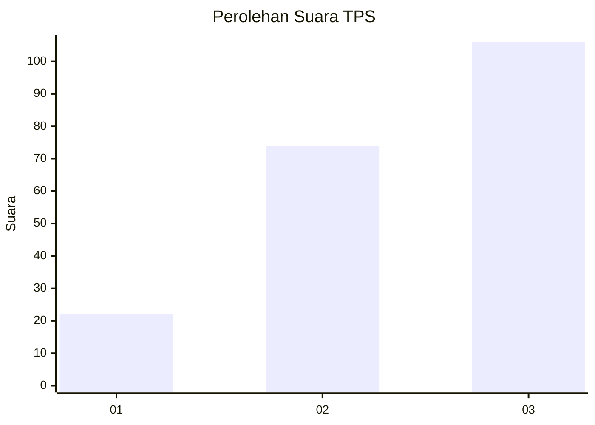
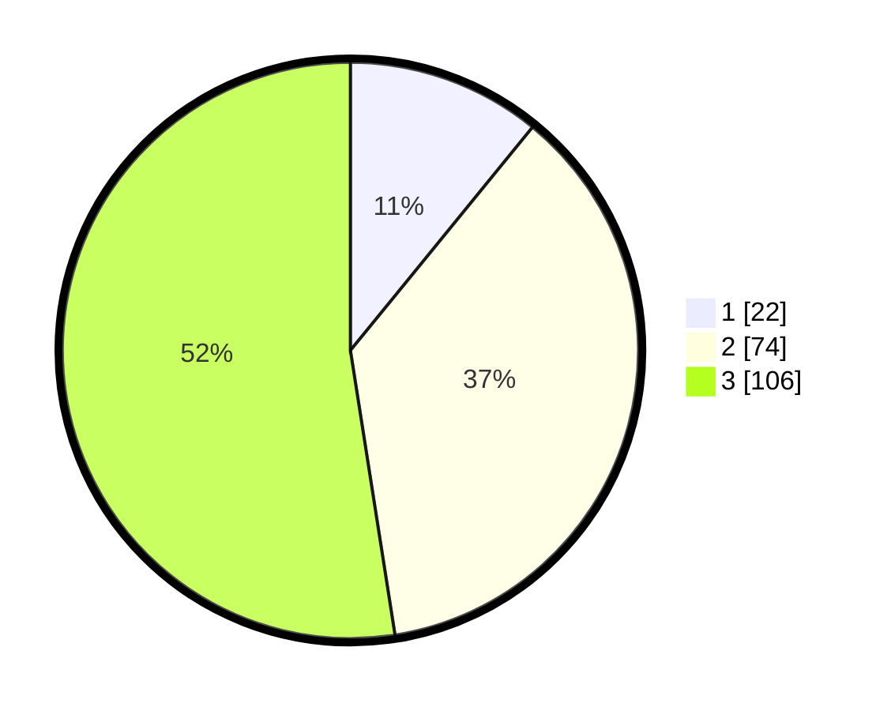

# Hasil

## Grafik

## Tabel

| No. | Nama Paslon    | Suara | Suara (raw) | Persentase |
|:--- |:-------------- | -----:| -----------:| ----------:|
| 1   | ANIES MUHAIMIN | 22    | [22][p-1]   | 10,89      |
| 2   | PRABOWO GIBRAN | 74    | [74][p-2]   | 36,63      |
| 3   | GANJAR MAHFUD  | 106   | [106][p-3]  | 52,48      |

[p-1]: https://github.com/gigit-pemilu/pemilu-2024-33-jawa-tengah/blob/main/pilpres/hitung-suara/sub/33-jawa-tengah/sub/10-klaten/sub/22-ngawen/sub/2008-manjungan/sub/004-tps/sub/paslon-1.txt
[p-2]: https://github.com/gigit-pemilu/pemilu-2024-33-jawa-tengah/blob/main/pilpres/hitung-suara/sub/33-jawa-tengah/sub/10-klaten/sub/22-ngawen/sub/2008-manjungan/sub/004-tps/sub/paslon-2.txt
[p-3]: https://github.com/gigit-pemilu/pemilu-2024-33-jawa-tengah/blob/main/pilpres/hitung-suara/sub/33-jawa-tengah/sub/10-klaten/sub/22-ngawen/sub/2008-manjungan/sub/004-tps/sub/paslon-3.txt

## Foto C Plano

https://sirekap-obj-formc.kpu.go.id/83f8/pemilu/ppwp/33/10/22/20/08/3310222008004-20240214-210434--e6fbdfa9-a8eb-4631-a5ce-f39c49f854a7.jpg

https://sirekap-obj-formc.kpu.go.id/83f8/pemilu/ppwp/33/10/22/20/08/3310222008004-20240214-160058--400cbe76-345e-4a5c-980c-792ac39c0122.jpg

https://sirekap-obj-formc.kpu.go.id/83f8/pemilu/ppwp/33/10/22/20/08/3310222008004-20240214-155747--91e7432c-dfa7-41b1-bd8c-d47c5e3a147a.jpg

## Metadata

| Key        | Value               |
| ---------- | ------------------- |
| Time Stamp | 2024-02-19 06:16:00 |

