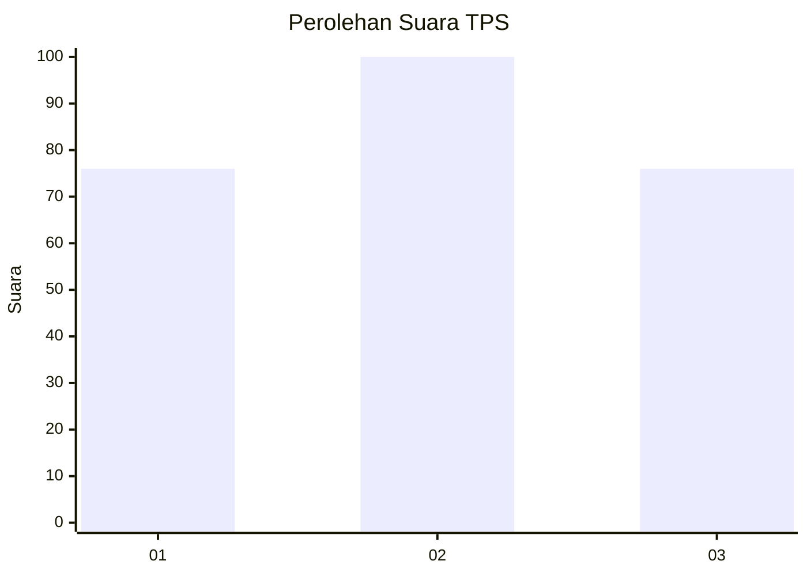
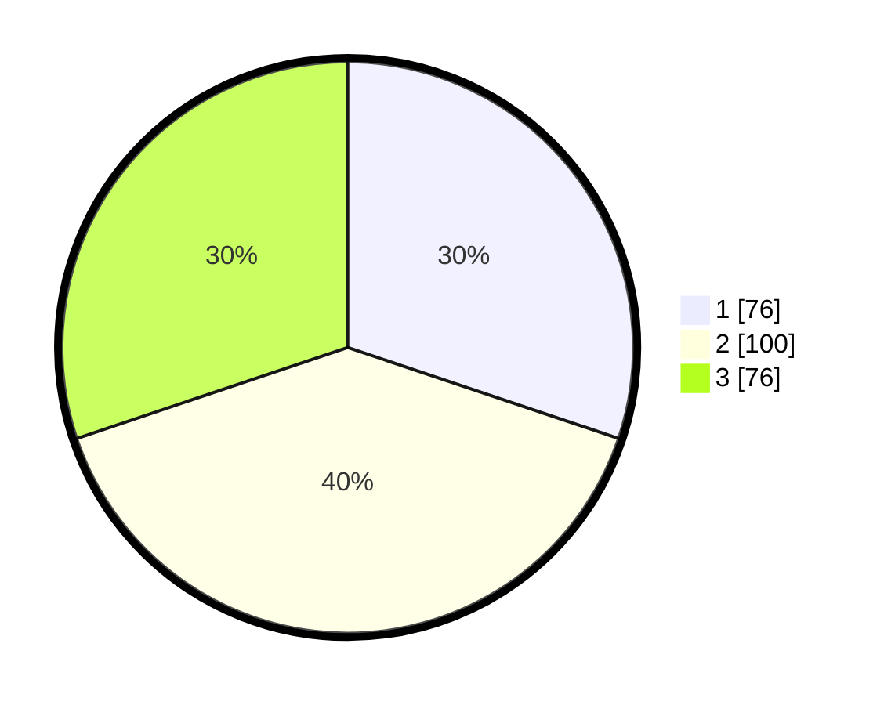

# Hasil

## Grafik

## Tabel

| No. | Nama Paslon    | Suara | Suara (raw) | Persentase |
|:--- |:-------------- | -----:| -----------:| ----------:|
| 1   | ANIES MUHAIMIN | 76    | [76][p-1]   | 30,16      |
| 2   | PRABOWO GIBRAN | 100   | [100][p-2]  | 39,68      |
| 3   | GANJAR MAHFUD  | 76    | [76][p-3]   | 30,16      |

[p-1]: https://github.com/gigit-pemilu/pemilu-2024-33-jawa-tengah/blob/main/pilpres/hitung-suara/sub/33-jawa-tengah/sub/10-klaten/sub/22-ngawen/sub/2010-mayungan/sub/005-tps/sub/paslon-1.txt
[p-2]: https://github.com/gigit-pemilu/pemilu-2024-33-jawa-tengah/blob/main/pilpres/hitung-suara/sub/33-jawa-tengah/sub/10-klaten/sub/22-ngawen/sub/2010-mayungan/sub/005-tps/sub/paslon-2.txt
[p-3]: https://github.com/gigit-pemilu/pemilu-2024-33-jawa-tengah/blob/main/pilpres/hitung-suara/sub/33-jawa-tengah/sub/10-klaten/sub/22-ngawen/sub/2010-mayungan/sub/005-tps/sub/paslon-3.txt

## Foto C Plano

https://sirekap-obj-formc.kpu.go.id/3f42/pemilu/ppwp/33/10/22/20/10/3310222010005-20240214-215824--1f6649b6-d836-4266-8c1d-0cf44bf455f3.jpg

https://sirekap-obj-formc.kpu.go.id/3f42/pemilu/ppwp/33/10/22/20/10/3310222010005-20240214-224432--f5974c78-4150-4c8a-8dd7-b35710242f09.jpg

https://sirekap-obj-formc.kpu.go.id/3f42/pemilu/ppwp/33/10/22/20/10/3310222010005-20240214-215836--426dc2bf-0c37-4fa6-bfad-87bec9f71b1d.jpg

## Metadata

| Key        | Value               |
| ---------- | ------------------- |
| Time Stamp | 2024-02-15 12:00:28 |

