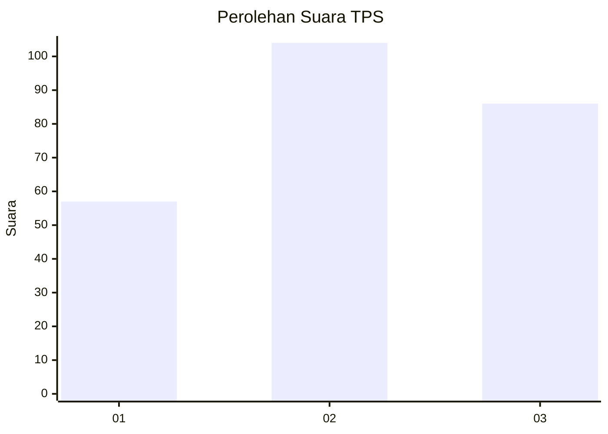
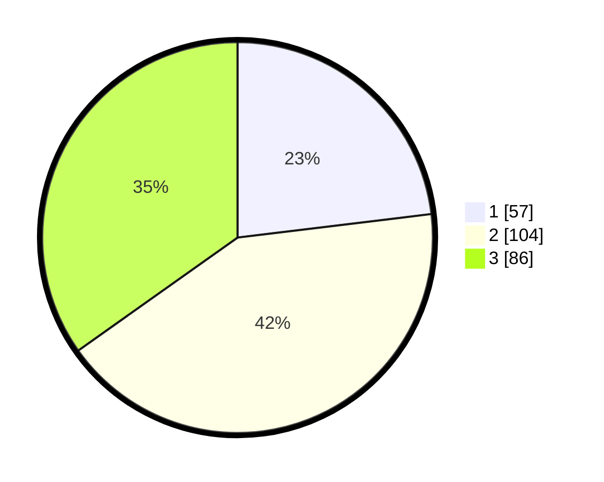

# Hasil

## Grafik

## Tabel

| No. | Nama Paslon    | Suara | Suara (raw) | Persentase |
|:--- |:-------------- | -----:| -----------:| ----------:|
| 1   | ANIES MUHAIMIN | 57    | [57][p-1]   | 23,08      |
| 2   | PRABOWO GIBRAN | 104   | [104][p-2]  | 42,11      |
| 3   | GANJAR MAHFUD  | 86    | [86][p-3]   | 34,82      |

[p-1]: https://github.com/gigit-pemilu/pemilu-2024/blob/main/pilpres/hitung-suara/sub/33-jawa-tengah/sub/10-klaten/sub/22-ngawen/sub/2011-tempursari/sub/010-tps/sub/paslon-1.txt
[p-2]: https://github.com/gigit-pemilu/pemilu-2024/blob/main/pilpres/hitung-suara/sub/33-jawa-tengah/sub/10-klaten/sub/22-ngawen/sub/2011-tempursari/sub/010-tps/sub/paslon-2.txt
[p-3]: https://github.com/gigit-pemilu/pemilu-2024/blob/main/pilpres/hitung-suara/sub/33-jawa-tengah/sub/10-klaten/sub/22-ngawen/sub/2011-tempursari/sub/010-tps/sub/paslon-3.txt

## Foto C Plano

https://sirekap-obj-formc.kpu.go.id/819a/pemilu/ppwp/33/10/22/20/11/3310222011010-20240215-010034--be3e10e0-773f-4361-b68a-74a1a653c453.jpg

https://sirekap-obj-formc.kpu.go.id/819a/pemilu/ppwp/33/10/22/20/11/3310222011010-20240215-010116--5ae8c564-47ce-4748-8910-3d914d1f2a85.jpg

https://sirekap-obj-formc.kpu.go.id/819a/pemilu/ppwp/33/10/22/20/11/3310222011010-20240215-010201--fdd4336b-5b24-403c-9083-d3a3f3fc7d74.jpg

## Metadata

| Key        | Value               |
| ---------- | ------------------- |
| Time Stamp | 2024-02-16 16:25:10 |

