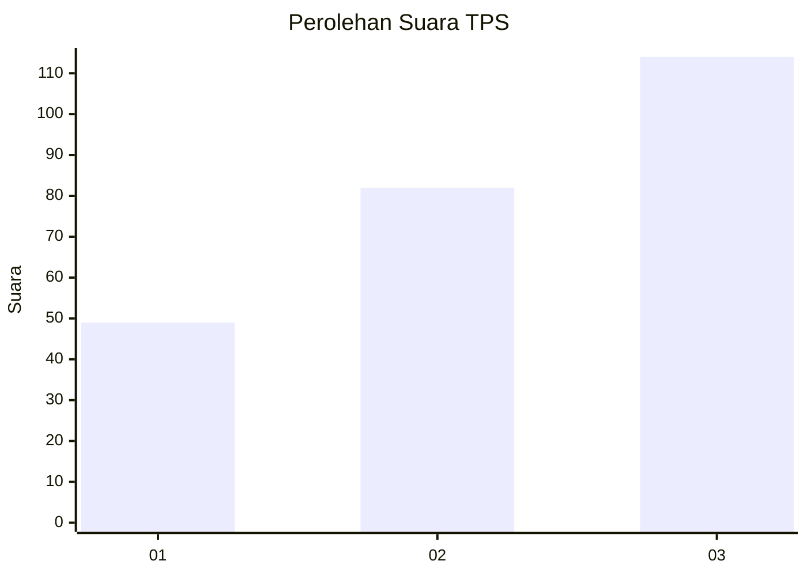
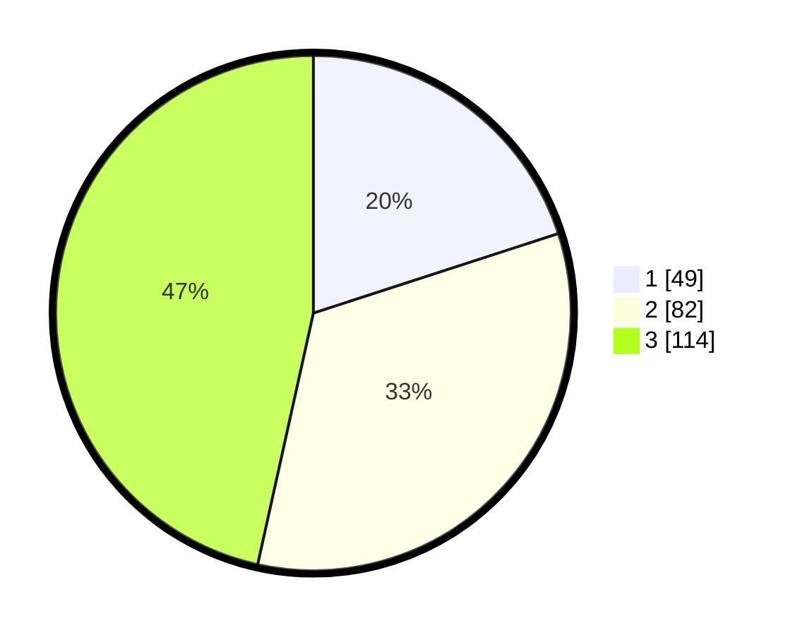

# Hasil

## Grafik

## Tabel

| No. | Nama Paslon    | Suara | Suara (raw) | Persentase |
|:--- |:-------------- | -----:| -----------:| ----------:|
| 1   | ANIES MUHAIMIN | 49    | [49][p-1]   | 20,00      |
| 2   | PRABOWO GIBRAN | 82    | [82][p-2]   | 33,47      |
| 3   | GANJAR MAHFUD  | 114   | [114][p-3]  | 46,53      |

[p-1]: https://github.com/gigit-pemilu/pemilu-2024-33-jawa-tengah/blob/main/pilpres/hitung-suara/sub/33-jawa-tengah/sub/10-klaten/sub/22-ngawen/sub/2012-candirejo/sub/005-tps/sub/paslon-1.txt
[p-2]: https://github.com/gigit-pemilu/pemilu-2024-33-jawa-tengah/blob/main/pilpres/hitung-suara/sub/33-jawa-tengah/sub/10-klaten/sub/22-ngawen/sub/2012-candirejo/sub/005-tps/sub/paslon-2.txt
[p-3]: https://github.com/gigit-pemilu/pemilu-2024-33-jawa-tengah/blob/main/pilpres/hitung-suara/sub/33-jawa-tengah/sub/10-klaten/sub/22-ngawen/sub/2012-candirejo/sub/005-tps/sub/paslon-3.txt

## Foto C Plano

https://sirekap-obj-formc.kpu.go.id/85fb/pemilu/ppwp/33/10/22/20/12/3310222012005-20240215-020158--79d4084a-c01d-43b6-9e94-b39fe8603e59.jpg

https://sirekap-obj-formc.kpu.go.id/85fb/pemilu/ppwp/33/10/22/20/12/3310222012005-20240215-020449--c221cdcd-142f-4a15-8a6e-f71c854e1dd6.jpg

https://sirekap-obj-formc.kpu.go.id/85fb/pemilu/ppwp/33/10/22/20/12/3310222012005-20240215-020627--8f5fefbe-24c8-4743-acbc-50e95c2d78c1.jpg

## Metadata

| Key        | Value               |
| ---------- | ------------------- |
| Time Stamp | 2024-02-16 16:25:10 |

