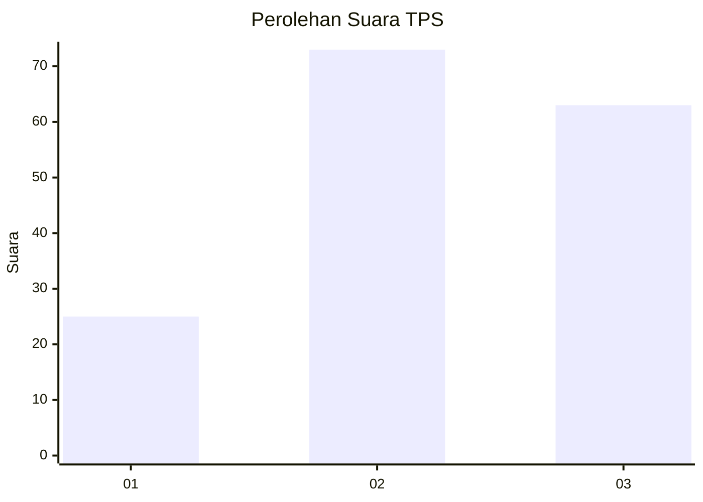
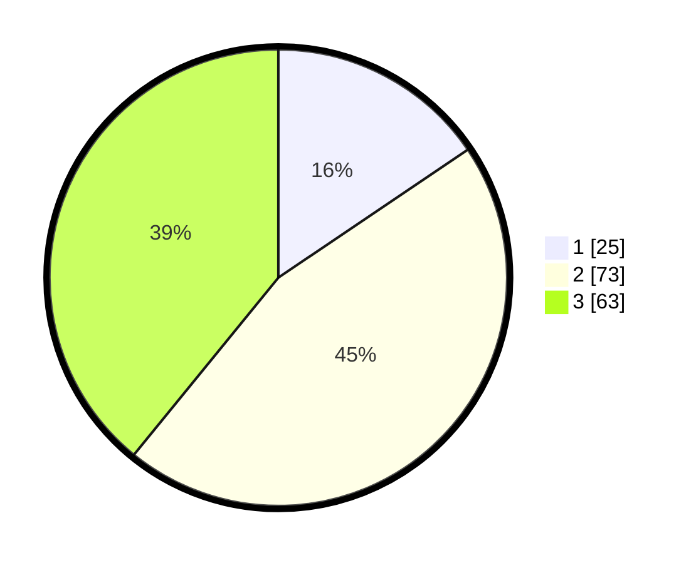

# Hasil

## Grafik

## Tabel

| No. | Nama Paslon    | Suara | Suara (raw) | Persentase |
|:--- |:-------------- | -----:| -----------:| ----------:|
| 1   | ANIES MUHAIMIN | 25    | [25][p-1]   | 15,53      |
| 2   | PRABOWO GIBRAN | 73    | [73][p-2]   | 45,34      |
| 3   | GANJAR MAHFUD  | 63    | [63][p-3]   | 39,13      |

[p-1]: https://github.com/gigit-pemilu/pemilu-2024-33-jawa-tengah/blob/main/pilpres/hitung-suara/sub/33-jawa-tengah/sub/10-klaten/sub/23-kalikotes/sub/2001-jimbung/sub/035-tps/sub/paslon-1.txt
[p-2]: https://github.com/gigit-pemilu/pemilu-2024-33-jawa-tengah/blob/main/pilpres/hitung-suara/sub/33-jawa-tengah/sub/10-klaten/sub/23-kalikotes/sub/2001-jimbung/sub/035-tps/sub/paslon-2.txt
[p-3]: https://github.com/gigit-pemilu/pemilu-2024-33-jawa-tengah/blob/main/pilpres/hitung-suara/sub/33-jawa-tengah/sub/10-klaten/sub/23-kalikotes/sub/2001-jimbung/sub/035-tps/sub/paslon-3.txt

## Foto C Plano

https://sirekap-obj-formc.kpu.go.id/b2a2/pemilu/ppwp/33/10/23/20/01/3310232001035-20240218-164909--b982d0b7-851f-478b-8c9a-51a160384c28.jpg

https://sirekap-obj-formc.kpu.go.id/b2a2/pemilu/ppwp/33/10/23/20/01/3310232001035-20240218-165018--7cd11138-a513-4a7e-8511-84d3b4a3098d.jpg

https://sirekap-obj-formc.kpu.go.id/b2a2/pemilu/ppwp/33/10/23/20/01/3310232001035-20240218-165043--78c308db-ad81-4a00-81a7-e0b09fe99d8e.jpg

## Metadata

| Key        | Value               |
| ---------- | ------------------- |
| Time Stamp | 2024-02-20 12:00:00 |

## DATA PEMILIH TETAP

Jumlah pemilih dalam DPT: **693**.
 * L: **296**.
 * P: **697**.

## DATA PENGGUNA HAK PILIH

Jumlah pengguna hak pilih dalam DPT: **864**.
 * L: **238**.
 * P: **223**.

Jumlah pengguna hak pilih dalam DPTb: **365**.
 * L: **663**.
 * P: **626**.

Jumlah pengguna hak pilih dalam DPK: **296**.
 * L: **282**.
 * P: **666**.

Jumlah pengguna hak pilih: **59**.
 * L: **663**.
 * P: **833**.

## JUMLAH SUARA SAH DAN TIDAK SAH

JUMLAH SELURUH SUARA SAH: **161**.

JUMLAH SUARA TIDAK SAH: **3**.

JUMLAH SELURUH SUARA SAH DAN SUARA TIDAK SAH: **164**.

