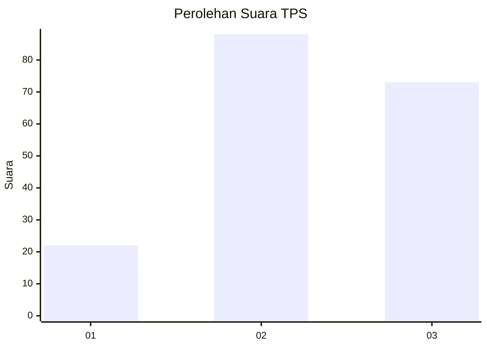
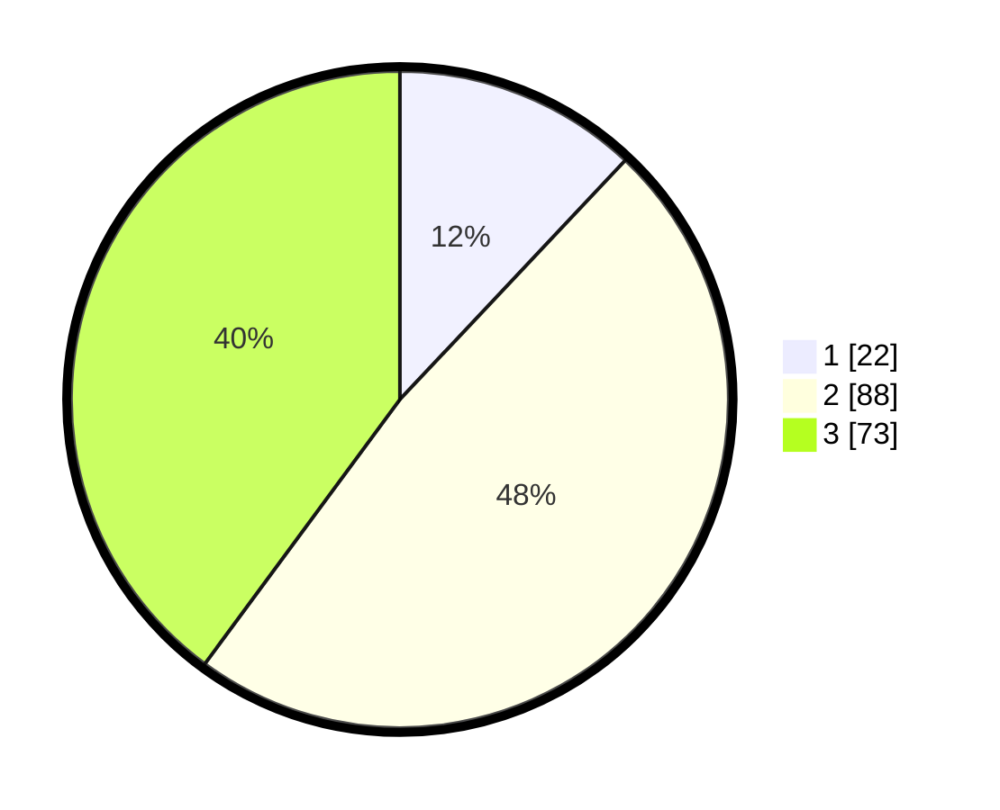

# Hasil

## Grafik

## Tabel

| No. | Nama Paslon    | Suara | Suara (raw) | Persentase |
|:--- |:-------------- | -----:| -----------:| ----------:|
| 1   | ANIES MUHAIMIN | 22    | [22][p-1]   | 12,02      |
| 2   | PRABOWO GIBRAN | 88    | [88][p-2]   | 48,09      |
| 3   | GANJAR MAHFUD  | 73    | [73][p-3]   | 39,89      |

[p-1]: https://github.com/gigit-pemilu/pemilu-2024/blob/main/pilpres/hitung-suara/sub/33-jawa-tengah/sub/10-klaten/sub/23-kalikotes/sub/2002-ngemplak/sub/004-tps/sub/paslon-1.txt
[p-2]: https://github.com/gigit-pemilu/pemilu-2024/blob/main/pilpres/hitung-suara/sub/33-jawa-tengah/sub/10-klaten/sub/23-kalikotes/sub/2002-ngemplak/sub/004-tps/sub/paslon-2.txt
[p-3]: https://github.com/gigit-pemilu/pemilu-2024/blob/main/pilpres/hitung-suara/sub/33-jawa-tengah/sub/10-klaten/sub/23-kalikotes/sub/2002-ngemplak/sub/004-tps/sub/paslon-3.txt

## Foto C Plano

https://sirekap-obj-formc.kpu.go.id/da57/pemilu/ppwp/33/10/23/20/02/3310232002004-20240218-170320--b486cd93-6436-4e63-8e8f-207f9f20ed5e.jpg

https://sirekap-obj-formc.kpu.go.id/da57/pemilu/ppwp/33/10/23/20/02/3310232002004-20240218-170346--b8237a2d-ceaf-4c5d-ac91-6bab334e9306.jpg

https://sirekap-obj-formc.kpu.go.id/da57/pemilu/ppwp/33/10/23/20/02/3310232002004-20240218-170438--385d91cd-7f1d-4ccd-8bd4-8fadb6a857dc.jpg

## Metadata

| Key        | Value               |
| ---------- | ------------------- |
| Time Stamp | 2024-02-19 06:16:00 |

## DATA PEMILIH TETAP

Jumlah pemilih dalam DPT: **257**.
 * L: **106**.
 * P: **861**.

## DATA PENGGUNA HAK PILIH

Jumlah pengguna hak pilih dalam DPT: **522**.
 * L: **85**.
 * P: **97**.

Jumlah pengguna hak pilih dalam DPTb: **6**.
 * L: **0**.
 * P: **0**.

Jumlah pengguna hak pilih dalam DPK: **0**.
 * L: **0**.
 * P: **800**.

Jumlah pengguna hak pilih: **186**.
 * L: **24**.
 * P: **42**.

## JUMLAH SUARA SAH DAN TIDAK SAH

JUMLAH SELURUH SUARA SAH: **333**.

JUMLAH SUARA TIDAK SAH: **33**.

JUMLAH SELURUH SUARA SAH DAN SUARA TIDAK SAH: **186**.

