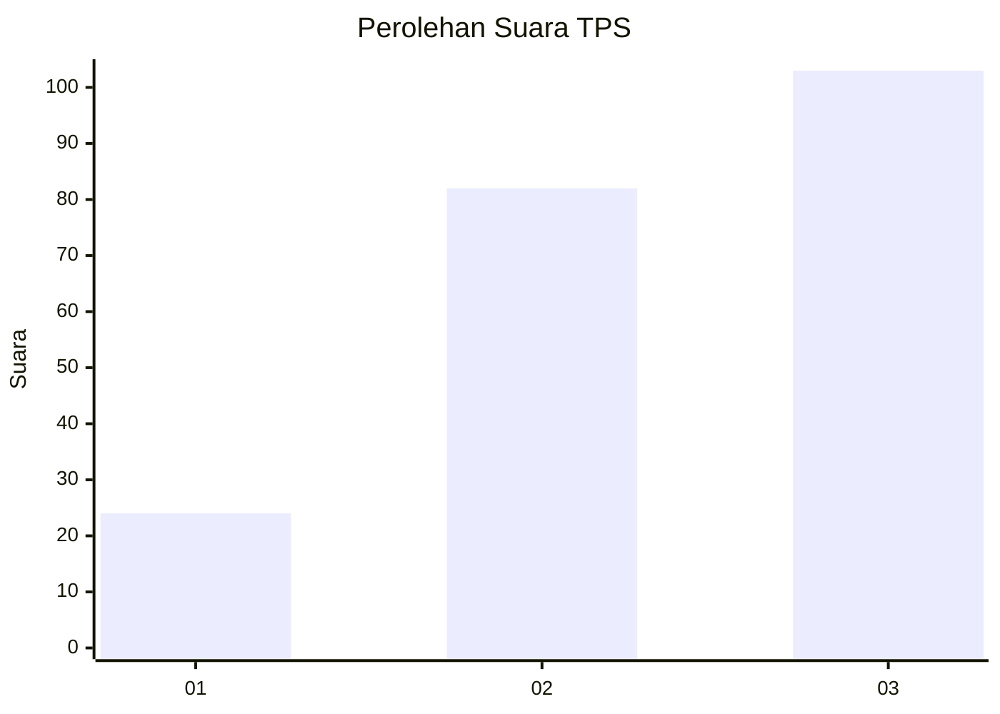
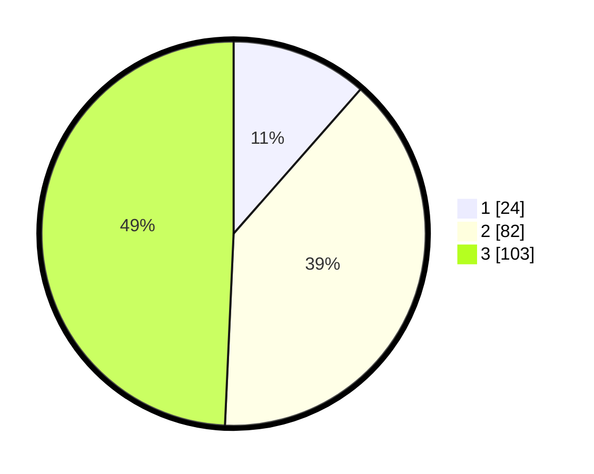

# Hasil

## Grafik

## Tabel

| No. | Nama Paslon    | Suara | Suara (raw) | Persentase |
|:--- |:-------------- | -----:| -----------:| ----------:|
| 1   | ANIES MUHAIMIN | 24    | [24][p-1]   | 11,48      |
| 2   | PRABOWO GIBRAN | 82    | [82][p-2]   | 39,23      |
| 3   | GANJAR MAHFUD  | 103   | [103][p-3]  | 49,28      |

[p-1]: https://github.com/gigit-pemilu/pemilu-2024-33-jawa-tengah/blob/main/pilpres/hitung-suara/sub/33-jawa-tengah/sub/10-klaten/sub/23-kalikotes/sub/2003-kalikotes/sub/005-tps/sub/paslon-1.txt
[p-2]: https://github.com/gigit-pemilu/pemilu-2024-33-jawa-tengah/blob/main/pilpres/hitung-suara/sub/33-jawa-tengah/sub/10-klaten/sub/23-kalikotes/sub/2003-kalikotes/sub/005-tps/sub/paslon-2.txt
[p-3]: https://github.com/gigit-pemilu/pemilu-2024-33-jawa-tengah/blob/main/pilpres/hitung-suara/sub/33-jawa-tengah/sub/10-klaten/sub/23-kalikotes/sub/2003-kalikotes/sub/005-tps/sub/paslon-3.txt

## Foto C Plano

https://sirekap-obj-formc.kpu.go.id/a713/pemilu/ppwp/33/10/23/20/03/3310232003005-20240218-165611--80c9336a-be2f-49f0-8d3c-2809c6ff9972.jpg

https://sirekap-obj-formc.kpu.go.id/a713/pemilu/ppwp/33/10/23/20/03/3310232003005-20240218-170008--d8f3517c-65f5-41a9-9964-762865f98163.jpg

https://sirekap-obj-formc.kpu.go.id/a713/pemilu/ppwp/33/10/23/20/03/3310232003005-20240218-170141--40c8b71d-7b2a-4815-b247-0b82732ae03b.jpg

## Metadata

| Key        | Value               |
| ---------- | ------------------- |
| Time Stamp | 2024-02-19 19:00:00 |

## DATA PEMILIH TETAP

Jumlah pemilih dalam DPT: **50**.
 * L: **452**.
 * P: **222**.

## DATA PENGGUNA HAK PILIH

Jumlah pengguna hak pilih dalam DPT: **588**.
 * L: **222**.
 * P: **257**.

Jumlah pengguna hak pilih dalam DPTb: **0**.
 * L: **600**.
 * P: **0**.

Jumlah pengguna hak pilih dalam DPK: **260**.
 * L: **99**.
 * P: **62**.

Jumlah pengguna hak pilih: **0**.
 * L: **575**.
 * P: **50**.

## JUMLAH SUARA SAH DAN TIDAK SAH

JUMLAH SELURUH SUARA SAH: **209**.

JUMLAH SUARA TIDAK SAH: **2**.

JUMLAH SELURUH SUARA SAH DAN SUARA TIDAK SAH: **211**.

