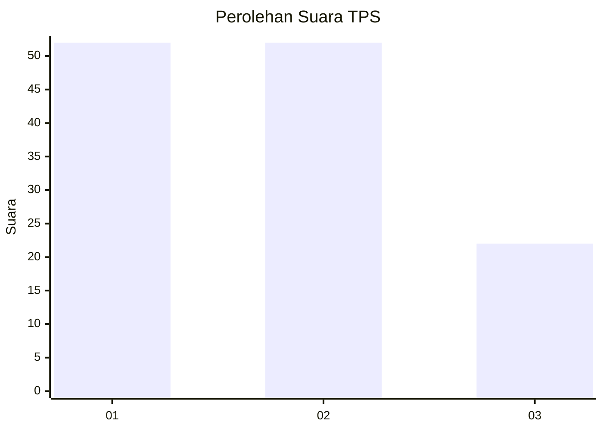
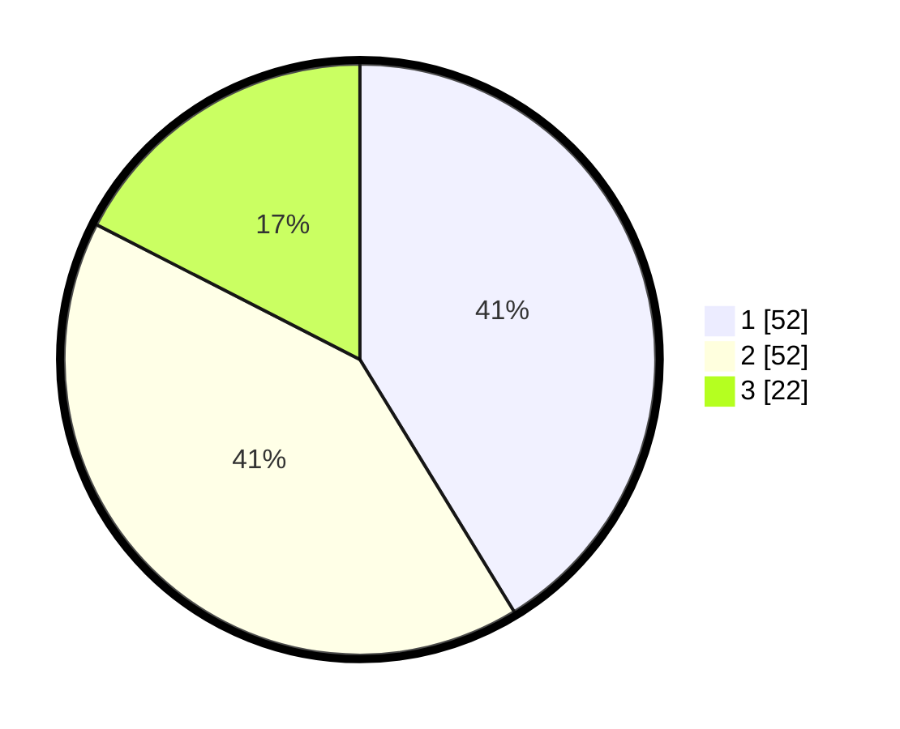

# Hasil

## Grafik

## Tabel

| No. | Nama Paslon    | Suara | Suara (raw) | Persentase |
|:--- |:-------------- | -----:| -----------:| ----------:|
| 1   | ANIES MUHAIMIN | 52    | [52][p-1]   | 41,27      |
| 2   | PRABOWO GIBRAN | 52    | [52][p-2]   | 41,27      |
| 3   | GANJAR MAHFUD  | 22    | [22][p-3]   | 17,46      |

[p-1]: https://github.com/gigit-pemilu/pemilu-2024/blob/main/pilpres/hitung-suara/sub/33-jawa-tengah/sub/10-klaten/sub/23-kalikotes/sub/2007-gemblegan/sub/004-tps/sub/paslon-1.txt
[p-2]: https://github.com/gigit-pemilu/pemilu-2024/blob/main/pilpres/hitung-suara/sub/33-jawa-tengah/sub/10-klaten/sub/23-kalikotes/sub/2007-gemblegan/sub/004-tps/sub/paslon-2.txt
[p-3]: https://github.com/gigit-pemilu/pemilu-2024/blob/main/pilpres/hitung-suara/sub/33-jawa-tengah/sub/10-klaten/sub/23-kalikotes/sub/2007-gemblegan/sub/004-tps/sub/paslon-3.txt

## Foto C Plano

https://sirekap-obj-formc.kpu.go.id/463b/pemilu/ppwp/33/10/23/20/07/3310232007004-20240220-140855--9677be18-17de-47a1-b627-89cc96f33446.jpg

https://sirekap-obj-formc.kpu.go.id/463b/pemilu/ppwp/33/10/23/20/07/3310232007004-20240220-131211--86ac8fe0-7731-43be-a483-db49f25f8f08.jpg

https://sirekap-obj-formc.kpu.go.id/463b/pemilu/ppwp/33/10/23/20/07/3310232007004-20240220-131231--cf4d1e8d-cee3-4fcb-9ac1-a45676e8576e.jpg

## Metadata

| Key        | Value               |
| ---------- | ------------------- |
| Time Stamp | 2024-02-20 15:00:00 |

