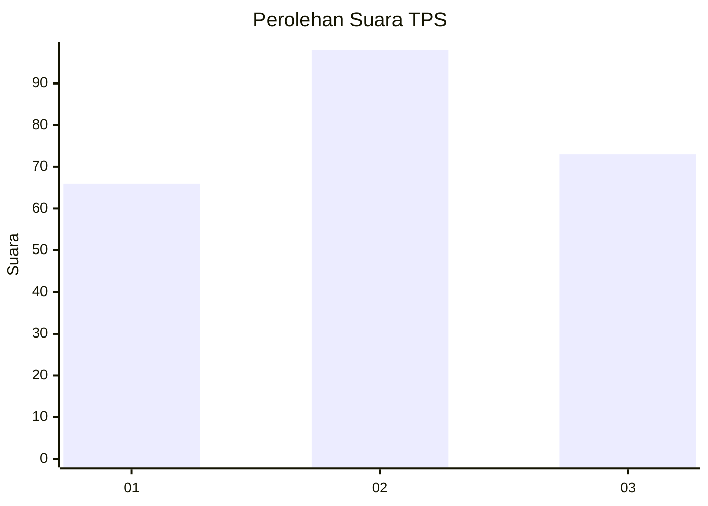
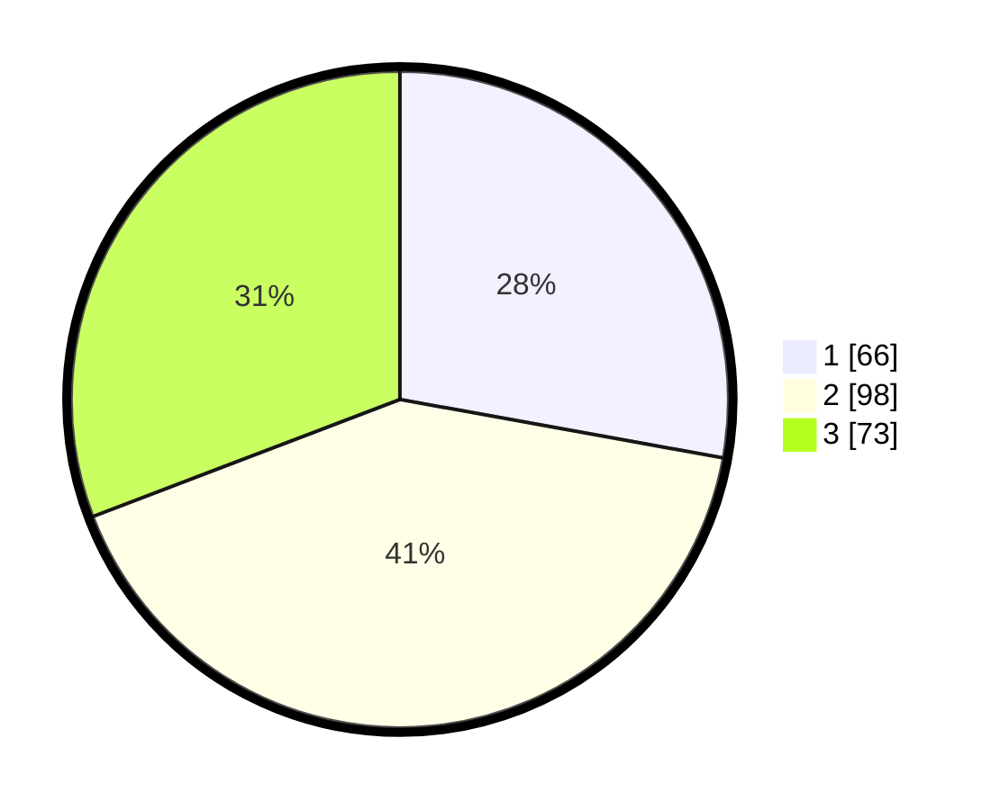

# Hasil

## Grafik

## Tabel

| No. | Nama Paslon    | Suara | Suara (raw) | Persentase |
|:--- |:-------------- | -----:| -----------:| ----------:|
| 1   | ANIES MUHAIMIN | 66    | [66][p-1]   | 27,85      |
| 2   | PRABOWO GIBRAN | 98    | [98][p-2]   | 41,35      |
| 3   | GANJAR MAHFUD  | 73    | [73][p-3]   | 30,80      |

[p-1]: https://github.com/gigit-pemilu/pemilu-2024-33-jawa-tengah/blob/main/pilpres/hitung-suara/sub/33-jawa-tengah/sub/10-klaten/sub/24-klaten-utara/sub/1002-barenglor/sub/014-tps/sub/paslon-1.txt
[p-2]: https://github.com/gigit-pemilu/pemilu-2024-33-jawa-tengah/blob/main/pilpres/hitung-suara/sub/33-jawa-tengah/sub/10-klaten/sub/24-klaten-utara/sub/1002-barenglor/sub/014-tps/sub/paslon-2.txt
[p-3]: https://github.com/gigit-pemilu/pemilu-2024-33-jawa-tengah/blob/main/pilpres/hitung-suara/sub/33-jawa-tengah/sub/10-klaten/sub/24-klaten-utara/sub/1002-barenglor/sub/014-tps/sub/paslon-3.txt

## Foto C Plano

https://sirekap-obj-formc.kpu.go.id/8f0f/pemilu/ppwp/33/10/24/10/02/3310241002014-20240217-153021--31be222d-5869-4fd3-93ab-282105452dde.jpg

https://sirekap-obj-formc.kpu.go.id/8f0f/pemilu/ppwp/33/10/24/10/02/3310241002014-20240217-152609--3e8765a4-dc29-40fb-a2c5-824f78ef0293.jpg

https://sirekap-obj-formc.kpu.go.id/8f0f/pemilu/ppwp/33/10/24/10/02/3310241002014-20240217-152213--c4d21c74-9a8a-45b2-b09c-348cc14c4316.jpg

## Metadata

| Key        | Value               |
| ---------- | ------------------- |
| Time Stamp | 2024-02-19 11:00:00 |

## DATA PEMILIH TETAP

Jumlah pemilih dalam DPT: **273**.
 * L: **439**.
 * P: **443**.

## DATA PENGGUNA HAK PILIH

Jumlah pengguna hak pilih dalam DPT: **232**.
 * L: **63**.
 * P: **435**.

Jumlah pengguna hak pilih dalam DPTb: **885**.
 * L: **885**.
 * P: **885**.

Jumlah pengguna hak pilih dalam DPK: **886**.
 * L: **84**.
 * P: **282**.

Jumlah pengguna hak pilih: **240**.
 * L: **2**.
 * P: **428**.

## JUMLAH SUARA SAH DAN TIDAK SAH

JUMLAH SELURUH SUARA SAH: **237**.

JUMLAH SUARA TIDAK SAH: **3**.

JUMLAH SELURUH SUARA SAH DAN SUARA TIDAK SAH: **240**.

