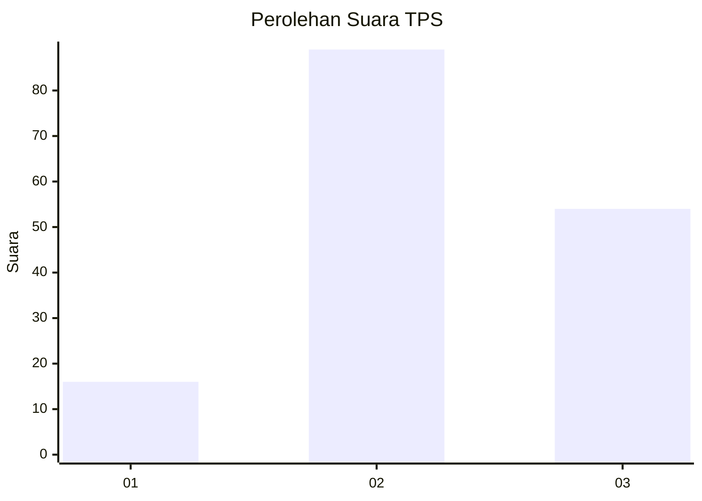
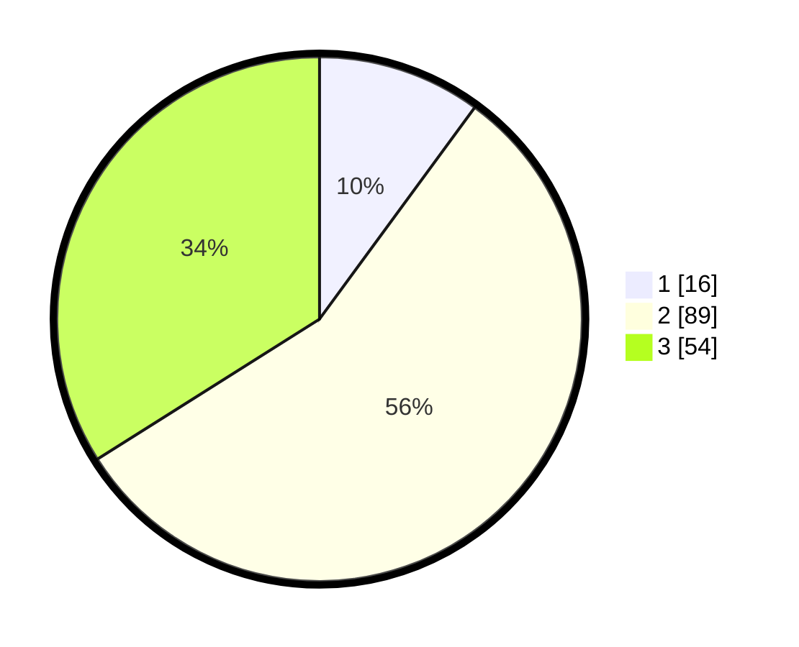

# Hasil

## Grafik

## Tabel

| No. | Nama Paslon    | Suara | Suara (raw) | Persentase |
|:--- |:-------------- | -----:| -----------:| ----------:|
| 1   | ANIES MUHAIMIN | 16    | [16][p-1]   | 10,06      |
| 2   | PRABOWO GIBRAN | 89    | [89][p-2]   | 55,97      |
| 3   | GANJAR MAHFUD  | 54    | [54][p-3]   | 33,96      |

[p-1]: https://github.com/gigit-pemilu/pemilu-2024-33-jawa-tengah/blob/main/pilpres/hitung-suara/sub/33-jawa-tengah/sub/10-klaten/sub/24-klaten-utara/sub/2008-jebugan/sub/005-tps/sub/paslon-1.txt
[p-2]: https://github.com/gigit-pemilu/pemilu-2024-33-jawa-tengah/blob/main/pilpres/hitung-suara/sub/33-jawa-tengah/sub/10-klaten/sub/24-klaten-utara/sub/2008-jebugan/sub/005-tps/sub/paslon-2.txt
[p-3]: https://github.com/gigit-pemilu/pemilu-2024-33-jawa-tengah/blob/main/pilpres/hitung-suara/sub/33-jawa-tengah/sub/10-klaten/sub/24-klaten-utara/sub/2008-jebugan/sub/005-tps/sub/paslon-3.txt

## Foto C Plano

https://sirekap-obj-formc.kpu.go.id/fa13/pemilu/ppwp/33/10/24/20/08/3310242008005-20240216-154835--52217741-e2b0-4fda-9270-fc26d283a2f6.jpg

https://sirekap-obj-formc.kpu.go.id/fa13/pemilu/ppwp/33/10/24/20/08/3310242008005-20240217-162608--5bfcfcd6-061b-4dd7-bb7e-0d94250dfa36.jpg

https://sirekap-obj-formc.kpu.go.id/fa13/pemilu/ppwp/33/10/24/20/08/3310242008005-20240216-213916--f515df66-1cc8-4ad5-ba94-d14412c781de.jpg

## Metadata

| Key        | Value               |
| ---------- | ------------------- |
| Time Stamp | 2024-02-20 11:00:00 |

