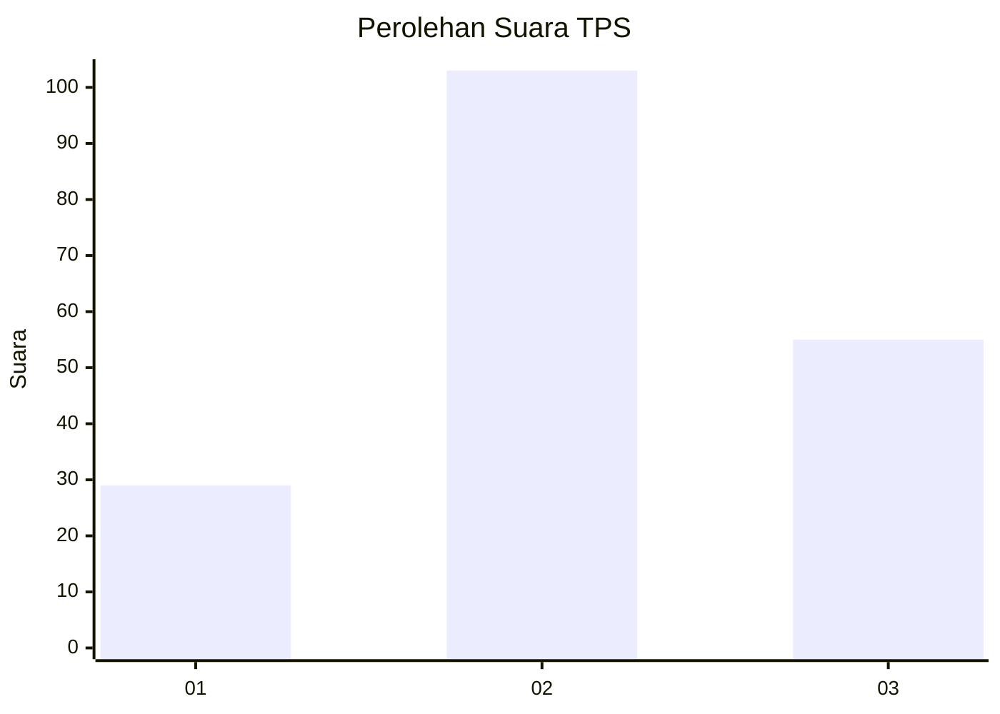
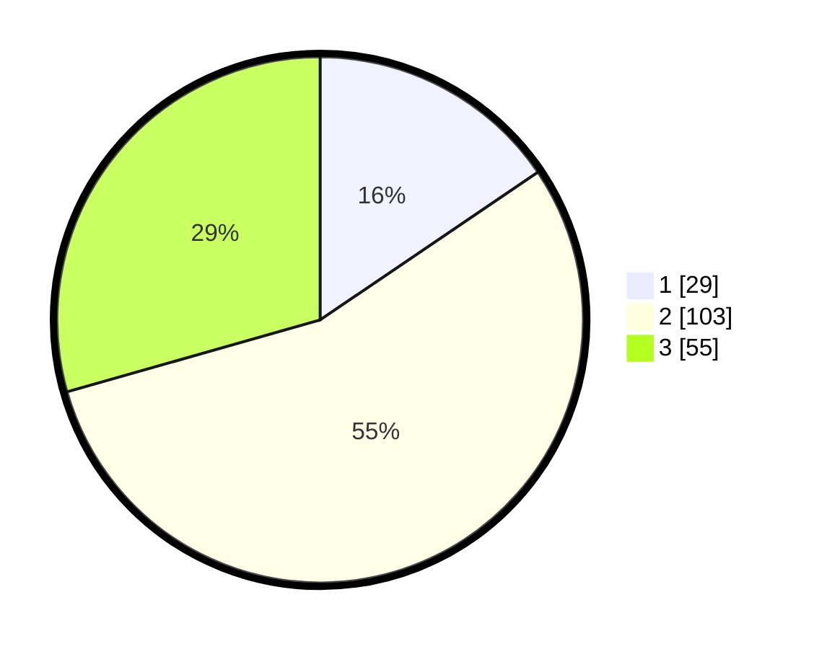

# Hasil

## Grafik

## Tabel

| No. | Nama Paslon    | Suara | Suara (raw) | Persentase |
|:--- |:-------------- | -----:| -----------:| ----------:|
| 1   | ANIES MUHAIMIN | 29    | [29][p-1]   | 15,51      |
| 2   | PRABOWO GIBRAN | 103   | [103][p-2]  | 55,08      |
| 3   | GANJAR MAHFUD  | 55    | [55][p-3]   | 29,41      |

[p-1]: https://github.com/gigit-pemilu/pemilu-2024-33-jawa-tengah/blob/main/pilpres/hitung-suara/sub/33-jawa-tengah/sub/10-klaten/sub/26-klaten-selatan/sub/1009-gayamprit/sub/003-tps/sub/paslon-1.txt
[p-2]: https://github.com/gigit-pemilu/pemilu-2024-33-jawa-tengah/blob/main/pilpres/hitung-suara/sub/33-jawa-tengah/sub/10-klaten/sub/26-klaten-selatan/sub/1009-gayamprit/sub/003-tps/sub/paslon-2.txt
[p-3]: https://github.com/gigit-pemilu/pemilu-2024-33-jawa-tengah/blob/main/pilpres/hitung-suara/sub/33-jawa-tengah/sub/10-klaten/sub/26-klaten-selatan/sub/1009-gayamprit/sub/003-tps/sub/paslon-3.txt

## Foto C Plano

https://sirekap-obj-formc.kpu.go.id/3258/pemilu/ppwp/33/10/26/10/09/3310261009003-20240215-012906--4ed992f7-2416-4229-a497-5a2f679c25ca.jpg

https://sirekap-obj-formc.kpu.go.id/3258/pemilu/ppwp/33/10/26/10/09/3310261009003-20240215-013040--95c98148-99a2-4390-a696-fcf4a1e7cdd6.jpg

https://sirekap-obj-formc.kpu.go.id/3258/pemilu/ppwp/33/10/26/10/09/3310261009003-20240215-013156--ecb31c61-8233-40db-ade5-6319b5a2f762.jpg

## Metadata

| Key        | Value               |
| ---------- | ------------------- |
| Time Stamp | 2024-02-15 23:29:50 |

