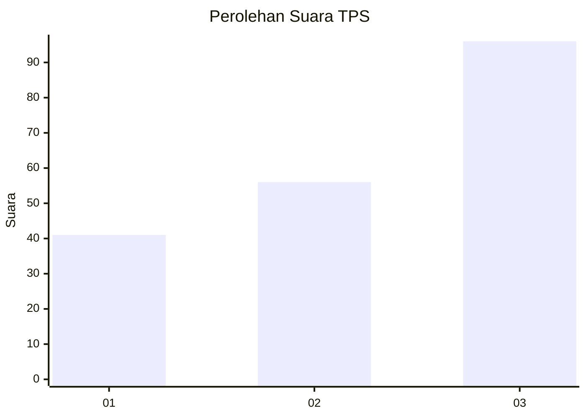
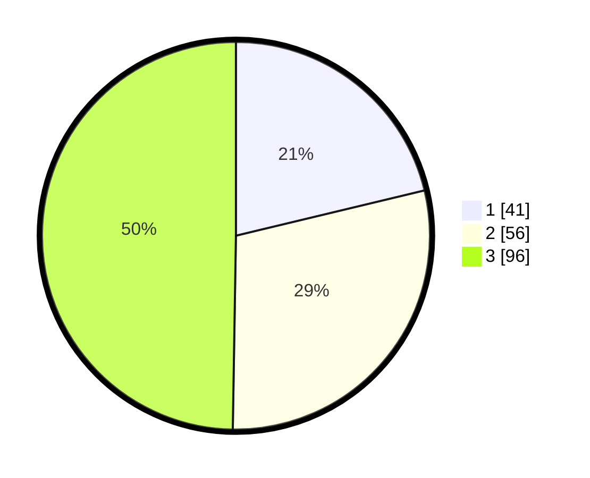

# Hasil

## Grafik

## Tabel

| No. | Nama Paslon    | Suara | Suara (raw) | Persentase |
|:--- |:-------------- | -----:| -----------:| ----------:|
| 1   | ANIES MUHAIMIN | 41    | [41][p-1]   | 21,24      |
| 2   | PRABOWO GIBRAN | 56    | [56][p-2]   | 29,02      |
| 3   | GANJAR MAHFUD  | 96    | [96][p-3]   | 49,74      |

[p-1]: https://github.com/gigit-pemilu/pemilu-2024-33-jawa-tengah/blob/main/pilpres/hitung-suara/sub/33-jawa-tengah/sub/11-sukoharjo/sub/01-weru/sub/2001-grogol/sub/004-tps/sub/paslon-1.txt
[p-2]: https://github.com/gigit-pemilu/pemilu-2024-33-jawa-tengah/blob/main/pilpres/hitung-suara/sub/33-jawa-tengah/sub/11-sukoharjo/sub/01-weru/sub/2001-grogol/sub/004-tps/sub/paslon-2.txt
[p-3]: https://github.com/gigit-pemilu/pemilu-2024-33-jawa-tengah/blob/main/pilpres/hitung-suara/sub/33-jawa-tengah/sub/11-sukoharjo/sub/01-weru/sub/2001-grogol/sub/004-tps/sub/paslon-3.txt

## Foto C Plano

https://sirekap-obj-formc.kpu.go.id/fbe1/pemilu/ppwp/33/11/01/20/01/3311012001004-20240214-141340--229410fa-8b9d-48ea-aebc-1be6c75a6dd3.jpg

https://sirekap-obj-formc.kpu.go.id/fbe1/pemilu/ppwp/33/11/01/20/01/3311012001004-20240214-141431--6039e232-25f6-4d3d-bafa-d22cd03b2289.jpg

https://sirekap-obj-formc.kpu.go.id/fbe1/pemilu/ppwp/33/11/01/20/01/3311012001004-20240214-141501--7ce665a1-6ca4-42de-b043-d67eefd80838.jpg

## Metadata

| Key        | Value               |
| ---------- | ------------------- |
| Time Stamp | 2024-02-15 19:30:26 |

## DATA PEMILIH TETAP

Jumlah pemilih dalam DPT: **243**.
 * L: **430**.
 * P: **423**.

## DATA PENGGUNA HAK PILIH

Jumlah pengguna hak pilih dalam DPT: **697**.
 * L: **600**.
 * P: **97**.

Jumlah pengguna hak pilih dalam DPTb: **8**.
 * L: **8**.
 * P: **0**.

Jumlah pengguna hak pilih dalam DPK: **0**.
 * L: **0**.
 * P: **0**.

Jumlah pengguna hak pilih: **97**.
 * L: **0**.
 * P: **97**.

## JUMLAH SUARA SAH DAN TIDAK SAH

JUMLAH SELURUH SUARA SAH: **193**.

JUMLAH SUARA TIDAK SAH: **4**.

JUMLAH SELURUH SUARA SAH DAN SUARA TIDAK SAH: **197**.

