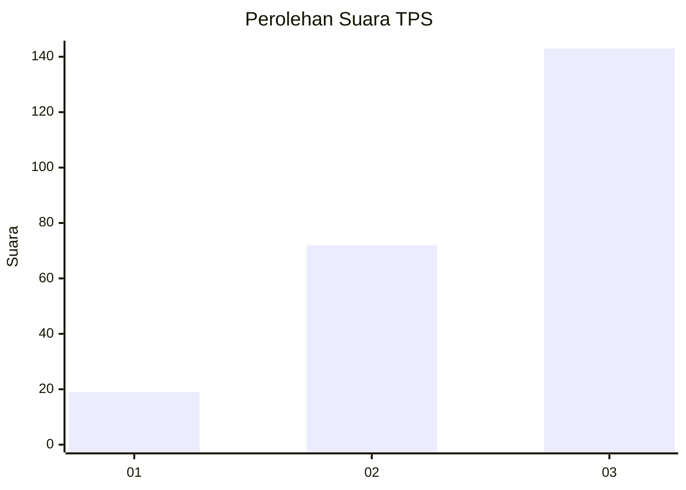
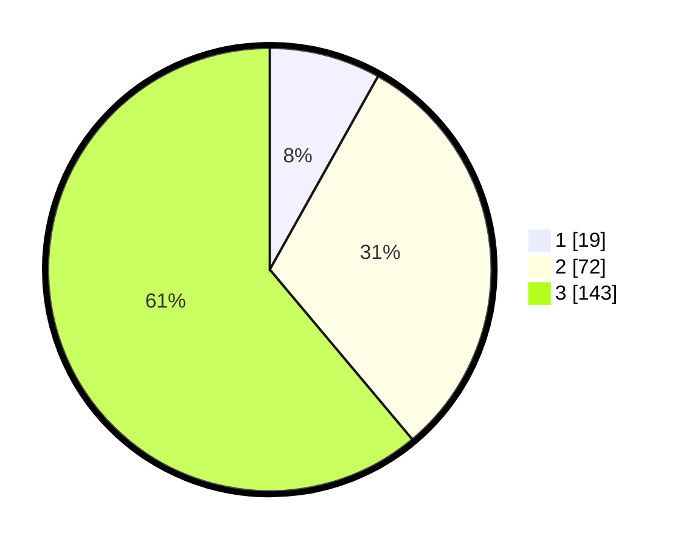

# Hasil

## Grafik

## Tabel

| No. | Nama Paslon    | Suara | Suara (raw) | Persentase |
|:--- |:-------------- | -----:| -----------:| ----------:|
| 1   | ANIES MUHAIMIN | 19    | [19][p-1]   | 8,12       |
| 2   | PRABOWO GIBRAN | 72    | [72][p-2]   | 30,77      |
| 3   | GANJAR MAHFUD  | 143   | [143][p-3]  | 61,11      |

[p-1]: https://github.com/gigit-pemilu/pemilu-2024-33-jawa-tengah/blob/main/pilpres/hitung-suara/sub/33-jawa-tengah/sub/11-sukoharjo/sub/01-weru/sub/2003-karangwuni/sub/001-tps/sub/paslon-1.txt
[p-2]: https://github.com/gigit-pemilu/pemilu-2024-33-jawa-tengah/blob/main/pilpres/hitung-suara/sub/33-jawa-tengah/sub/11-sukoharjo/sub/01-weru/sub/2003-karangwuni/sub/001-tps/sub/paslon-2.txt
[p-3]: https://github.com/gigit-pemilu/pemilu-2024-33-jawa-tengah/blob/main/pilpres/hitung-suara/sub/33-jawa-tengah/sub/11-sukoharjo/sub/01-weru/sub/2003-karangwuni/sub/001-tps/sub/paslon-3.txt

## Foto C Plano

https://sirekap-obj-formc.kpu.go.id/0ecf/pemilu/ppwp/33/11/01/20/03/3311012003001-20240214-203510--b4211a22-3a86-4996-b1cd-c81d9bd7b240.jpg

https://sirekap-obj-formc.kpu.go.id/0ecf/pemilu/ppwp/33/11/01/20/03/3311012003001-20240218-195340--af93a0f9-e5ac-456a-a389-ac19631dc5a8.jpg

https://sirekap-obj-formc.kpu.go.id/0ecf/pemilu/ppwp/33/11/01/20/03/3311012003001-20240214-204052--3f0230d1-9be8-4587-9117-9b186b671846.jpg

## Metadata

| Key        | Value               |
| ---------- | ------------------- |
| Time Stamp | 2024-02-19 06:16:00 |

