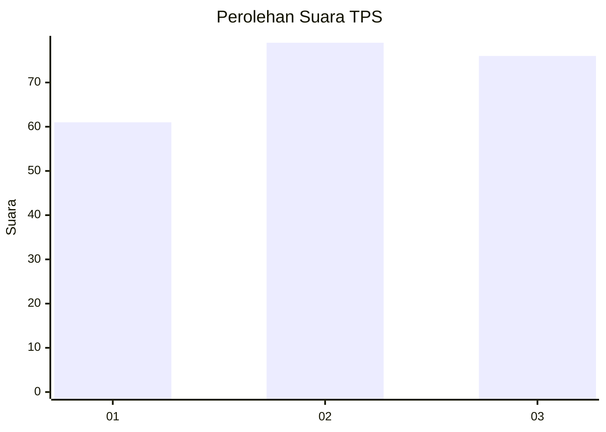
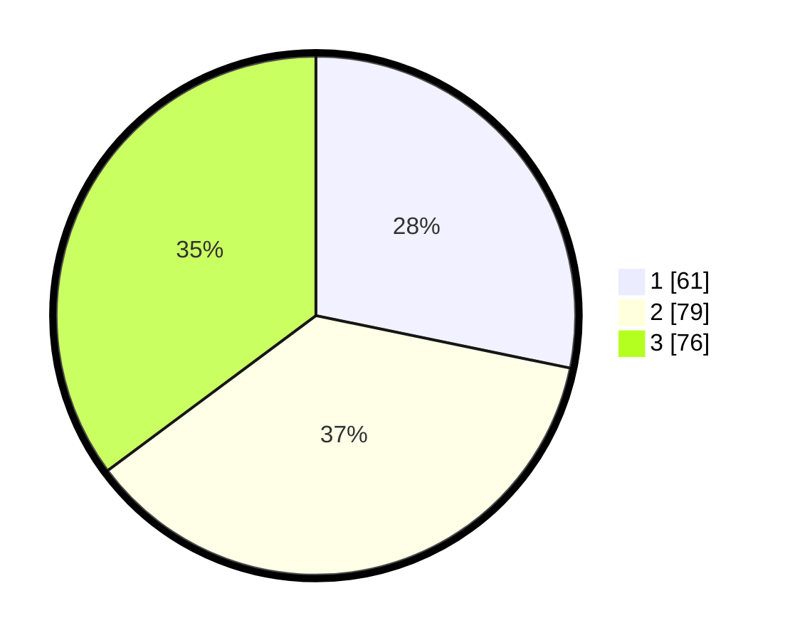

# Hasil

## Grafik

## Tabel

| No. | Nama Paslon    | Suara | Suara (raw) | Persentase |
|:--- |:-------------- | -----:| -----------:| ----------:|
| 1   | ANIES MUHAIMIN | 61    | [61][p-1]   | 28,24      |
| 2   | PRABOWO GIBRAN | 79    | [79][p-2]   | 36,57      |
| 3   | GANJAR MAHFUD  | 76    | [76][p-3]   | 35,19      |

[p-1]: https://github.com/gigit-pemilu/pemilu-2024-33-jawa-tengah/blob/main/pilpres/hitung-suara/sub/33-jawa-tengah/sub/11-sukoharjo/sub/01-weru/sub/2010-karakan/sub/003-tps/sub/paslon-1.txt
[p-2]: https://github.com/gigit-pemilu/pemilu-2024-33-jawa-tengah/blob/main/pilpres/hitung-suara/sub/33-jawa-tengah/sub/11-sukoharjo/sub/01-weru/sub/2010-karakan/sub/003-tps/sub/paslon-2.txt
[p-3]: https://github.com/gigit-pemilu/pemilu-2024-33-jawa-tengah/blob/main/pilpres/hitung-suara/sub/33-jawa-tengah/sub/11-sukoharjo/sub/01-weru/sub/2010-karakan/sub/003-tps/sub/paslon-3.txt

## Foto C Plano

https://sirekap-obj-formc.kpu.go.id/1ebf/pemilu/ppwp/33/11/01/20/10/3311012010003-20240216-140444--fea776ae-8027-4183-a2c8-60d9aa34e2bf.jpg

https://sirekap-obj-formc.kpu.go.id/1ebf/pemilu/ppwp/33/11/01/20/10/3311012010003-20240216-140052--54d4bad4-fbf5-4a04-9bf2-0a16b8138481.jpg

https://sirekap-obj-formc.kpu.go.id/1ebf/pemilu/ppwp/33/11/01/20/10/3311012010003-20240216-140212--e89759d6-ccc1-4e67-bb6a-679361cfe877.jpg

## Metadata

| Key        | Value               |
| ---------- | ------------------- |
| Time Stamp | 2024-02-16 14:30:33 |

