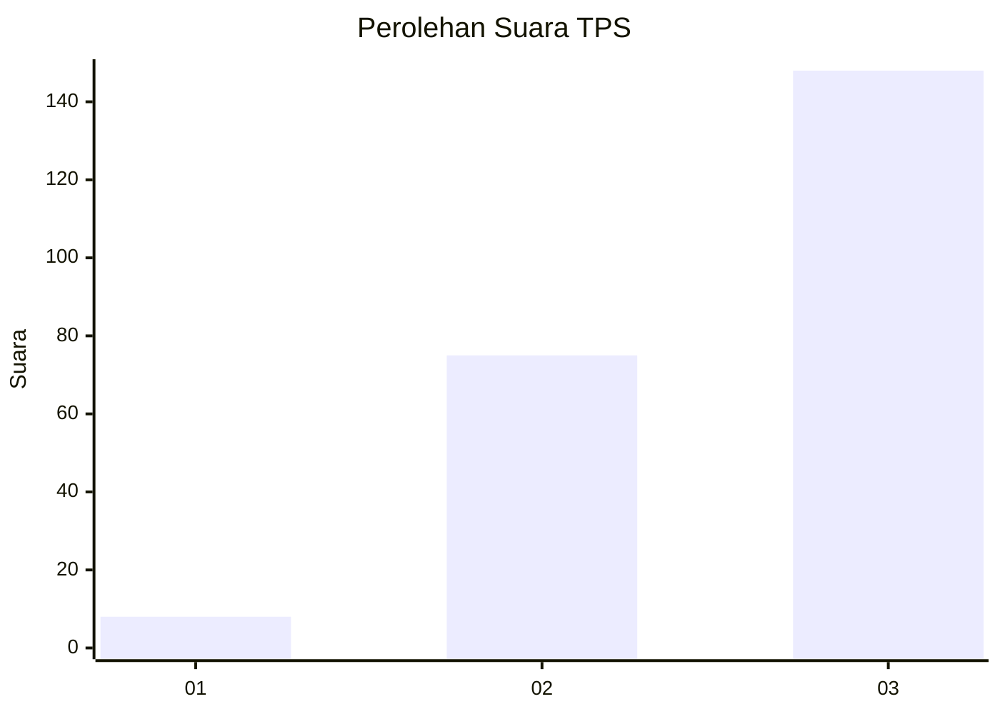
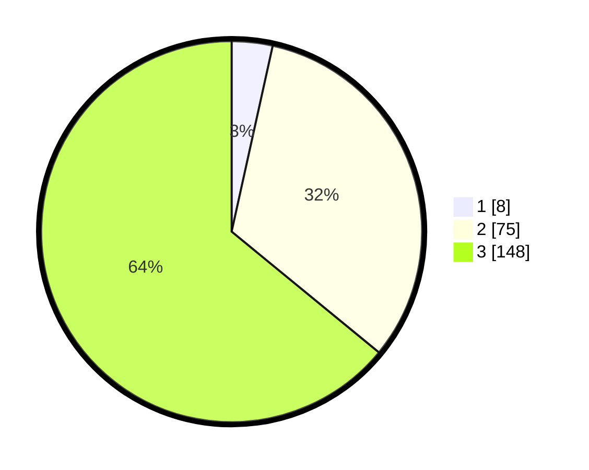

# Hasil

## Grafik

## Tabel

| No. | Nama Paslon    | Suara | Suara (raw) | Persentase |
|:--- |:-------------- | -----:| -----------:| ----------:|
| 1   | ANIES MUHAIMIN | 8     | [8][p-1]    | 3,46       |
| 2   | PRABOWO GIBRAN | 75    | [75][p-2]   | 32,47      |
| 3   | GANJAR MAHFUD  | 148   | [148][p-3]  | 64,07      |

[p-1]: https://github.com/gigit-pemilu/pemilu-2024-33-jawa-tengah/blob/main/pilpres/hitung-suara/sub/33-jawa-tengah/sub/11-sukoharjo/sub/01-weru/sub/2011-tegalsari/sub/013-tps/sub/paslon-1.txt
[p-2]: https://github.com/gigit-pemilu/pemilu-2024-33-jawa-tengah/blob/main/pilpres/hitung-suara/sub/33-jawa-tengah/sub/11-sukoharjo/sub/01-weru/sub/2011-tegalsari/sub/013-tps/sub/paslon-2.txt
[p-3]: https://github.com/gigit-pemilu/pemilu-2024-33-jawa-tengah/blob/main/pilpres/hitung-suara/sub/33-jawa-tengah/sub/11-sukoharjo/sub/01-weru/sub/2011-tegalsari/sub/013-tps/sub/paslon-3.txt

## Foto C Plano

https://sirekap-obj-formc.kpu.go.id/bd06/pemilu/ppwp/33/11/01/20/11/3311012011013-20240218-114101--09aa679a-a0f6-4d99-8b17-c4cbbedfa363.jpg

https://sirekap-obj-formc.kpu.go.id/bd06/pemilu/ppwp/33/11/01/20/11/3311012011013-20240218-114307--0c9b877b-7e2b-4109-b04e-b776e7491b26.jpg

https://sirekap-obj-formc.kpu.go.id/bd06/pemilu/ppwp/33/11/01/20/11/3311012011013-20240218-114353--e70d1df2-fd0d-4e0e-ae58-a772e711b713.jpg

## Metadata

| Key        | Value               |
| ---------- | ------------------- |
| Time Stamp | 2024-02-19 06:16:00 |

