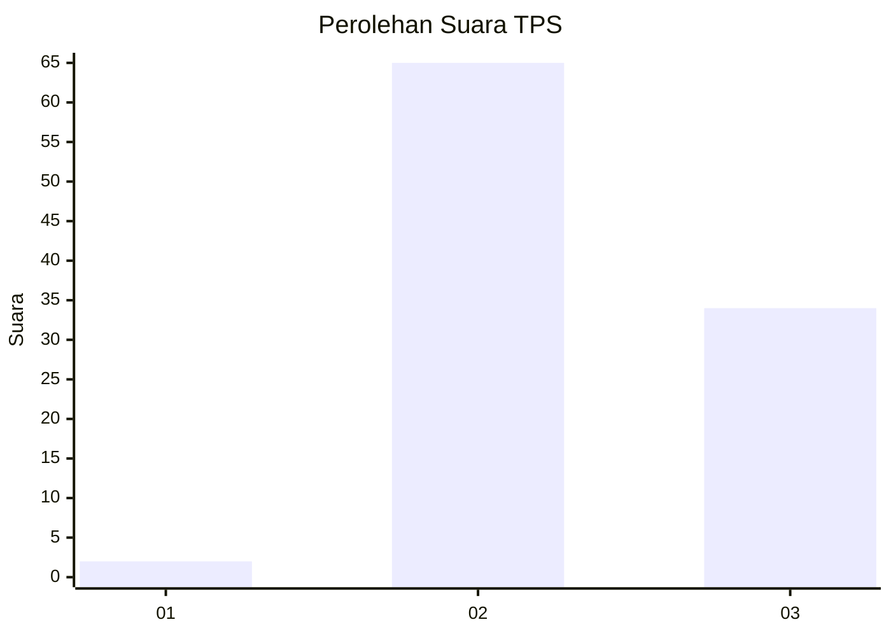
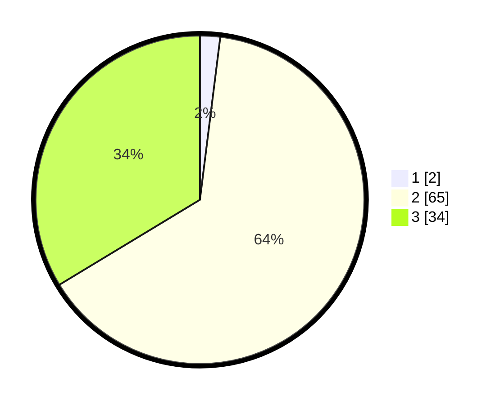

# Hasil

## Grafik

## Tabel

| No. | Nama Paslon    | Suara | Suara (raw) | Persentase |
|:--- |:-------------- | -----:| -----------:| ----------:|
| 1   | ANIES MUHAIMIN | 2     | [2][p-1]    | 1,98       |
| 2   | PRABOWO GIBRAN | 65    | [65][p-2]   | 64,36      |
| 3   | GANJAR MAHFUD  | 34    | [34][p-3]   | 33,66      |

[p-1]: https://github.com/gigit-pemilu/pemilu-2024-33-jawa-tengah/blob/main/pilpres/hitung-suara/sub/33-jawa-tengah/sub/11-sukoharjo/sub/02-bulu/sub/2002-kamal/sub/006-tps/sub/paslon-1.txt
[p-2]: https://github.com/gigit-pemilu/pemilu-2024-33-jawa-tengah/blob/main/pilpres/hitung-suara/sub/33-jawa-tengah/sub/11-sukoharjo/sub/02-bulu/sub/2002-kamal/sub/006-tps/sub/paslon-2.txt
[p-3]: https://github.com/gigit-pemilu/pemilu-2024-33-jawa-tengah/blob/main/pilpres/hitung-suara/sub/33-jawa-tengah/sub/11-sukoharjo/sub/02-bulu/sub/2002-kamal/sub/006-tps/sub/paslon-3.txt

## Foto C Plano

https://sirekap-obj-formc.kpu.go.id/9efa/pemilu/ppwp/33/11/02/20/02/3311022002006-20240218-231306--4fba3ef8-8c2d-476f-8c95-e2b90ed4dae9.jpg

https://sirekap-obj-formc.kpu.go.id/9efa/pemilu/ppwp/33/11/02/20/02/3311022002006-20240214-155613--d9fac5d9-67d7-46c2-872a-45d91c48bbaf.jpg

https://sirekap-obj-formc.kpu.go.id/9efa/pemilu/ppwp/33/11/02/20/02/3311022002006-20240214-155740--7a145981-4368-48eb-9723-6a0c9ead5057.jpg

## Metadata

| Key        | Value               |
| ---------- | ------------------- |
| Time Stamp | 2024-02-19 06:16:00 |

