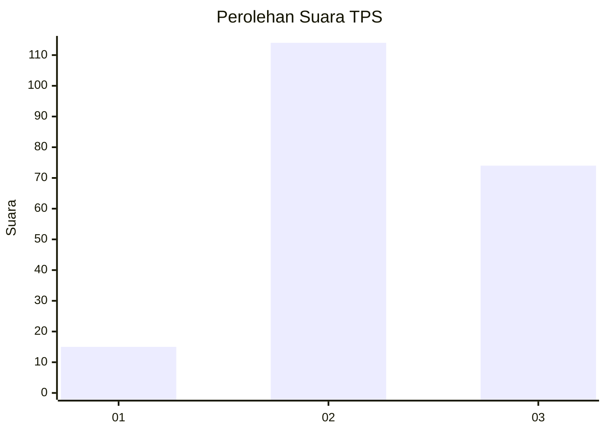
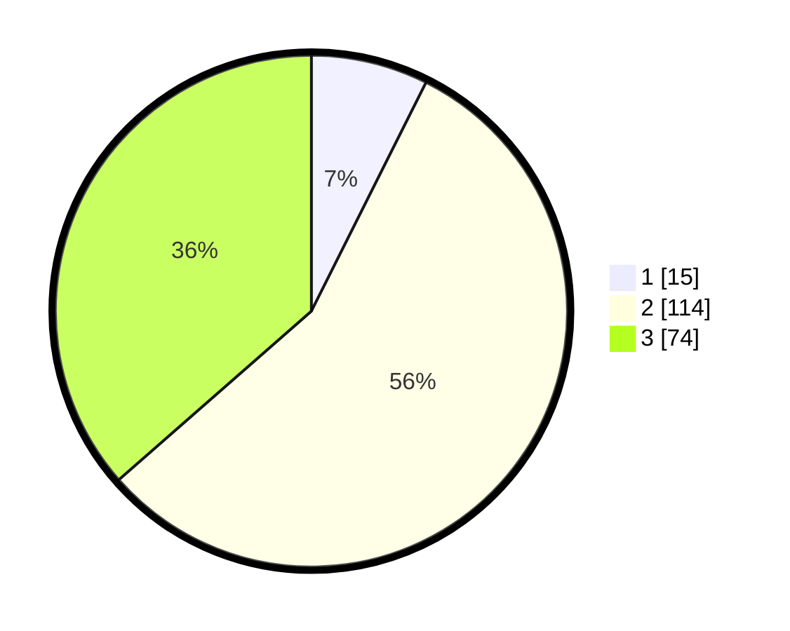

# Hasil

## Grafik

## Tabel

| No. | Nama Paslon    | Suara | Suara (raw) | Persentase |
|:--- |:-------------- | -----:| -----------:| ----------:|
| 1   | ANIES MUHAIMIN | 15    | [15][p-1]   | 7,39       |
| 2   | PRABOWO GIBRAN | 114   | [114][p-2]  | 56,16      |
| 3   | GANJAR MAHFUD  | 74    | [74][p-3]   | 36,45      |

[p-1]: https://github.com/gigit-pemilu/pemilu-2024-33-jawa-tengah/blob/main/pilpres/hitung-suara/sub/33-jawa-tengah/sub/11-sukoharjo/sub/03-tawangsari/sub/2001-pundungrejo/sub/001-tps/sub/paslon-1.txt
[p-2]: https://github.com/gigit-pemilu/pemilu-2024-33-jawa-tengah/blob/main/pilpres/hitung-suara/sub/33-jawa-tengah/sub/11-sukoharjo/sub/03-tawangsari/sub/2001-pundungrejo/sub/001-tps/sub/paslon-2.txt
[p-3]: https://github.com/gigit-pemilu/pemilu-2024-33-jawa-tengah/blob/main/pilpres/hitung-suara/sub/33-jawa-tengah/sub/11-sukoharjo/sub/03-tawangsari/sub/2001-pundungrejo/sub/001-tps/sub/paslon-3.txt

## Foto C Plano

https://sirekap-obj-formc.kpu.go.id/2fa4/pemilu/ppwp/33/11/03/20/01/3311032001001-20240215-175509--f209f2e8-ad95-4c0d-9a0e-4d146b630d55.jpg

https://sirekap-obj-formc.kpu.go.id/2fa4/pemilu/ppwp/33/11/03/20/01/3311032001001-20240215-175640--c3d07715-5085-414c-bd0d-1f5702735b46.jpg

https://sirekap-obj-formc.kpu.go.id/2fa4/pemilu/ppwp/33/11/03/20/01/3311032001001-20240215-175737--7496bc91-f6b7-4e77-90d5-dbe60917e21b.jpg

## Metadata

| Key        | Value               |
| ---------- | ------------------- |
| Time Stamp | 2024-02-17 11:00:02 |

