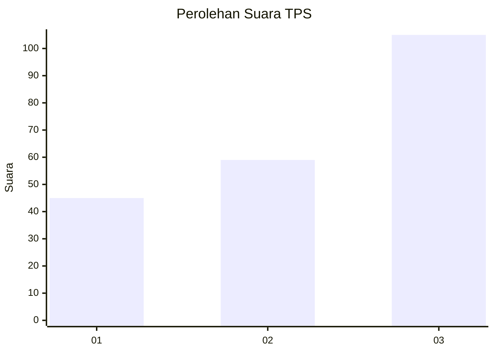
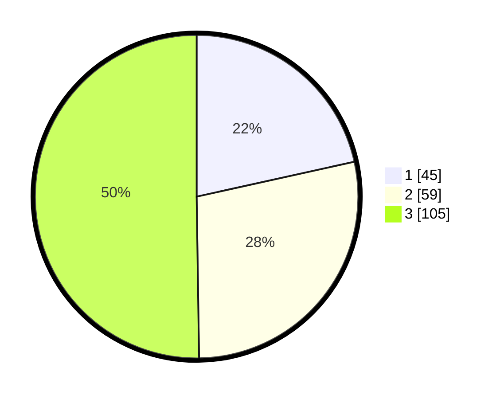

# Hasil

## Grafik

## Tabel

| No. | Nama Paslon    | Suara | Suara (raw) | Persentase |
|:--- |:-------------- | -----:| -----------:| ----------:|
| 1   | ANIES MUHAIMIN | 45    | [45][p-1]   | 21,53      |
| 2   | PRABOWO GIBRAN | 59    | [59][p-2]   | 28,23      |
| 3   | GANJAR MAHFUD  | 105   | [105][p-3]  | 50,24      |

[p-1]: https://github.com/gigit-pemilu/pemilu-2024/blob/main/pilpres/hitung-suara/sub/33-jawa-tengah/sub/11-sukoharjo/sub/03-tawangsari/sub/2007-dalangan/sub/001-tps/sub/paslon-1.txt
[p-2]: https://github.com/gigit-pemilu/pemilu-2024/blob/main/pilpres/hitung-suara/sub/33-jawa-tengah/sub/11-sukoharjo/sub/03-tawangsari/sub/2007-dalangan/sub/001-tps/sub/paslon-2.txt
[p-3]: https://github.com/gigit-pemilu/pemilu-2024/blob/main/pilpres/hitung-suara/sub/33-jawa-tengah/sub/11-sukoharjo/sub/03-tawangsari/sub/2007-dalangan/sub/001-tps/sub/paslon-3.txt

## Foto C Plano

https://sirekap-obj-formc.kpu.go.id/752d/pemilu/ppwp/33/11/03/20/07/3311032007001-20240216-223811--ce3ff220-bcd1-4008-87ad-d8e382410a30.jpg

https://sirekap-obj-formc.kpu.go.id/752d/pemilu/ppwp/33/11/03/20/07/3311032007001-20240216-223903--ad734b73-126c-40f2-9d98-198ff02dddf7.jpg

https://sirekap-obj-formc.kpu.go.id/752d/pemilu/ppwp/33/11/03/20/07/3311032007001-20240216-223953--465917c8-0b4c-4530-816d-6417915638a6.jpg

## Metadata

| Key        | Value               |
| ---------- | ------------------- |
| Time Stamp | 2024-02-17 09:30:03 |

