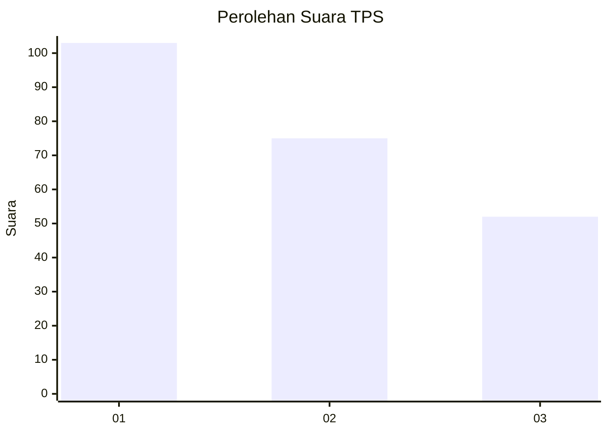
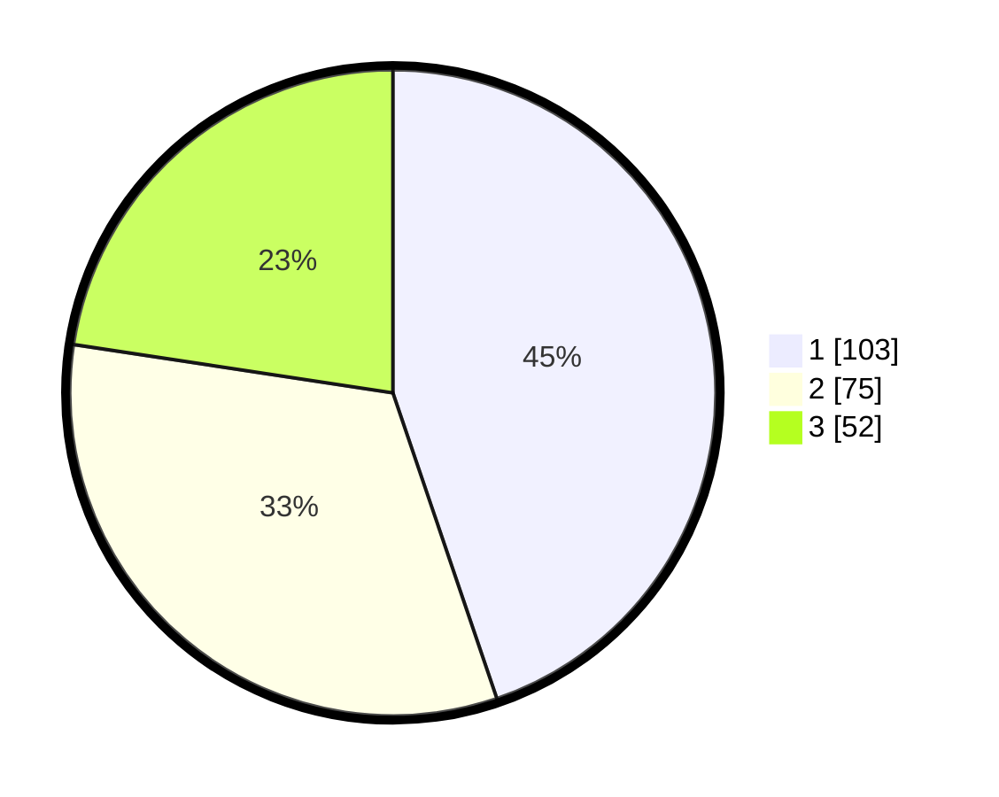

# Hasil

## Grafik

## Tabel

| No. | Nama Paslon    | Suara | Suara (raw) | Persentase |
|:--- |:-------------- | -----:| -----------:| ----------:|
| 1   | ANIES MUHAIMIN | 103   | [103][p-1]  | 44,78      |
| 2   | PRABOWO GIBRAN | 75    | [75][p-2]   | 32,61      |
| 3   | GANJAR MAHFUD  | 52    | [52][p-3]   | 22,61      |

[p-1]: https://github.com/gigit-pemilu/pemilu-2024-33-jawa-tengah/blob/main/pilpres/hitung-suara/sub/33-jawa-tengah/sub/11-sukoharjo/sub/03-tawangsari/sub/2008-pojok/sub/006-tps/sub/paslon-1.txt
[p-2]: https://github.com/gigit-pemilu/pemilu-2024-33-jawa-tengah/blob/main/pilpres/hitung-suara/sub/33-jawa-tengah/sub/11-sukoharjo/sub/03-tawangsari/sub/2008-pojok/sub/006-tps/sub/paslon-2.txt
[p-3]: https://github.com/gigit-pemilu/pemilu-2024-33-jawa-tengah/blob/main/pilpres/hitung-suara/sub/33-jawa-tengah/sub/11-sukoharjo/sub/03-tawangsari/sub/2008-pojok/sub/006-tps/sub/paslon-3.txt

## Foto C Plano

https://sirekap-obj-formc.kpu.go.id/e023/pemilu/ppwp/33/11/03/20/08/3311032008006-20240218-155000--ddecaca6-23ef-4668-9245-b107ee1a7cb3.jpg

https://sirekap-obj-formc.kpu.go.id/e023/pemilu/ppwp/33/11/03/20/08/3311032008006-20240218-155051--df213f05-f3ec-4e34-b306-723d40fb6e50.jpg

https://sirekap-obj-formc.kpu.go.id/e023/pemilu/ppwp/33/11/03/20/08/3311032008006-20240218-155128--e40162e7-b0f5-4ed8-b51d-15b0b7629aa4.jpg

## Metadata

| Key        | Value               |
| ---------- | ------------------- |
| Time Stamp | 2024-02-25 12:00:00 |

