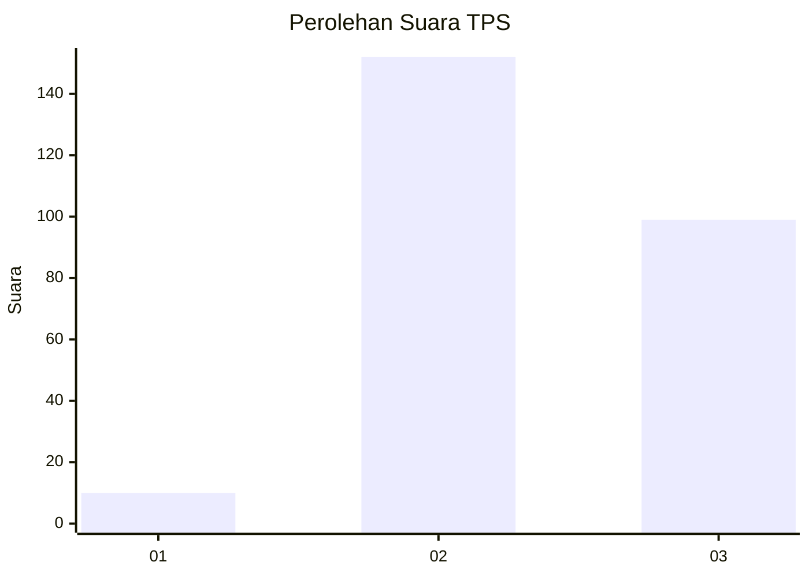
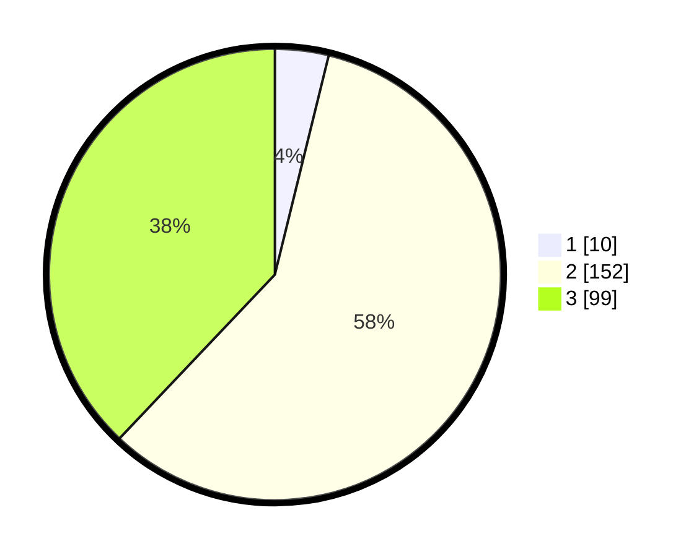

# Hasil

## Grafik

## Tabel

| No. | Nama Paslon    | Suara | Suara (raw) | Persentase |
|:--- |:-------------- | -----:| -----------:| ----------:|
| 1   | ANIES MUHAIMIN | 10    | [10][p-1]   | 3,83       |
| 2   | PRABOWO GIBRAN | 152   | [152][p-2]  | 58,24      |
| 3   | GANJAR MAHFUD  | 99    | [99][p-3]   | 37,93      |

[p-1]: https://github.com/gigit-pemilu/pemilu-2024/blob/main/pilpres/hitung-suara/sub/33-jawa-tengah/sub/11-sukoharjo/sub/03-tawangsari/sub/2009-tangkisan/sub/011-tps/sub/paslon-1.txt
[p-2]: https://github.com/gigit-pemilu/pemilu-2024/blob/main/pilpres/hitung-suara/sub/33-jawa-tengah/sub/11-sukoharjo/sub/03-tawangsari/sub/2009-tangkisan/sub/011-tps/sub/paslon-2.txt
[p-3]: https://github.com/gigit-pemilu/pemilu-2024/blob/main/pilpres/hitung-suara/sub/33-jawa-tengah/sub/11-sukoharjo/sub/03-tawangsari/sub/2009-tangkisan/sub/011-tps/sub/paslon-3.txt

## Foto C Plano

https://sirekap-obj-formc.kpu.go.id/979a/pemilu/ppwp/33/11/03/20/09/3311032009011-20240214-205321--42082bc4-cd3e-4e11-bf3e-93e7bb9474ca.jpg

https://sirekap-obj-formc.kpu.go.id/979a/pemilu/ppwp/33/11/03/20/09/3311032009011-20240214-231908--5b13eea0-2f9e-47f4-aea3-6cecb54d36bb.jpg

https://sirekap-obj-formc.kpu.go.id/979a/pemilu/ppwp/33/11/03/20/09/3311032009011-20240214-232306--268d84c1-80f1-4c2c-877a-cb6d4d500023.jpg

## Metadata

| Key        | Value               |
| ---------- | ------------------- |
| Time Stamp | 2024-02-15 16:00:26 |

