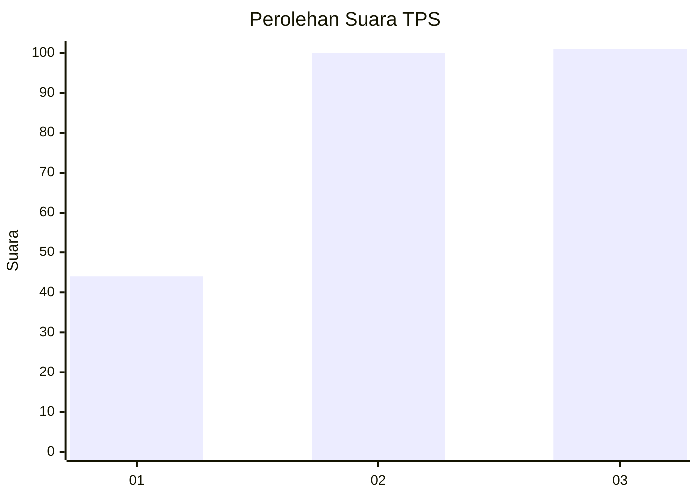
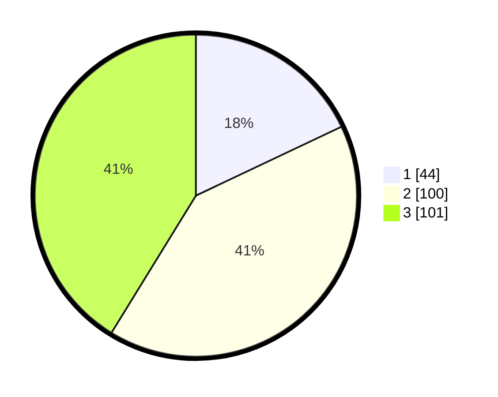

# Hasil

## Grafik

## Tabel

| No. | Nama Paslon    | Suara | Suara (raw) | Persentase |
|:--- |:-------------- | -----:| -----------:| ----------:|
| 1   | ANIES MUHAIMIN | 44    | [44][p-1]   | 17,96      |
| 2   | PRABOWO GIBRAN | 100   | [100][p-2]  | 40,82      |
| 3   | GANJAR MAHFUD  | 101   | [101][p-3]  | 41,22      |

[p-1]: https://github.com/gigit-pemilu/pemilu-2024/blob/main/pilpres/hitung-suara/sub/33-jawa-tengah/sub/11-sukoharjo/sub/03-tawangsari/sub/2010-ponowaren/sub/003-tps/sub/paslon-1.txt
[p-2]: https://github.com/gigit-pemilu/pemilu-2024/blob/main/pilpres/hitung-suara/sub/33-jawa-tengah/sub/11-sukoharjo/sub/03-tawangsari/sub/2010-ponowaren/sub/003-tps/sub/paslon-2.txt
[p-3]: https://github.com/gigit-pemilu/pemilu-2024/blob/main/pilpres/hitung-suara/sub/33-jawa-tengah/sub/11-sukoharjo/sub/03-tawangsari/sub/2010-ponowaren/sub/003-tps/sub/paslon-3.txt

## Foto C Plano

https://sirekap-obj-formc.kpu.go.id/2dbb/pemilu/ppwp/33/11/03/20/10/3311032010003-20240215-174737--0003359c-40df-4247-8b6f-317516326a92.jpg

https://sirekap-obj-formc.kpu.go.id/2dbb/pemilu/ppwp/33/11/03/20/10/3311032010003-20240215-174826--fc23e63c-6911-468f-ad51-c25690374daf.jpg

https://sirekap-obj-formc.kpu.go.id/2dbb/pemilu/ppwp/33/11/03/20/10/3311032010003-20240215-183925--88e5fa79-be6a-4d88-9c2f-a5f871865605.jpg

## Metadata

| Key        | Value               |
| ---------- | ------------------- |
| Time Stamp | 2024-02-15 22:00:27 |

