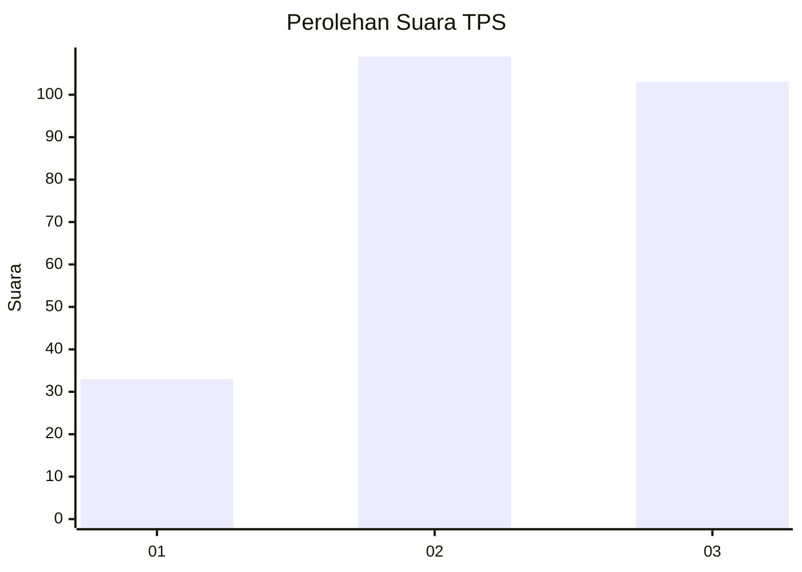
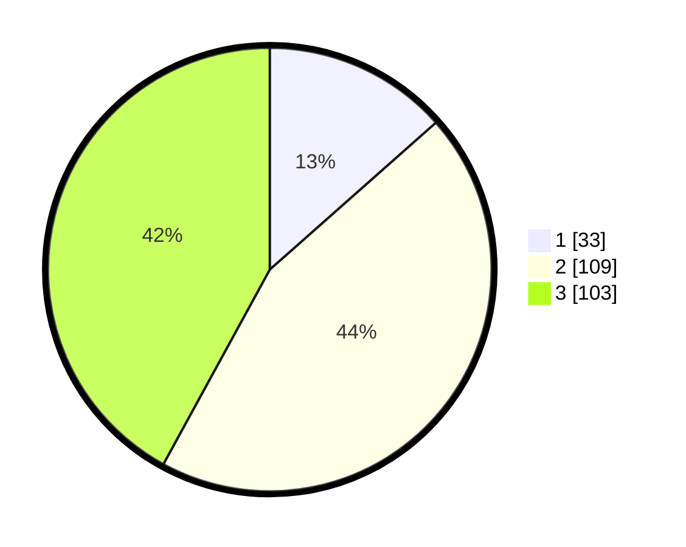

# Hasil

## Grafik

## Tabel

| No. | Nama Paslon    | Suara | Suara (raw) | Persentase |
|:--- |:-------------- | -----:| -----------:| ----------:|
| 1   | ANIES MUHAIMIN | 33    | [33][p-1]   | 13,47      |
| 2   | PRABOWO GIBRAN | 109   | [109][p-2]  | 44,49      |
| 3   | GANJAR MAHFUD  | 103   | [103][p-3]  | 42,04      |

[p-1]: https://github.com/gigit-pemilu/pemilu-2024-33-jawa-tengah/blob/main/pilpres/hitung-suara/sub/33-jawa-tengah/sub/11-sukoharjo/sub/03-tawangsari/sub/2011-majasto/sub/001-tps/sub/paslon-1.txt
[p-2]: https://github.com/gigit-pemilu/pemilu-2024-33-jawa-tengah/blob/main/pilpres/hitung-suara/sub/33-jawa-tengah/sub/11-sukoharjo/sub/03-tawangsari/sub/2011-majasto/sub/001-tps/sub/paslon-2.txt
[p-3]: https://github.com/gigit-pemilu/pemilu-2024-33-jawa-tengah/blob/main/pilpres/hitung-suara/sub/33-jawa-tengah/sub/11-sukoharjo/sub/03-tawangsari/sub/2011-majasto/sub/001-tps/sub/paslon-3.txt

## Foto C Plano

https://sirekap-obj-formc.kpu.go.id/48b1/pemilu/ppwp/33/11/03/20/11/3311032011001-20240216-165801--89648683-fd79-41a0-a837-ab5082afcde2.jpg

https://sirekap-obj-formc.kpu.go.id/48b1/pemilu/ppwp/33/11/03/20/11/3311032011001-20240216-170118--3d94a40f-a49c-4a50-a8cc-30ffe2e4fbf9.jpg

https://sirekap-obj-formc.kpu.go.id/48b1/pemilu/ppwp/33/11/03/20/11/3311032011001-20240216-164524--4f4f025a-5d55-44ee-a0c9-a3293d24082d.jpg

## Metadata

| Key        | Value               |
| ---------- | ------------------- |
| Time Stamp | 2024-02-16 23:00:00 |

