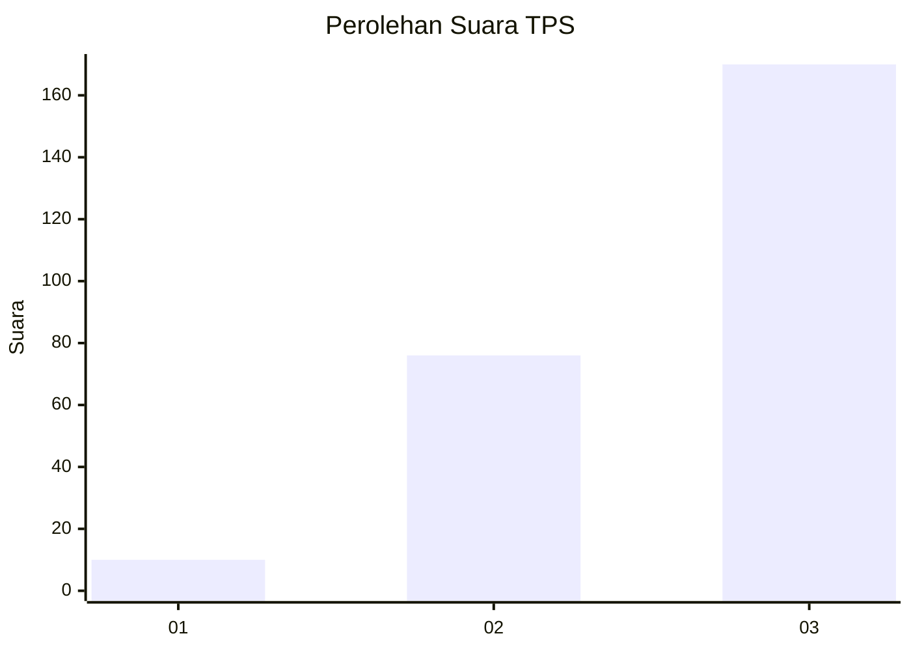
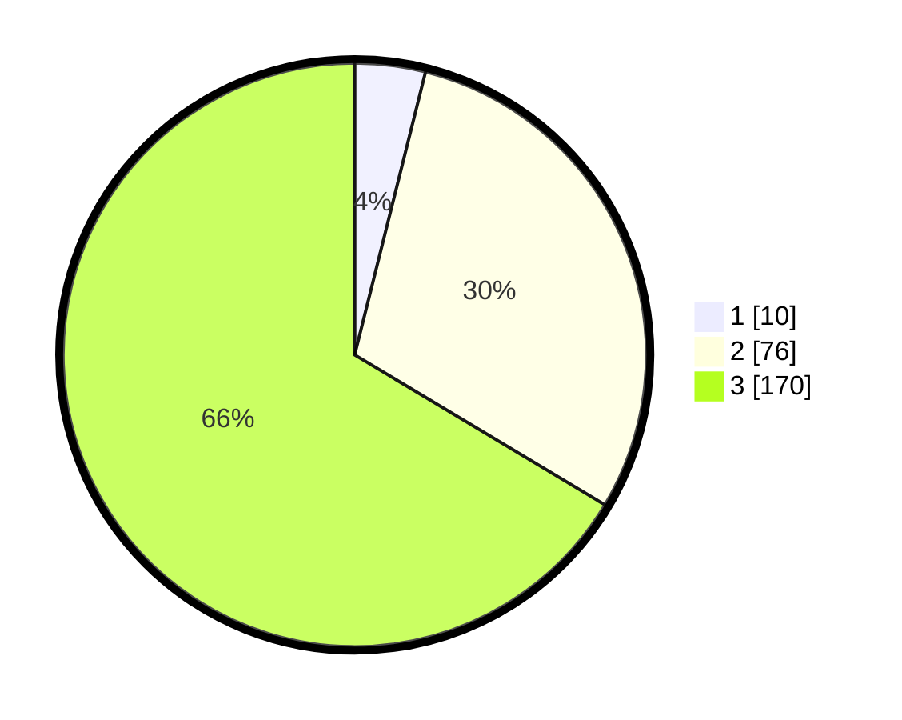

# Hasil

## Grafik

## Tabel

| No. | Nama Paslon    | Suara | Suara (raw) | Persentase |
|:--- |:-------------- | -----:| -----------:| ----------:|
| 1   | ANIES MUHAIMIN | 10    | [10][p-1]   | 3,91       |
| 2   | PRABOWO GIBRAN | 76    | [76][p-2]   | 29,69      |
| 3   | GANJAR MAHFUD  | 170   | [170][p-3]  | 66,41      |

[p-1]: https://github.com/gigit-pemilu/pemilu-2024-33-jawa-tengah/blob/main/pilpres/hitung-suara/sub/33-jawa-tengah/sub/11-sukoharjo/sub/03-tawangsari/sub/2012-tambakboyo/sub/004-tps/sub/paslon-1.txt
[p-2]: https://github.com/gigit-pemilu/pemilu-2024-33-jawa-tengah/blob/main/pilpres/hitung-suara/sub/33-jawa-tengah/sub/11-sukoharjo/sub/03-tawangsari/sub/2012-tambakboyo/sub/004-tps/sub/paslon-2.txt
[p-3]: https://github.com/gigit-pemilu/pemilu-2024-33-jawa-tengah/blob/main/pilpres/hitung-suara/sub/33-jawa-tengah/sub/11-sukoharjo/sub/03-tawangsari/sub/2012-tambakboyo/sub/004-tps/sub/paslon-3.txt

## Foto C Plano

https://sirekap-obj-formc.kpu.go.id/24a3/pemilu/ppwp/33/11/03/20/12/3311032012004-20240215-014924--8439ca77-9273-4bdc-a070-deba41f41f33.jpg

https://sirekap-obj-formc.kpu.go.id/24a3/pemilu/ppwp/33/11/03/20/12/3311032012004-20240215-020255--e2a97d23-e954-4bac-82b1-9f4bfaf756ff.jpg

https://sirekap-obj-formc.kpu.go.id/24a3/pemilu/ppwp/33/11/03/20/12/3311032012004-20240215-020313--8383d0d0-490c-4d33-9ef2-dd5fefd4f03b.jpg

## Metadata

| Key        | Value               |
| ---------- | ------------------- |
| Time Stamp | 2024-02-17 13:37:34 |

