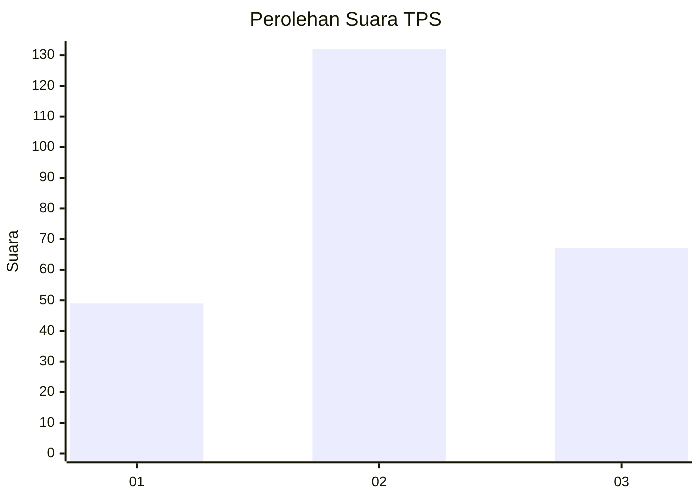
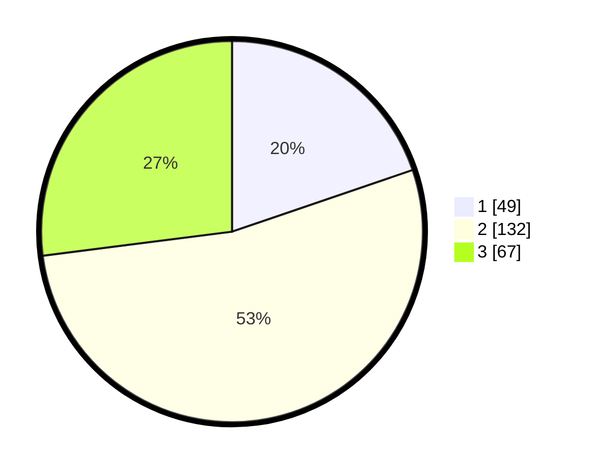

# Hasil

## Grafik

## Tabel

| No. | Nama Paslon    | Suara | Suara (raw) | Persentase |
|:--- |:-------------- | -----:| -----------:| ----------:|
| 1   | ANIES MUHAIMIN | 49    | [49][p-1]   | 19,76      |
| 2   | PRABOWO GIBRAN | 132   | [132][p-2]  | 53,23      |
| 3   | GANJAR MAHFUD  | 67    | [67][p-3]   | 27,02      |

[p-1]: https://github.com/gigit-pemilu/pemilu-2024/blob/main/pilpres/hitung-suara/sub/33-jawa-tengah/sub/11-sukoharjo/sub/04-sukoharjo/sub/1001-kenep/sub/003-tps/sub/paslon-1.txt
[p-2]: https://github.com/gigit-pemilu/pemilu-2024/blob/main/pilpres/hitung-suara/sub/33-jawa-tengah/sub/11-sukoharjo/sub/04-sukoharjo/sub/1001-kenep/sub/003-tps/sub/paslon-2.txt
[p-3]: https://github.com/gigit-pemilu/pemilu-2024/blob/main/pilpres/hitung-suara/sub/33-jawa-tengah/sub/11-sukoharjo/sub/04-sukoharjo/sub/1001-kenep/sub/003-tps/sub/paslon-3.txt

## Foto C Plano

https://sirekap-obj-formc.kpu.go.id/a711/pemilu/ppwp/33/11/04/10/01/3311041001003-20240215-034017--4b4e39c3-76f0-4812-936f-52f62b2e4f9f.jpg

https://sirekap-obj-formc.kpu.go.id/a711/pemilu/ppwp/33/11/04/10/01/3311041001003-20240215-034020--49ba5b08-359e-4d24-8295-06b3d1ab9555.jpg

https://sirekap-obj-formc.kpu.go.id/a711/pemilu/ppwp/33/11/04/10/01/3311041001003-20240217-183743--a632cb1d-5b43-498f-810e-fd0648d48d00.jpg

## Metadata

| Key        | Value               |
| ---------- | ------------------- |
| Time Stamp | 2024-02-17 19:00:04 |

