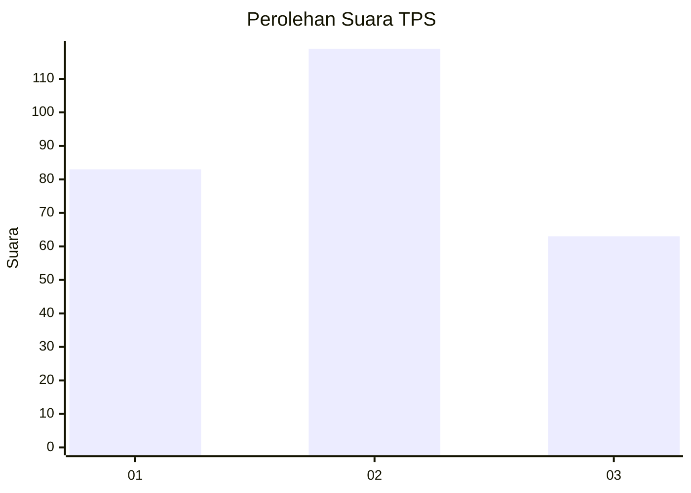
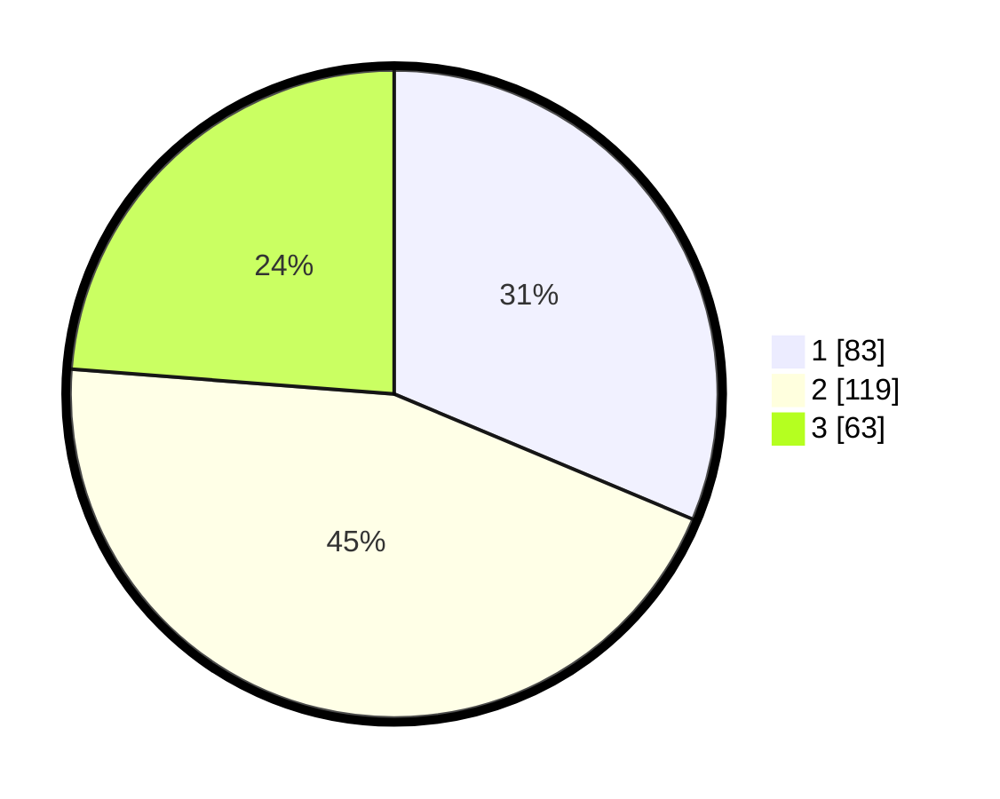

# Hasil

## Grafik

## Tabel

| No. | Nama Paslon    | Suara | Suara (raw) | Persentase |
|:--- |:-------------- | -----:| -----------:| ----------:|
| 1   | ANIES MUHAIMIN | 83    | [83][p-1]   | 31,32      |
| 2   | PRABOWO GIBRAN | 119   | [119][p-2]  | 44,91      |
| 3   | GANJAR MAHFUD  | 63    | [63][p-3]   | 23,77      |

[p-1]: https://github.com/gigit-pemilu/pemilu-2024/blob/main/pilpres/hitung-suara/sub/33-jawa-tengah/sub/11-sukoharjo/sub/04-sukoharjo/sub/1006-joho/sub/010-tps/sub/paslon-1.txt
[p-2]: https://github.com/gigit-pemilu/pemilu-2024/blob/main/pilpres/hitung-suara/sub/33-jawa-tengah/sub/11-sukoharjo/sub/04-sukoharjo/sub/1006-joho/sub/010-tps/sub/paslon-2.txt
[p-3]: https://github.com/gigit-pemilu/pemilu-2024/blob/main/pilpres/hitung-suara/sub/33-jawa-tengah/sub/11-sukoharjo/sub/04-sukoharjo/sub/1006-joho/sub/010-tps/sub/paslon-3.txt

## Foto C Plano

https://sirekap-obj-formc.kpu.go.id/b535/pemilu/ppwp/33/11/04/10/06/3311041006010-20240214-233400--f12c9877-6d41-4e1c-b8fe-d9d3bde37239.jpg

https://sirekap-obj-formc.kpu.go.id/b535/pemilu/ppwp/33/11/04/10/06/3311041006010-20240214-233913--ddb5c88a-e337-4214-a61a-f351b1a81c73.jpg

https://sirekap-obj-formc.kpu.go.id/b535/pemilu/ppwp/33/11/04/10/06/3311041006010-20240214-234432--7b76ee28-7f59-4e98-b075-093148e44530.jpg

## Metadata

| Key        | Value               |
| ---------- | ------------------- |
| Time Stamp | 2024-02-16 16:25:10 |

