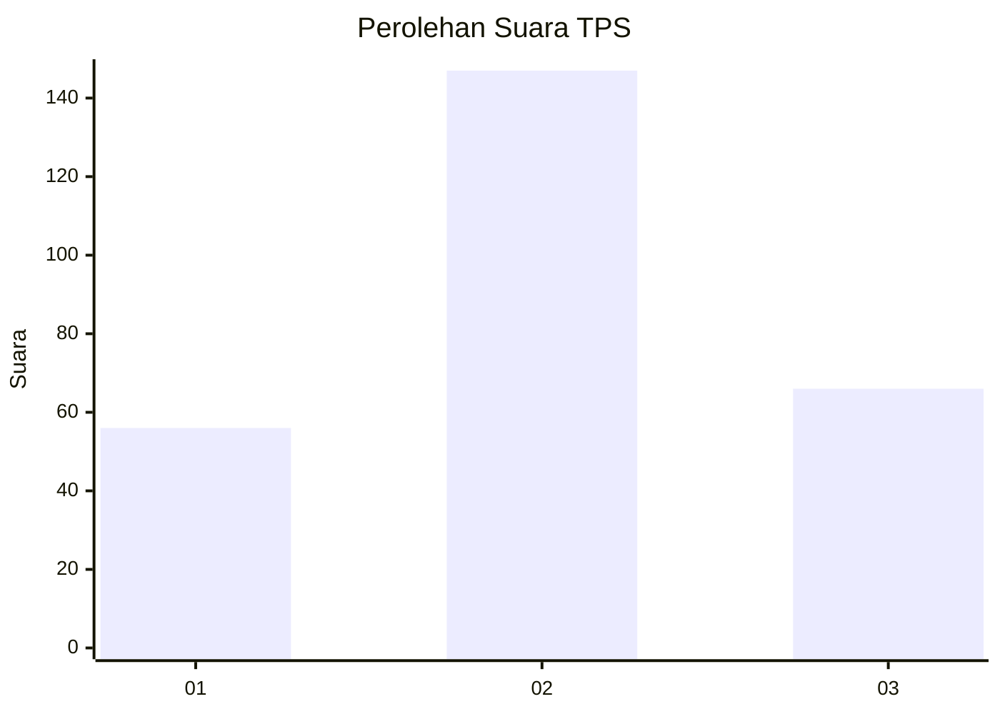
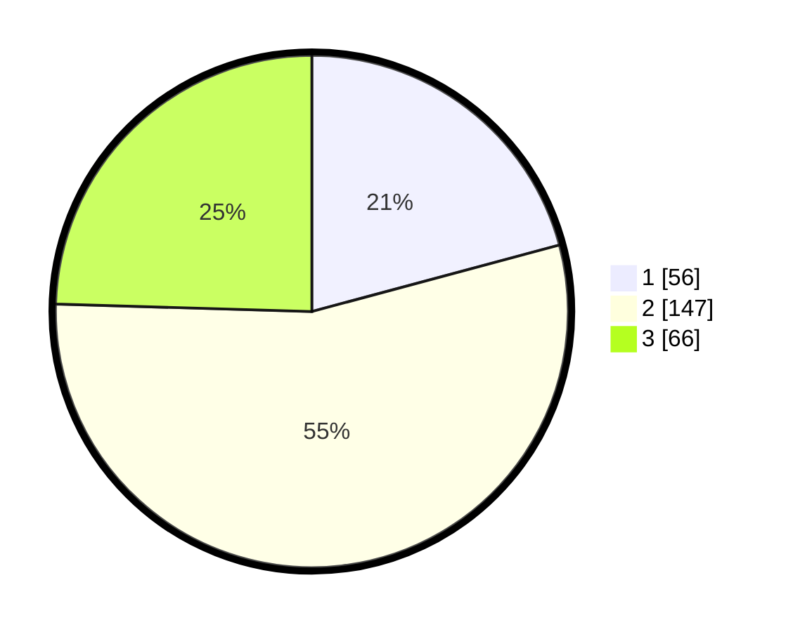

# Hasil

## Grafik

## Tabel

| No. | Nama Paslon    | Suara | Suara (raw) | Persentase |
|:--- |:-------------- | -----:| -----------:| ----------:|
| 1   | ANIES MUHAIMIN | 56    | [56][p-1]   | 20,82      |
| 2   | PRABOWO GIBRAN | 147   | [147][p-2]  | 54,65      |
| 3   | GANJAR MAHFUD  | 66    | [66][p-3]   | 24,54      |

[p-1]: https://github.com/gigit-pemilu/pemilu-2024/blob/main/pilpres/hitung-suara/sub/33-jawa-tengah/sub/11-sukoharjo/sub/04-sukoharjo/sub/1006-joho/sub/011-tps/sub/paslon-1.txt
[p-2]: https://github.com/gigit-pemilu/pemilu-2024/blob/main/pilpres/hitung-suara/sub/33-jawa-tengah/sub/11-sukoharjo/sub/04-sukoharjo/sub/1006-joho/sub/011-tps/sub/paslon-2.txt
[p-3]: https://github.com/gigit-pemilu/pemilu-2024/blob/main/pilpres/hitung-suara/sub/33-jawa-tengah/sub/11-sukoharjo/sub/04-sukoharjo/sub/1006-joho/sub/011-tps/sub/paslon-3.txt

## Foto C Plano

https://sirekap-obj-formc.kpu.go.id/c89b/pemilu/ppwp/33/11/04/10/06/3311041006011-20240216-211721--bea03c5e-8aed-4376-8550-45d6232439a9.jpg

https://sirekap-obj-formc.kpu.go.id/c89b/pemilu/ppwp/33/11/04/10/06/3311041006011-20240216-211844--d570e07c-0d14-4d40-a6a4-bc6ff160606f.jpg

https://sirekap-obj-formc.kpu.go.id/c89b/pemilu/ppwp/33/11/04/10/06/3311041006011-20240216-212009--25cf32f9-d8f9-4d0f-ada3-a459a732b777.jpg

## Metadata

| Key        | Value               |
| ---------- | ------------------- |
| Time Stamp | 2024-02-16 22:01:00 |

