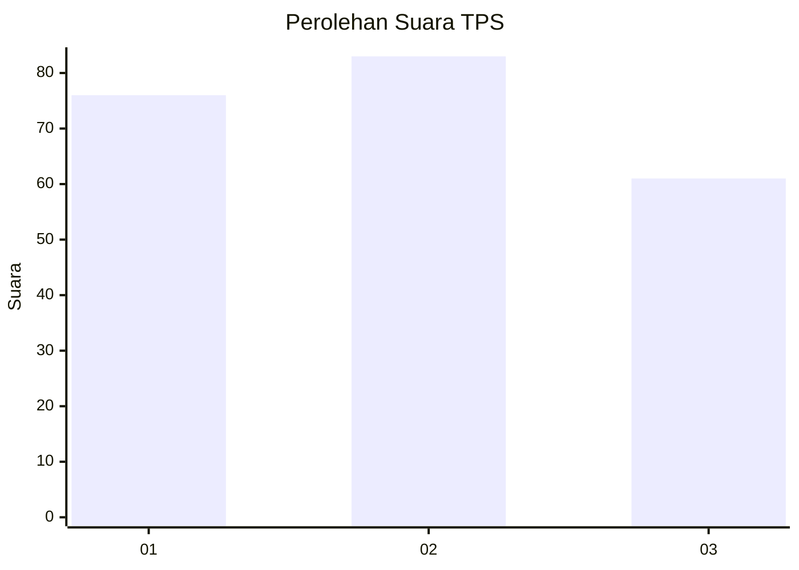
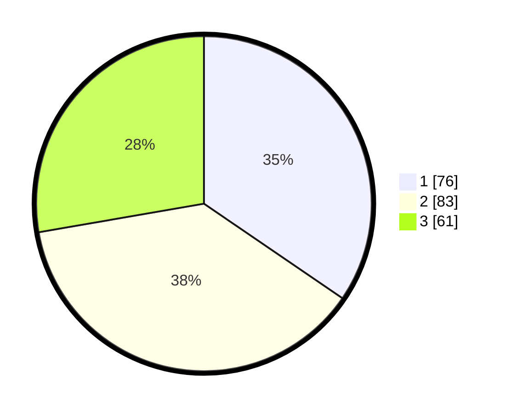

# Hasil

## Grafik

## Tabel

| No. | Nama Paslon    | Suara | Suara (raw) | Persentase |
|:--- |:-------------- | -----:| -----------:| ----------:|
| 1   | ANIES MUHAIMIN | 76    | [76][p-1]   | 34,55      |
| 2   | PRABOWO GIBRAN | 83    | [83][p-2]   | 37,73      |
| 3   | GANJAR MAHFUD  | 61    | [61][p-3]   | 27,73      |

[p-1]: https://github.com/gigit-pemilu/pemilu-2024/blob/main/pilpres/hitung-suara/sub/33-jawa-tengah/sub/11-sukoharjo/sub/04-sukoharjo/sub/1007-jetis/sub/014-tps/sub/paslon-1.txt
[p-2]: https://github.com/gigit-pemilu/pemilu-2024/blob/main/pilpres/hitung-suara/sub/33-jawa-tengah/sub/11-sukoharjo/sub/04-sukoharjo/sub/1007-jetis/sub/014-tps/sub/paslon-2.txt
[p-3]: https://github.com/gigit-pemilu/pemilu-2024/blob/main/pilpres/hitung-suara/sub/33-jawa-tengah/sub/11-sukoharjo/sub/04-sukoharjo/sub/1007-jetis/sub/014-tps/sub/paslon-3.txt

## Foto C Plano

https://sirekap-obj-formc.kpu.go.id/d80a/pemilu/ppwp/33/11/04/10/07/3311041007014-20240217-134856--2e63a173-749d-4819-9e13-02d80f609d32.jpg

https://sirekap-obj-formc.kpu.go.id/d80a/pemilu/ppwp/33/11/04/10/07/3311041007014-20240217-134957--334d24ea-2562-4f04-8a35-c2a1eff02d3f.jpg

https://sirekap-obj-formc.kpu.go.id/d80a/pemilu/ppwp/33/11/04/10/07/3311041007014-20240217-135100--4a005634-3d7c-411e-a83e-52b9adaac79c.jpg

## Metadata

| Key        | Value               |
| ---------- | ------------------- |
| Time Stamp | 2024-02-17 14:56:33 |

