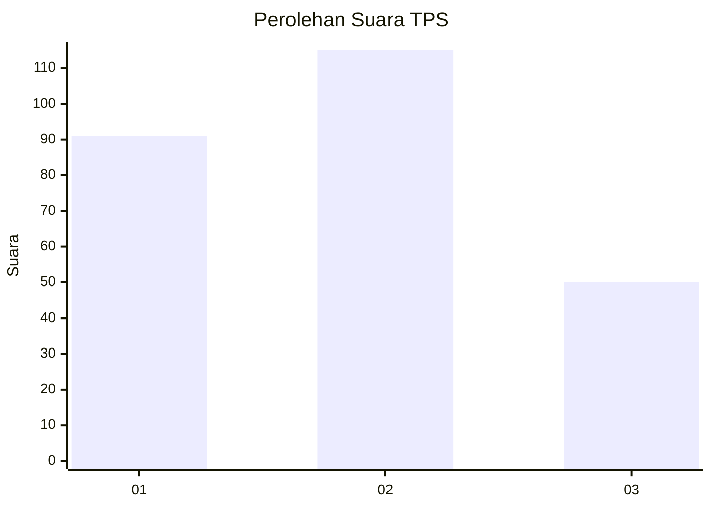
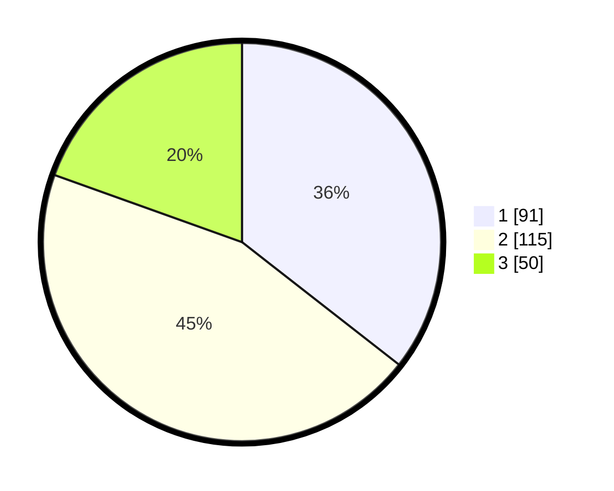

# Hasil

## Grafik

## Tabel

| No. | Nama Paslon    | Suara | Suara (raw) | Persentase |
|:--- |:-------------- | -----:| -----------:| ----------:|
| 1   | ANIES MUHAIMIN | 91    | [91][p-1]   | 35,55      |
| 2   | PRABOWO GIBRAN | 115   | [115][p-2]  | 44,92      |
| 3   | GANJAR MAHFUD  | 50    | [50][p-3]   | 19,53      |

[p-1]: https://github.com/gigit-pemilu/pemilu-2024-33-jawa-tengah/blob/main/pilpres/hitung-suara/sub/33-jawa-tengah/sub/11-sukoharjo/sub/04-sukoharjo/sub/1007-jetis/sub/021-tps/sub/paslon-1.txt
[p-2]: https://github.com/gigit-pemilu/pemilu-2024-33-jawa-tengah/blob/main/pilpres/hitung-suara/sub/33-jawa-tengah/sub/11-sukoharjo/sub/04-sukoharjo/sub/1007-jetis/sub/021-tps/sub/paslon-2.txt
[p-3]: https://github.com/gigit-pemilu/pemilu-2024-33-jawa-tengah/blob/main/pilpres/hitung-suara/sub/33-jawa-tengah/sub/11-sukoharjo/sub/04-sukoharjo/sub/1007-jetis/sub/021-tps/sub/paslon-3.txt

## Foto C Plano

https://sirekap-obj-formc.kpu.go.id/3c90/pemilu/ppwp/33/11/04/10/07/3311041007021-20240217-090110--83f9bb89-a0d9-4c27-9178-22b6ffc2a30f.jpg

https://sirekap-obj-formc.kpu.go.id/3c90/pemilu/ppwp/33/11/04/10/07/3311041007021-20240217-095233--6d50067e-e06b-4ca0-8f09-abd5b9cb8f9a.jpg

https://sirekap-obj-formc.kpu.go.id/3c90/pemilu/ppwp/33/11/04/10/07/3311041007021-20240214-200145--aed1f36e-cb5a-420f-86bd-2ce84e9145ac.jpg

## Metadata

| Key        | Value               |
| ---------- | ------------------- |
| Time Stamp | 2024-02-17 10:00:02 |

