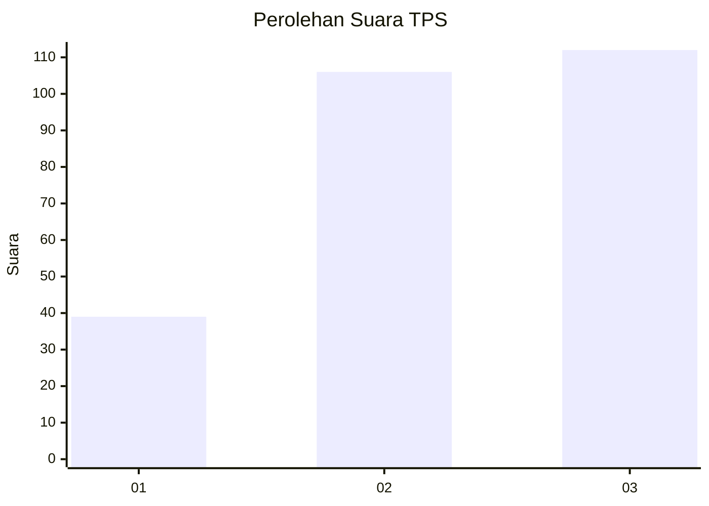
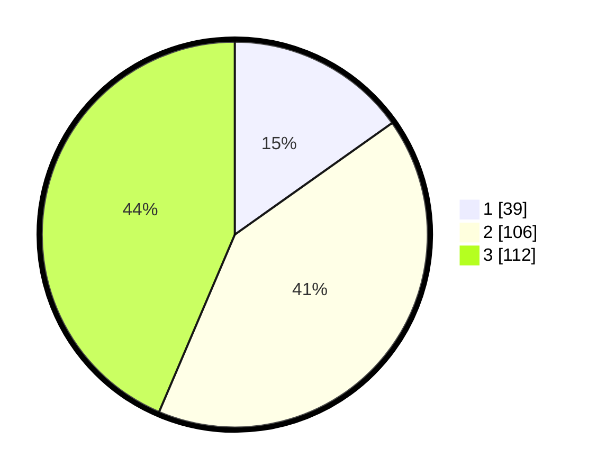

# Hasil

## Grafik

## Tabel

| No. | Nama Paslon    | Suara | Suara (raw) | Persentase |
|:--- |:-------------- | -----:| -----------:| ----------:|
| 1   | ANIES MUHAIMIN | 39    | [39][p-1]   | 15,18      |
| 2   | PRABOWO GIBRAN | 106   | [106][p-2]  | 41,25      |
| 3   | GANJAR MAHFUD  | 112   | [112][p-3]  | 43,58      |

[p-1]: https://github.com/gigit-pemilu/pemilu-2024/blob/main/pilpres/hitung-suara/sub/33-jawa-tengah/sub/11-sukoharjo/sub/04-sukoharjo/sub/1009-kriwen/sub/007-tps/sub/paslon-1.txt
[p-2]: https://github.com/gigit-pemilu/pemilu-2024/blob/main/pilpres/hitung-suara/sub/33-jawa-tengah/sub/11-sukoharjo/sub/04-sukoharjo/sub/1009-kriwen/sub/007-tps/sub/paslon-2.txt
[p-3]: https://github.com/gigit-pemilu/pemilu-2024/blob/main/pilpres/hitung-suara/sub/33-jawa-tengah/sub/11-sukoharjo/sub/04-sukoharjo/sub/1009-kriwen/sub/007-tps/sub/paslon-3.txt

## Foto C Plano

https://sirekap-obj-formc.kpu.go.id/5541/pemilu/ppwp/33/11/04/10/09/3311041009007-20240218-085930--e673800c-4a0b-4bdd-bfc3-86e38d5ea273.jpg

https://sirekap-obj-formc.kpu.go.id/5541/pemilu/ppwp/33/11/04/10/09/3311041009007-20240217-222645--5d1cf3bf-b10b-4521-a8ab-394ef1244034.jpg

https://sirekap-obj-formc.kpu.go.id/5541/pemilu/ppwp/33/11/04/10/09/3311041009007-20240218-194631--e454ffbf-1ae4-4991-b647-16235faeefb0.jpg

## Metadata

| Key        | Value               |
| ---------- | ------------------- |
| Time Stamp | 2024-02-19 11:00:00 |

