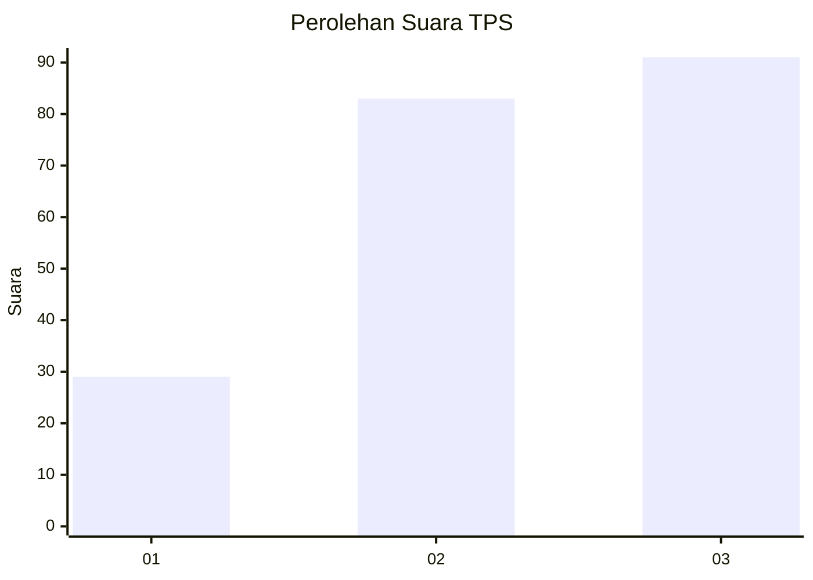
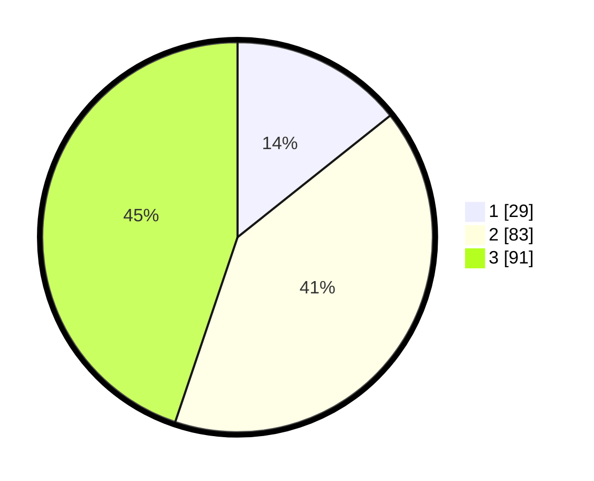

# Hasil

## Grafik

## Tabel

| No. | Nama Paslon    | Suara | Suara (raw) | Persentase |
|:--- |:-------------- | -----:| -----------:| ----------:|
| 1   | ANIES MUHAIMIN | 29    | [29][p-1]   | 14,29      |
| 2   | PRABOWO GIBRAN | 83    | [83][p-2]   | 40,89      |
| 3   | GANJAR MAHFUD  | 91    | [91][p-3]   | 44,83      |

[p-1]: https://github.com/gigit-pemilu/pemilu-2024/blob/main/pilpres/hitung-suara/sub/33-jawa-tengah/sub/11-sukoharjo/sub/04-sukoharjo/sub/1010-bulakan/sub/001-tps/sub/paslon-1.txt
[p-2]: https://github.com/gigit-pemilu/pemilu-2024/blob/main/pilpres/hitung-suara/sub/33-jawa-tengah/sub/11-sukoharjo/sub/04-sukoharjo/sub/1010-bulakan/sub/001-tps/sub/paslon-2.txt
[p-3]: https://github.com/gigit-pemilu/pemilu-2024/blob/main/pilpres/hitung-suara/sub/33-jawa-tengah/sub/11-sukoharjo/sub/04-sukoharjo/sub/1010-bulakan/sub/001-tps/sub/paslon-3.txt

## Foto C Plano

https://sirekap-obj-formc.kpu.go.id/5366/pemilu/ppwp/33/11/04/10/10/3311041010001-20240214-195548--643539dc-3013-42ec-b5ce-15e96a6212e4.jpg

https://sirekap-obj-formc.kpu.go.id/5366/pemilu/ppwp/33/11/04/10/10/3311041010001-20240214-195831--386242e0-c533-4d05-bf6d-d3df1a2ac2bc.jpg

https://sirekap-obj-formc.kpu.go.id/5366/pemilu/ppwp/33/11/04/10/10/3311041010001-20240214-200020--944746aa-f1bb-4a7b-8a07-156c6f132ce1.jpg

## Metadata

| Key        | Value               |
| ---------- | ------------------- |
| Time Stamp | 2024-02-16 12:51:22 |

