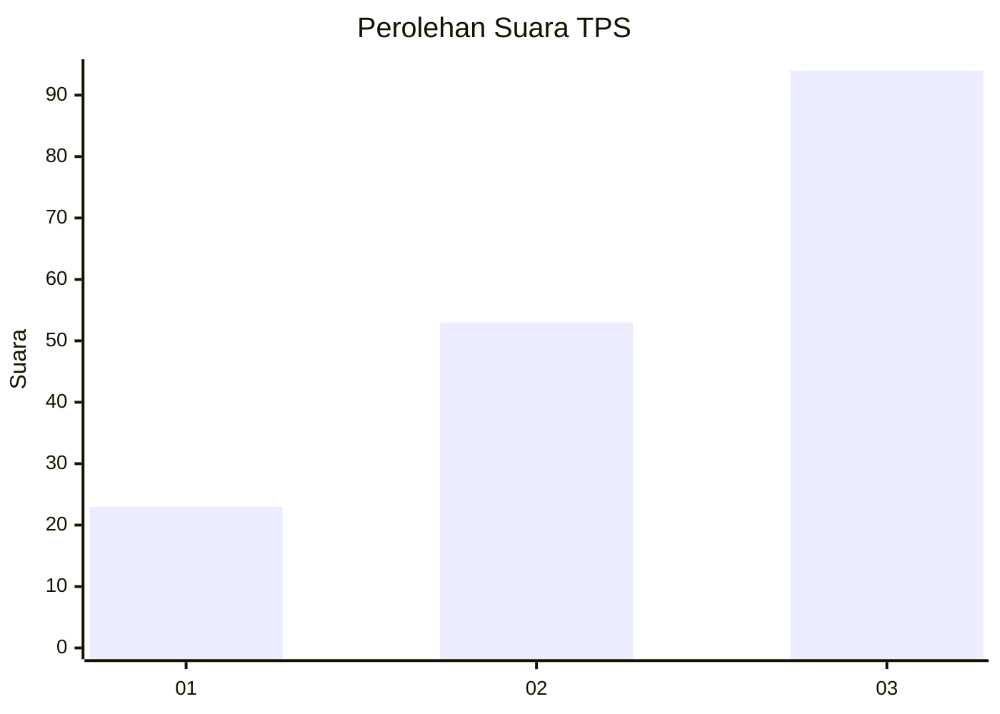
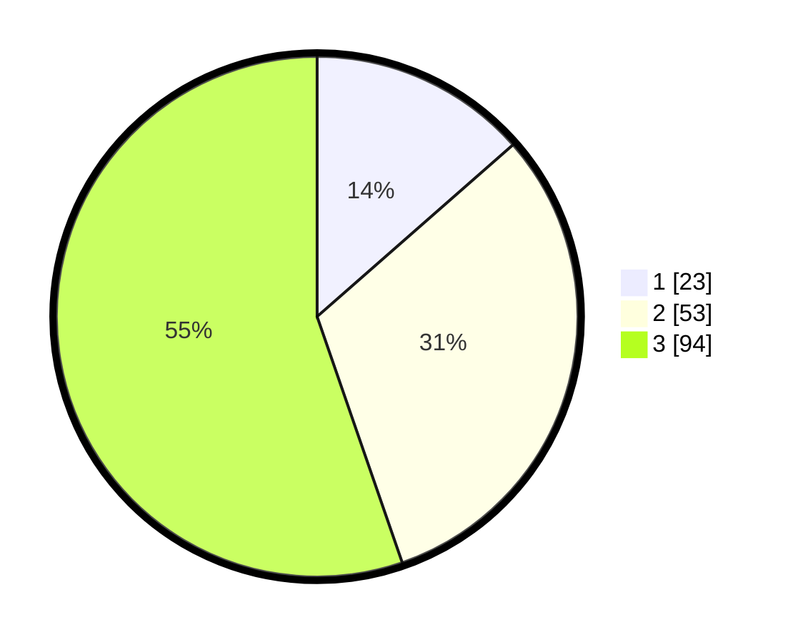

# Hasil

## Grafik

## Tabel

| No. | Nama Paslon    | Suara | Suara (raw) | Persentase |
|:--- |:-------------- | -----:| -----------:| ----------:|
| 1   | ANIES MUHAIMIN | 23    | [23][p-1]   | 13,53      |
| 2   | PRABOWO GIBRAN | 53    | [53][p-2]   | 31,18      |
| 3   | GANJAR MAHFUD  | 94    | [94][p-3]   | 55,29      |

[p-1]: https://github.com/gigit-pemilu/pemilu-2024/blob/main/pilpres/hitung-suara/sub/33-jawa-tengah/sub/11-sukoharjo/sub/05-nguter/sub/2001-tanjungrejo/sub/006-tps/sub/paslon-1.txt
[p-2]: https://github.com/gigit-pemilu/pemilu-2024/blob/main/pilpres/hitung-suara/sub/33-jawa-tengah/sub/11-sukoharjo/sub/05-nguter/sub/2001-tanjungrejo/sub/006-tps/sub/paslon-2.txt
[p-3]: https://github.com/gigit-pemilu/pemilu-2024/blob/main/pilpres/hitung-suara/sub/33-jawa-tengah/sub/11-sukoharjo/sub/05-nguter/sub/2001-tanjungrejo/sub/006-tps/sub/paslon-3.txt

## Foto C Plano

https://sirekap-obj-formc.kpu.go.id/a38c/pemilu/ppwp/33/11/05/20/01/3311052001006-20240216-201632--7f151d42-6560-4b72-83f8-c9b69e70773e.jpg

https://sirekap-obj-formc.kpu.go.id/a38c/pemilu/ppwp/33/11/05/20/01/3311052001006-20240216-201527--4d96c8e8-837f-41da-975e-861a67d8b2af.jpg

https://sirekap-obj-formc.kpu.go.id/a38c/pemilu/ppwp/33/11/05/20/01/3311052001006-20240217-202216--056422bc-42b1-4d17-b6e4-12d8c1afef6b.jpg

## Metadata

| Key        | Value               |
| ---------- | ------------------- |
| Time Stamp | 2024-02-19 06:16:00 |

