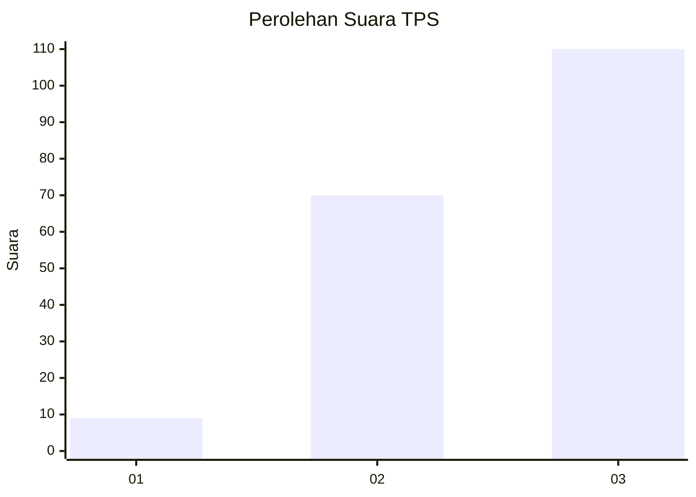
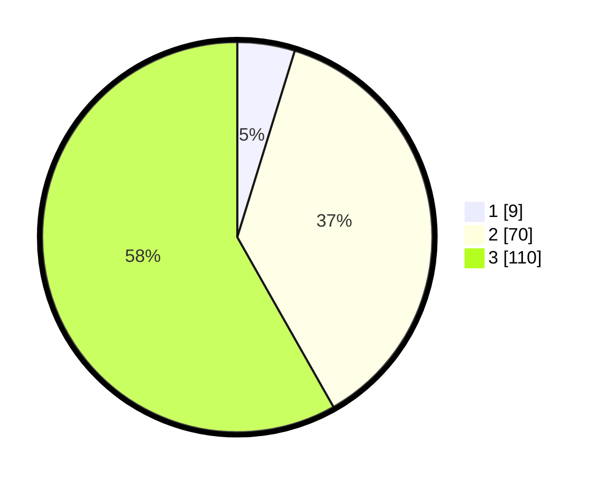

# Hasil

## Grafik

## Tabel

| No. | Nama Paslon    | Suara | Suara (raw) | Persentase |
|:--- |:-------------- | -----:| -----------:| ----------:|
| 1   | ANIES MUHAIMIN | 9     | [9][p-1]    | 4,76       |
| 2   | PRABOWO GIBRAN | 70    | [70][p-2]   | 37,04      |
| 3   | GANJAR MAHFUD  | 110   | [110][p-3]  | 58,20      |

[p-1]: https://github.com/gigit-pemilu/pemilu-2024/blob/main/pilpres/hitung-suara/sub/33-jawa-tengah/sub/11-sukoharjo/sub/05-nguter/sub/2002-jangglengan/sub/005-tps/sub/paslon-1.txt
[p-2]: https://github.com/gigit-pemilu/pemilu-2024/blob/main/pilpres/hitung-suara/sub/33-jawa-tengah/sub/11-sukoharjo/sub/05-nguter/sub/2002-jangglengan/sub/005-tps/sub/paslon-2.txt
[p-3]: https://github.com/gigit-pemilu/pemilu-2024/blob/main/pilpres/hitung-suara/sub/33-jawa-tengah/sub/11-sukoharjo/sub/05-nguter/sub/2002-jangglengan/sub/005-tps/sub/paslon-3.txt

## Foto C Plano

https://sirekap-obj-formc.kpu.go.id/4460/pemilu/ppwp/33/11/05/20/02/3311052002005-20240216-085628--168b6108-02be-4e93-8c38-266dfd71ea7e.jpg

https://sirekap-obj-formc.kpu.go.id/4460/pemilu/ppwp/33/11/05/20/02/3311052002005-20240216-090330--7a4542bd-5fb2-46ea-9f9d-e5effa90579d.jpg

https://sirekap-obj-formc.kpu.go.id/4460/pemilu/ppwp/33/11/05/20/02/3311052002005-20240216-090647--1186303e-e680-4a41-83be-c17e2ace28f3.jpg

## Metadata

| Key        | Value               |
| ---------- | ------------------- |
| Time Stamp | 2024-02-16 21:01:00 |

## DATA PEMILIH TETAP

Jumlah pemilih dalam DPT: **485**.
 * L: **488**.
 * P: **484**.

## DATA PENGGUNA HAK PILIH

Jumlah pengguna hak pilih dalam DPT: **682**.
 * L: **848**.
 * P: **884**.

Jumlah pengguna hak pilih dalam DPTb: **888**.
 * L: **888**.
 * P: **888**.

Jumlah pengguna hak pilih dalam DPK: **488**.
 * L: **888**.
 * P: **844**.

Jumlah pengguna hak pilih: **485**.
 * L: **842**.
 * P: **894**.

## JUMLAH SUARA SAH DAN TIDAK SAH

JUMLAH SELURUH SUARA SAH: **189**.

JUMLAH SUARA TIDAK SAH: **5**.

JUMLAH SELURUH SUARA SAH DAN SUARA TIDAK SAH: **194**.

