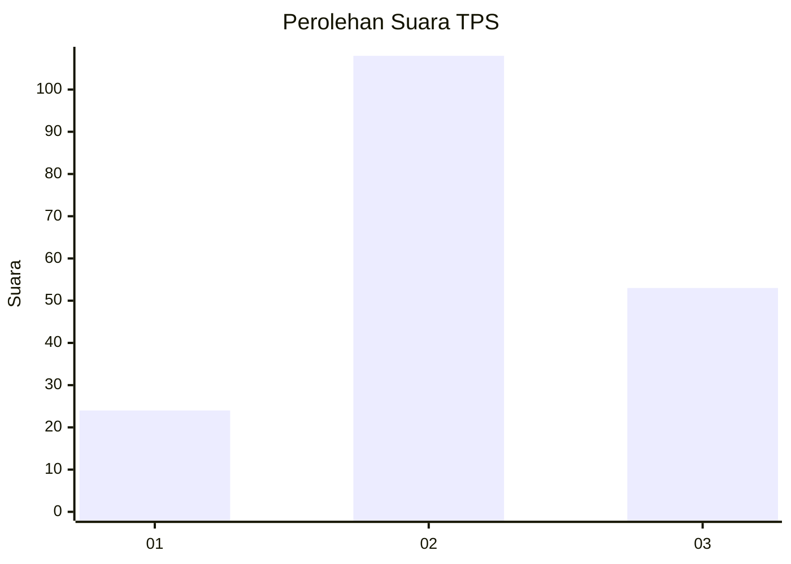
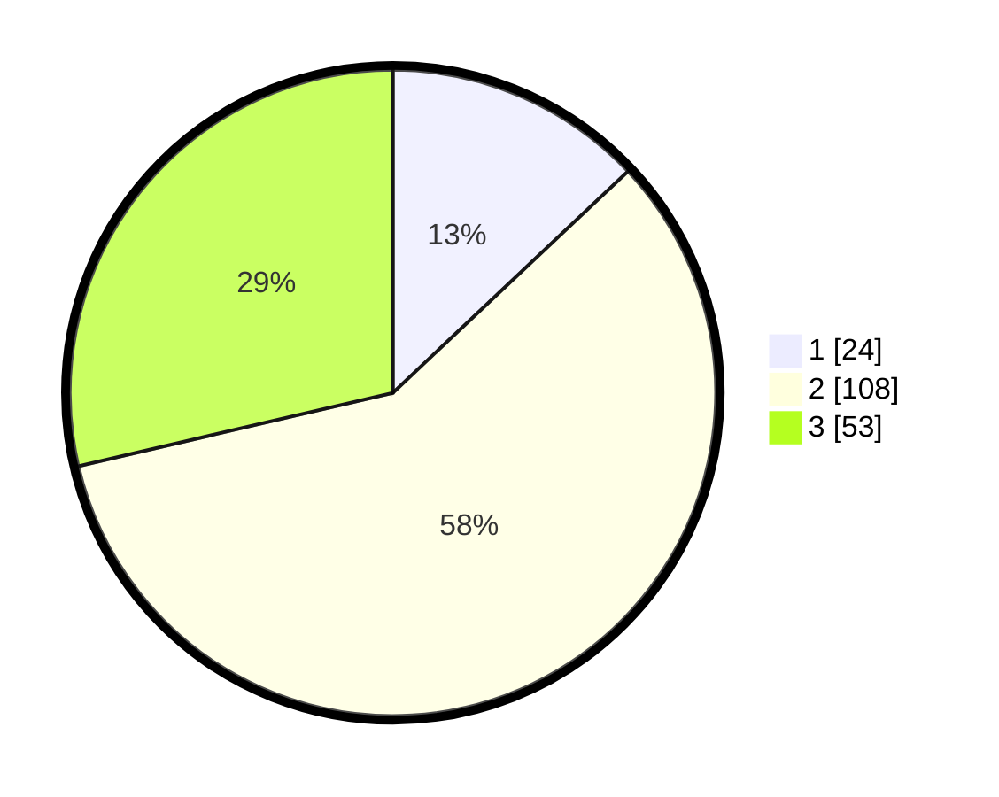

# Hasil

## Grafik

## Tabel

| No. | Nama Paslon    | Suara | Suara (raw) | Persentase |
|:--- |:-------------- | -----:| -----------:| ----------:|
| 1   | ANIES MUHAIMIN | 24    | [24][p-1]   | 12,97      |
| 2   | PRABOWO GIBRAN | 108   | [108][p-2]  | 58,38      |
| 3   | GANJAR MAHFUD  | 53    | [53][p-3]   | 28,65      |

[p-1]: https://github.com/gigit-pemilu/pemilu-2024-33-jawa-tengah/blob/main/pilpres/hitung-suara/sub/33-jawa-tengah/sub/11-sukoharjo/sub/05-nguter/sub/2007-gupit/sub/007-tps/sub/paslon-1.txt
[p-2]: https://github.com/gigit-pemilu/pemilu-2024-33-jawa-tengah/blob/main/pilpres/hitung-suara/sub/33-jawa-tengah/sub/11-sukoharjo/sub/05-nguter/sub/2007-gupit/sub/007-tps/sub/paslon-2.txt
[p-3]: https://github.com/gigit-pemilu/pemilu-2024-33-jawa-tengah/blob/main/pilpres/hitung-suara/sub/33-jawa-tengah/sub/11-sukoharjo/sub/05-nguter/sub/2007-gupit/sub/007-tps/sub/paslon-3.txt

## Foto C Plano

https://sirekap-obj-formc.kpu.go.id/4326/pemilu/ppwp/33/11/05/20/07/3311052007007-20240214-232122--48841f79-3a2f-4230-87c7-e4bbb43db196.jpg

https://sirekap-obj-formc.kpu.go.id/4326/pemilu/ppwp/33/11/05/20/07/3311052007007-20240214-231916--5f6fedf1-efe1-4916-9216-8ee25008acfb.jpg

https://sirekap-obj-formc.kpu.go.id/4326/pemilu/ppwp/33/11/05/20/07/3311052007007-20240214-231758--fdf3ad69-da60-4b71-9df9-b30f26a65caa.jpg

## Metadata

| Key        | Value               |
| ---------- | ------------------- |
| Time Stamp | 2024-02-16 22:01:00 |

## DATA PEMILIH TETAP

Jumlah pemilih dalam DPT: **269**.
 * L: **133**.
 * P: **130**.

## DATA PENGGUNA HAK PILIH

Jumlah pengguna hak pilih dalam DPT: **120**.
 * L: **892**.
 * P: **482**.

Jumlah pengguna hak pilih dalam DPTb: **488**.
 * L: **880**.
 * P: **838**.

Jumlah pengguna hak pilih dalam DPK: **888**.
 * L: **881**.
 * P: **888**.

Jumlah pengguna hak pilih: **871**.
 * L: **893**.
 * P: **898**.

## JUMLAH SUARA SAH DAN TIDAK SAH

JUMLAH SELURUH SUARA SAH: **185**.

JUMLAH SUARA TIDAK SAH: **6**.

JUMLAH SELURUH SUARA SAH DAN SUARA TIDAK SAH: **191**.

