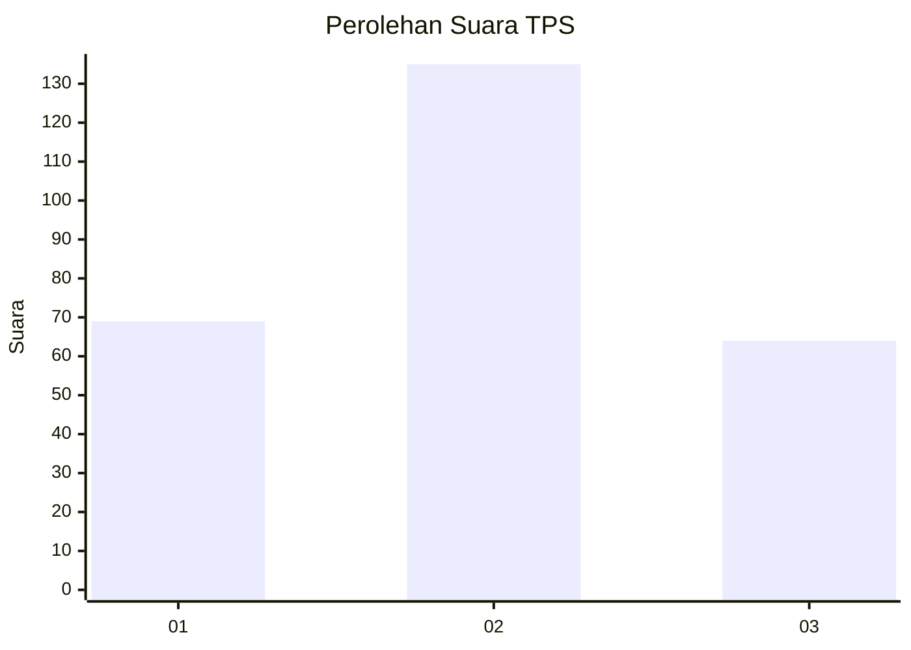
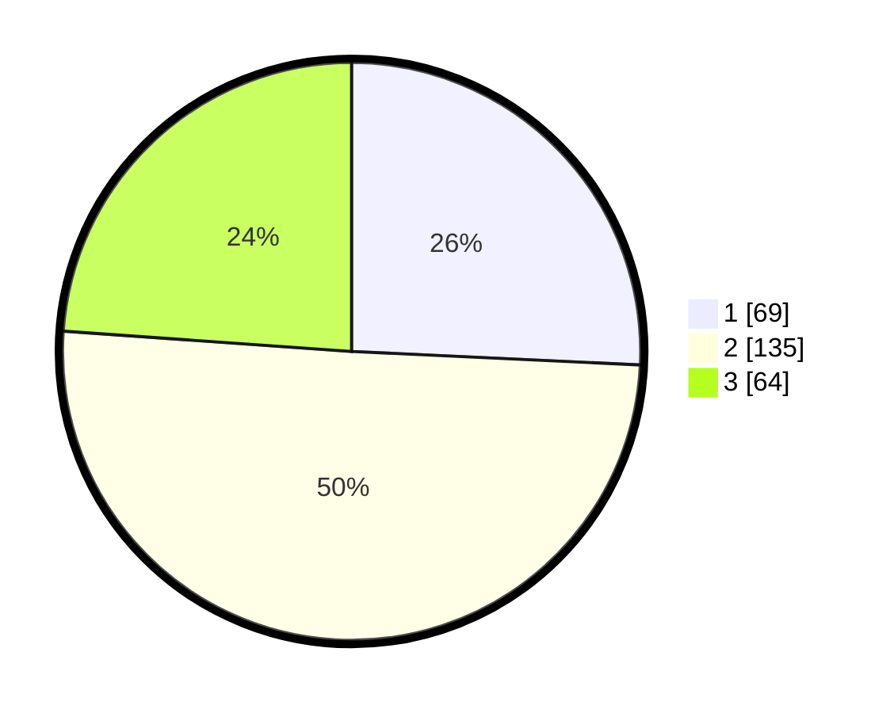

# Hasil

## Grafik

## Tabel

| No. | Nama Paslon    | Suara | Suara (raw) | Persentase |
|:--- |:-------------- | -----:| -----------:| ----------:|
| 1   | ANIES MUHAIMIN | 69    | [69][p-1]   | 25,75      |
| 2   | PRABOWO GIBRAN | 135   | [135][p-2]  | 50,37      |
| 3   | GANJAR MAHFUD  | 64    | [64][p-3]   | 23,88      |

[p-1]: https://github.com/gigit-pemilu/pemilu-2024/blob/main/pilpres/hitung-suara/sub/33-jawa-tengah/sub/11-sukoharjo/sub/06-bendosari/sub/1001-jombor/sub/009-tps/sub/paslon-1.txt
[p-2]: https://github.com/gigit-pemilu/pemilu-2024/blob/main/pilpres/hitung-suara/sub/33-jawa-tengah/sub/11-sukoharjo/sub/06-bendosari/sub/1001-jombor/sub/009-tps/sub/paslon-2.txt
[p-3]: https://github.com/gigit-pemilu/pemilu-2024/blob/main/pilpres/hitung-suara/sub/33-jawa-tengah/sub/11-sukoharjo/sub/06-bendosari/sub/1001-jombor/sub/009-tps/sub/paslon-3.txt

## Foto C Plano

https://sirekap-obj-formc.kpu.go.id/6479/pemilu/ppwp/33/11/06/10/01/3311061001009-20240219-230622--4a5c253c-4ca2-45d8-bb44-3d1c743a4f17.jpg

https://sirekap-obj-formc.kpu.go.id/6479/pemilu/ppwp/33/11/06/10/01/3311061001009-20240219-230813--b73058f1-df49-4ce6-9e95-3ec4b1e5999a.jpg

https://sirekap-obj-formc.kpu.go.id/6479/pemilu/ppwp/33/11/06/10/01/3311061001009-20240219-231029--cac3891d-524a-4153-a3f6-bb6f3686109b.jpg

## Metadata

| Key        | Value               |
| ---------- | ------------------- |
| Time Stamp | 2024-02-25 12:00:00 |

