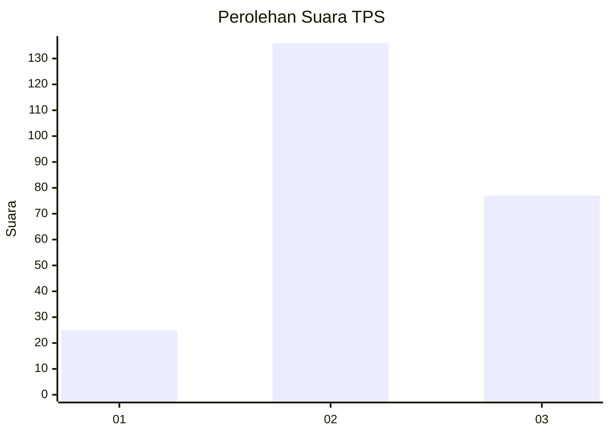
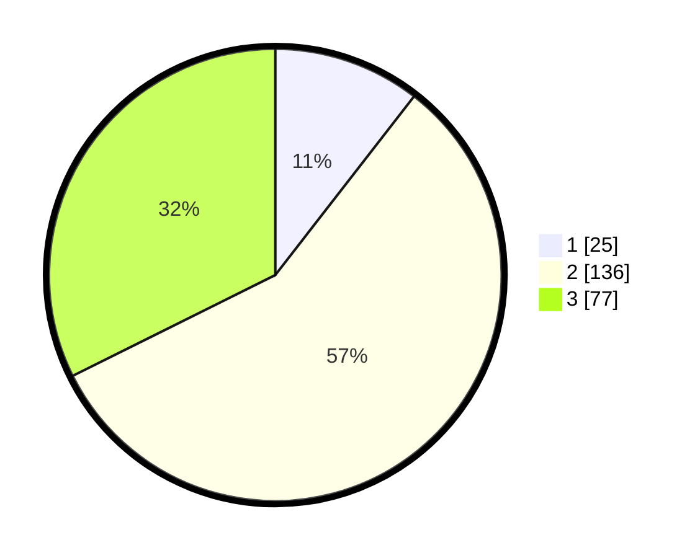

# Hasil

## Grafik

## Tabel

| No. | Nama Paslon    | Suara | Suara (raw) | Persentase |
|:--- |:-------------- | -----:| -----------:| ----------:|
| 1   | ANIES MUHAIMIN | 25    | [25][p-1]   | 10,50      |
| 2   | PRABOWO GIBRAN | 136   | [136][p-2]  | 57,14      |
| 3   | GANJAR MAHFUD  | 77    | [77][p-3]   | 32,35      |

[p-1]: https://github.com/gigit-pemilu/pemilu-2024/blob/main/pilpres/hitung-suara/sub/33-jawa-tengah/sub/11-sukoharjo/sub/06-bendosari/sub/1001-jombor/sub/015-tps/sub/paslon-1.txt
[p-2]: https://github.com/gigit-pemilu/pemilu-2024/blob/main/pilpres/hitung-suara/sub/33-jawa-tengah/sub/11-sukoharjo/sub/06-bendosari/sub/1001-jombor/sub/015-tps/sub/paslon-2.txt
[p-3]: https://github.com/gigit-pemilu/pemilu-2024/blob/main/pilpres/hitung-suara/sub/33-jawa-tengah/sub/11-sukoharjo/sub/06-bendosari/sub/1001-jombor/sub/015-tps/sub/paslon-3.txt

## Foto C Plano

https://sirekap-obj-formc.kpu.go.id/1469/pemilu/ppwp/33/11/06/10/01/3311061001015-20240217-141137--3cc8eeb8-2ca1-4f55-8c3e-9d413b8ada5e.jpg

https://sirekap-obj-formc.kpu.go.id/1469/pemilu/ppwp/33/11/06/10/01/3311061001015-20240217-141322--a6f23b84-6507-48f4-9e98-caf10145db5f.jpg

https://sirekap-obj-formc.kpu.go.id/1469/pemilu/ppwp/33/11/06/10/01/3311061001015-20240217-141433--7a6f3694-6cee-4c05-810e-bc6c4d09718d.jpg

## Metadata

| Key        | Value               |
| ---------- | ------------------- |
| Time Stamp | 2024-02-17 14:56:33 |

## DATA PEMILIH TETAP

Jumlah pemilih dalam DPT: **222**.
 * L: **424**.
 * P: **634**.

## DATA PENGGUNA HAK PILIH

Jumlah pengguna hak pilih dalam DPT: **242**.
 * L: **443**.
 * P: **424**.

Jumlah pengguna hak pilih dalam DPTb: **226**.
 * L: **800**.
 * P: **212**.

Jumlah pengguna hak pilih dalam DPK: **202**.
 * L: **500**.
 * P: **822**.

Jumlah pengguna hak pilih: **222**.
 * L: **352**.
 * P: **422**.

## JUMLAH SUARA SAH DAN TIDAK SAH

JUMLAH SELURUH SUARA SAH: **238**.

JUMLAH SUARA TIDAK SAH: **4**.

JUMLAH SELURUH SUARA SAH DAN SUARA TIDAK SAH: **242**.

