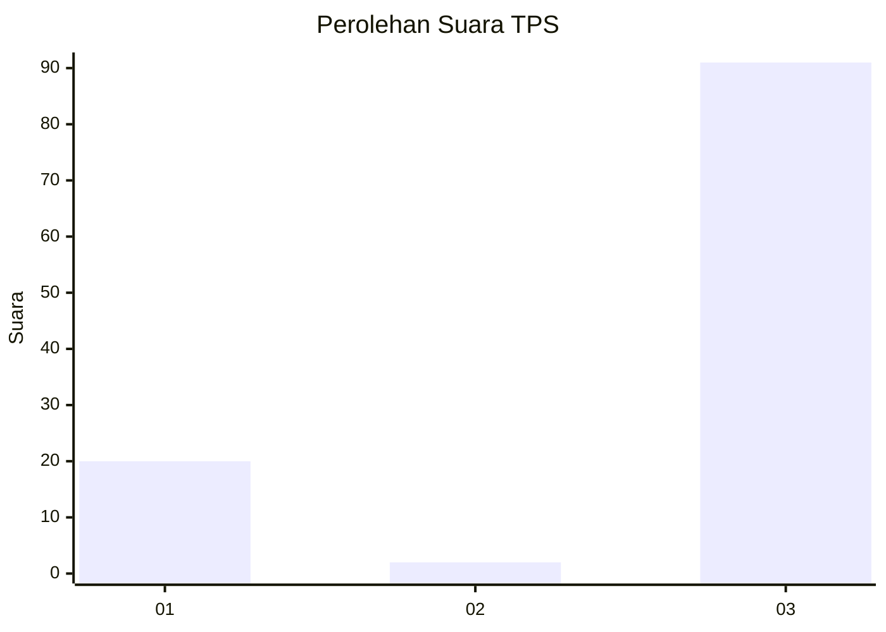
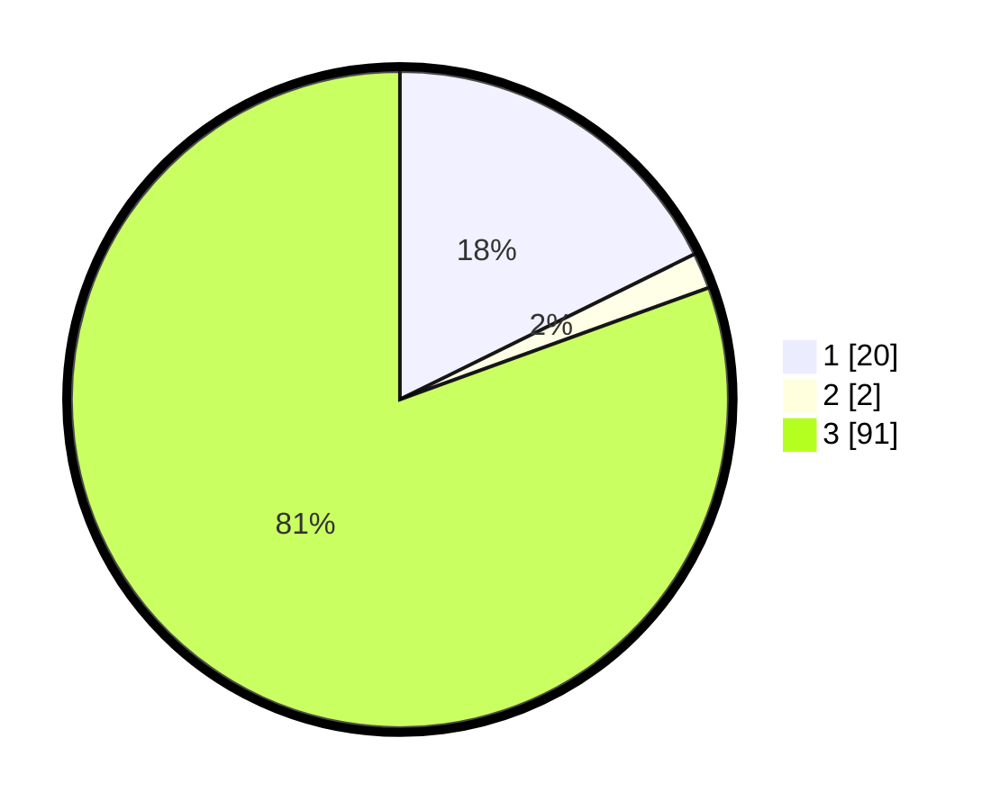

# Hasil

## Grafik

## Tabel

| No. | Nama Paslon    | Suara | Suara (raw) | Persentase |
|:--- |:-------------- | -----:| -----------:| ----------:|
| 1   | ANIES MUHAIMIN | 20    | [20][p-1]   | 17,70      |
| 2   | PRABOWO GIBRAN | 2     | [2][p-2]    | 1,77       |
| 3   | GANJAR MAHFUD  | 91    | [91][p-3]   | 80,53      |

[p-1]: https://github.com/gigit-pemilu/pemilu-2024-33-jawa-tengah/blob/main/pilpres/hitung-suara/sub/33-jawa-tengah/sub/11-sukoharjo/sub/06-bendosari/sub/2006-cabeyan/sub/001-tps/sub/paslon-1.txt
[p-2]: https://github.com/gigit-pemilu/pemilu-2024-33-jawa-tengah/blob/main/pilpres/hitung-suara/sub/33-jawa-tengah/sub/11-sukoharjo/sub/06-bendosari/sub/2006-cabeyan/sub/001-tps/sub/paslon-2.txt
[p-3]: https://github.com/gigit-pemilu/pemilu-2024-33-jawa-tengah/blob/main/pilpres/hitung-suara/sub/33-jawa-tengah/sub/11-sukoharjo/sub/06-bendosari/sub/2006-cabeyan/sub/001-tps/sub/paslon-3.txt

## Foto C Plano

https://sirekap-obj-formc.kpu.go.id/cee8/pemilu/ppwp/33/11/06/20/06/3311062006001-20240214-232248--eecc1fb0-524c-4909-9413-cacd29d5c3ed.jpg

https://sirekap-obj-formc.kpu.go.id/cee8/pemilu/ppwp/33/11/06/20/06/3311062006001-20240217-103323--879542cd-0be0-43b4-aecb-13b41e4a3e06.jpg

https://sirekap-obj-formc.kpu.go.id/cee8/pemilu/ppwp/33/11/06/20/06/3311062006001-20240217-143915--95d7260f-a59c-4cdf-a748-3f714fd67169.jpg

## Metadata

| Key        | Value               |
| ---------- | ------------------- |
| Time Stamp | 2024-02-17 14:45:18 |

